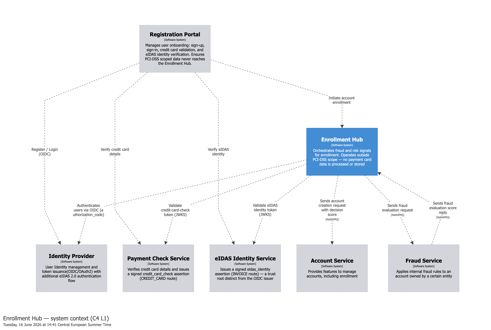

# Enrollment Hub

[](https://github.com/angelasindic/enrollment-hub/actions/workflows/ci.yml)

> A fraudster with twenty synthetic identities diversifies payment instruments, IP addresses, and device fingerprints.
> Standard fraud checks pass. The shared apartment address doesn't. The Enrollment Hub detects that cluster by scoring
> incoming enrollment addresses against a real-time geographic density index, with an aggregation rule that ensures a
> misconfigured threshold inflates the review queue but can never cause a wrongful rejection.

---

**Event-driven enrollment hub: it durably accepts registrations, scores each for synthetic-identity fraud via a
real-time geo-temporal density signal, and emits an auditable decision — keeping applicant latency independent of slow,
unreliable downstream services.**

## At a glance

| | |
|---|---|
| **Stack** | JDK 25 (virtual threads) · Spring Boot 4 · Spring Security 7 · PostgreSQL · RabbitMQ · Redis · Nominatim · libpostal |
| **Design driver** | **Latency isolation**, not throughput — applicant latency stays flat while downstream services run P99 >1s at <100% availability |
| **Observability** | OpenTelemetry traces + logs, Prometheus metrics, Grafana — one distributed trace per enrollment across every queue hop |
| **Status** | Reference implementation. Core pipeline, security perimeter, decision outbox, and observability working; Account-Service consumer and eIDAS/INVOICE prerequisite planned |



*(Container and landscape views: [`docs/structurizr/images/`](docs/structurizr/images).)*

---

## What this is

The Enrollment Hub is an event-driven, asynchronous registration pipeline featuring geo-temporal fraud detection. Its
design centres on three concrete properties: **concurrency-safe correlation** of parallel risk signals, **GDPR data
minimisation** enforced by the data lifecycle (prerequisite rejections never reach the database; spatial data expires
after 48h), and an **aggregation rule under which a misconfigured threshold can inflate the review queue but never cause a
wrongful rejection.**

Positioned between the registration frontend and downstream fulfillment services, the hub ingests enrollment requests,
fans out to parallel risk-evaluation services, and emits an asynchronous enrollment decision event. This decoupled
approach ensures applicant-facing latency remains entirely independent of downstream services with unpredictable or
unreliable execution times.

The system's important enhancement is a **Geo-Scoring module** designed to detect synthetic identity fraud. While advanced
fraud rings can randomize digital fingerprints and payment methods, they frequently rely on the same physical delivery
addresses. The Geo-Scoring module indexes and analyzes these addresses in real time to flag anomalous geographic
clustering.

> For a detailed look at the market validation, metrics, and rollout strategy for this module,
> see the [Geo-Scoring Business Analysis](docs/geo_scoring_business_analysis.md).

---

## Modules

| Module | Role |
|---|---|
| [`gateway`](gateway) | Authenticating edge — OIDC `authorization_code` login against the authorization-server + `TokenRelay`; fetches and relays the payment-check prerequisite token. Routes only; does not validate the relayed JWT. |
| [`authorization-server`](authorization-server) | Spring Authorization Server (IdP) issuing OIDC tokens over a JDBC-persisted client/user store, plus a co-located simulated payment-check prerequisite-token issuer under a distinct trust root. |
| [`decision-engine`](decision-engine) | The orchestrator — OAuth2 resource server, scatter-gather over RabbitMQ, correlation store, signal aggregation, timeout policy, and the transactional-outbox decision emission. |
| [`geo-scoring`](geo-scoring) | Synthetic-identity fraud signal — libpostal normalisation, Nominatim geocoding, atomic Redis Lua density check over configurable radii. |
| [`fraud-detection`](fraud-detection) | `BEST_EFFORT` fraud signal (stub) — consumes `FraudCheckRequest`, replies `OK`; the extension seam for a real service. |
| [`contracts`](contracts) | Shared event/DTO records — the producer-owned message contract between services. |

---

## What this demonstrates

### Asynchronous scatter-gather orchestration

Incoming HTTP requests are immediately offloaded to a durable intake queue, isolating the external API boundary from
background processing. The Decision Engine consumes from this intake queue and dispatches the requests across a RabbitMQ
direct exchange, routed by signal name, with the applicable set determined by payment type (credit-card / invoice). The
engine then correlates the incoming results and emits a terminal `EnrollmentDecisionEvent` once all applicable signals
settle or time out. This pattern handles concurrent result arrival, partial signal availability, and fail-open
degradation without requiring application-level coordination between services.

**Signal classification model (ADR-14).** Each signal declares a `GateClassification` that drives how the Decision
Engine treats its result and its absence:

| Classification   | Missing signal  | Authority over outcome                                   | Current assignment |
|------------------|-----------------|----------------------------------------------------------|--------------------|
| `REQUIRED`       | Fail-closed     | Authoritative — any outcome                              | Reserved (future)  |
| `BEST_EFFORT`    | Fail-open       | Authoritative — any outcome                              | Fraud Detection    |
| `SCORING_SIGNAL` | Fail-open       | Advisory — `CONDITIONAL_APPROVED` only, never `REJECTED` | Geo-Scoring        |

The asymmetry is structurally enforced in the aggregation loop — the `SCORING_SIGNAL` branch can only set the
review flag; the rejection accumulator is physically unreachable from it. Misconfiguring a geo-density threshold
can inflate the analyst review queue but cannot cause wrongful rejection.

**Concurrent scatter-gather completion safety (ADR-16).** Result handlers acquire a pessimistic lock
(`SELECT FOR UPDATE`) on the correlation record before recording a signal result. This prevents lost-update races
when two results arrive simultaneously, without requiring distributed locks or application-level sequencing.

**Compute-once decision emission (ADR-17).** The decision is computed exactly once, persisted on the correlation row,
and only then published — commit-then-publish, with the row itself serving as the transactional outbox. An eager
after-commit dispatch delivers within milliseconds; a scheduled sweep is the durability backstop that re-publishes the
frozen decision (same `decisionId`) after any broker failure, so a decided enrollment is never silently lost.

**JSONB-backed extensible signal registry.** The correlation record stores signal states as a
`Map<SignalConfig, SignalState>` in a single JSONB column. Adding a new signal requires only a new `SignalConfig`
enum value — no DDL migration, no entity field change. Routing and completion logic derive entirely from
`SignalConfig` metadata at runtime.

**Geo-spatial indexing on Redis (ADR-11).** The Geo-Scoring module normalizes enrollment addresses via libpostal,
geocodes them via self-hosted Nominatim, and indexes the coordinates using an atomic Lua script (GEOSEARCH + GEOADD)
with a 48-hour per-member TTL. Enrollment density is computed across multiple configurable radii; saturating the
Redis `COUNT 200` result cap produces `RiskLevel.EXTREME` — a first-class risk level treated distinctly from `HIGH`.
A sorted-set companion index drives per-member eviction via a scheduled cleanup job.

**GDPR-motivated data architecture.** Prerequisite rejections never touch the database. Only requests that cross
into the pipeline create correlation records, satisfying GDPR data minimisation. The 48-hour TTL on the geo-index
serves the same principle for spatial data (ADR-12).

**Layered security perimeter (ADR-03).** The gateway performs the interactive OIDC login and relays the access token;
the decision-engine is an OAuth2 resource server that validates bearer JWTs against the IdP JWKS and enforces the
`enrollment:write` scope. On top of the bearer token, a prerequisite payment-check token (`credit_card_check`, ADR-18)
is issued under a distinct trust root and validated conditionally on the CREDIT_CARD route (signature, issuer, audience,
`type`, and subject binding — the confused-deputy guard).

**JDK 25 virtual threads (ADR-04).** Virtual threads are the concurrency model — enabled globally
(`spring.threads.virtual.enabled=true`) and on the AMQP listener container factories. No reactive stack.

---

## Decisions Worth Explaining

- **Closing the decision the architecture rests on ([architecture](docs/architecture.md) §1.1, ADR-07).** Every later decision presumes an answer to whether the pipeline is asynchronous, so this one could not be left open — the design would keep moving under itself. The test was not how many arguments favoured messaging but whether any forced it: throughput does not, at five requests a second it decides nothing. Two do — applicant latency must not track a downstream P99 above a second, and an accepted enrollment must survive a crash — and together they leave one shape, with messaging's complexity as the price rather than an open question.
- **One token cannot vouch for everything (ADR-03, ADR-18).** The identity provider verified a login, so that is all its token is trusted for; a payment check is a separate attestation from its own issuer, fetched server-to-server so the party being checked never presents their own result; the request payload is claimed by the caller, not verified by anyone. Each boundary is enforced by construction — distinct trust roots, audience-scoped tokens, subject binding — and pinned by negative-path tests rather than by convention.
- **The textbook pattern fit only one end of the pipeline ([architecture](docs/architecture.md) §8.7, ADR-17).** Both ends face the same dual-write problem — a database write and a broker publish that cannot share one transaction — so a transactional outbox looks like the answer to both. It is, at egress: the decision is created inside a transaction with nothing upstream to carry it. At ingress there is something — the request itself becomes a durable queue message, so the queue is already the record of intent and an outbox would add a table and a relay for nothing; one detail about what exists at each end decides the design.
- **The GDPR deadline turned out to be the detection window (ADR-12).** Spatial data is deleted after 48 hours to satisfy data minimisation, which reads like a limit on how much history the fraud signal can draw on. It is the opposite: a ring is only actionable for a short window, so older points do not help detect an active one — they accumulate into background density that makes ordinary city blocks look like clusters. The expiry that privacy requires is also what keeps the signal sharp.
- **An unproven signal gets limited authority (ADR-14).** Geo-density is a new detection idea with no labeled fraud data behind it; how good the signal really is will only show in production. So it can flag an enrollment for human review but cannot reject one — a limit encoded in the signal's declared classification rather than left as a convention to remember. If production data earns it more authority, that is a one-value change.
- **The solution is simple; arriving at it was not (ADRs 08–11).** Four decisions produced it: how to normalize a hand-written address, how to resolve it to coordinates, which algorithm measures clustering, and how to keep the density check and the index write from racing. Each constrains the next — the canonical form determines the cache key, the provider determines the coordinates — so they were evaluated together rather than chosen one at a time, and they were the only ones in the geo stack worth settling before code. The ADRs record what lost, and why.

**What this does not establish.** The design is argued against its stated drivers, not proven against production traffic. Each ADR records the conditions that would overturn it, because these decisions are correct for a stated volume and latency envelope rather than in general; [architecture](docs/architecture.md) §7.4 sets out what changes for production and what breaks if it doesn't.

---

## Implementation status

The core pipeline, security perimeter, and observability are implemented. A few items are deliberately scoped out.

**Implemented:**
- RabbitMQ per-signal scatter-gather topology (`enrollment.check.request` / `enrollment.check.result` direct exchanges; decision-engine-owned request and result queues with DLQs)
- Durable intake queue with a `PENDING → COMPLETED` idempotency ledger (ADR-13); `EnrollmentIntakeService` consumes and dispatches one per-signal command (`geo.score` / `fraud.check`) per applicable signal, commit-before-publish
- Durable correlation record (PostgreSQL, JSONB signal map, `SELECT FOR UPDATE` concurrency guard)
- Decision Engine with the ADR-14 signal classification model (BEST_EFFORT + SCORING_SIGNAL aggregation)
- Complete Geo-Scoring module (libpostal normalisation, Nominatim geocoding, atomic Redis Lua density check)
- Fraud-detection module (stub) — consumes `FraudCheckRequest`, replies `OK`; recorded against `FRAUD_CHECK`
- Spring Cloud Gateway — authenticating edge with OIDC login + `TokenRelay`
- Authorization Server (IdP) — Spring Authorization Server with a JDBC-persisted client/user store (ADR-05)
- Decision-engine as OAuth2 resource server — validates bearer JWTs via the IdP JWKS, enforces the `enrollment:write` scope (ADR-03)
- Prerequisite payment-check token (`credit_card_check`, ADR-18) — issued under a distinct trust root, relayed by the gateway as `X-Prerequisite-Token`, validated conditionally on the CREDIT_CARD route
- Compute-once decision emission via a transactional outbox on the correlation row (ADR-17) — eager after-commit dispatch + scheduled sweep backstop, `EnrollmentDecisionEvent` carrying `decisionId`, the enrollment snapshot, and settled signal results
- Timeout policy (ADR-15) — fail-open per signal classification, run as the timeout phase of the scheduled sweep
- Observability — one distributed trace per enrollment across every queue hop (OpenTelemetry), Prometheus metrics with DLQ / publish-failure / stuck-outbox alerts, Grafana across traces, logs, and metrics

**Not yet implemented (by design):**
- Account Service consumer — `EnrollmentDecisionEvent` is published but no downstream consumer is built
- eIDAS / INVOICE prerequisite (`eidas_identity`) — same shape as the credit-card check with a second issuer; deferred (ADR-19)

---

## Tech stack

| Concern               | Technology                                                               |
|-----------------------|--------------------------------------------------------------------------|
| Runtime               | JDK 25, virtual threads                                                  |
| Framework             | Spring Boot 4.x, Spring AMQP, Spring Security 7                          |
| Messaging             | RabbitMQ — direct exchanges, per-signal scatter-gather topology          |
| Persistence           | PostgreSQL — correlation record with JSONB signal map; Flyway migrations |
| Geo index             | Redis — atomic Lua GEOSEARCH + GEOADD, 48-hour per-member TTL            |
| Geocoding             | Nominatim (self-hosted)                                                  |
| Address normalisation | libpostal                                                                |
| ORM                   | Spring Data JPA, Hibernate                                               |
| Observability         | OpenTelemetry, Micrometer/Prometheus, Grafana, Tempo, Loki               |
| Architecture diagrams | Structurizr DSL                                                          |
| Local infrastructure  | Docker Compose                                                           |
| Integration tests     | Testcontainers                                                           |

---

## Documents

| Document | What it covers |
|---|---|
| [Architecture Document](docs/architecture.md) | System design, C4 component model, scatter-gather topology, ADR log, observability strategy, GDPR posture, and operational decisions |
| [Geo-Scoring Business Analysis](docs/geo_scoring_business_analysis.md) | The synthetic-identity fraud pattern, the gap in existing defences, the geo-temporal clustering rationale, and the phased rollout strategy |
| [Architecture Decision Records](docs/adr) | The dense decision log — every non-trivial choice, with context, options, trade-offs, and triggers to reconsider |
| [DLQ replay runbook](docs/runbook-dlq-replay.md) | The operational procedure behind the `DlqNonEmpty` alert — inspect, classify, replay, or discard |
| [Security controls](docs/security-controls.md) | Control-by-control map — where each is implemented, the test that pins it, the document that argues it, and what is not implemented |

Each service also carries its own `design.md` / `README.md` describing its internals.

---

## Running locally

Services run on the host against Docker Compose infrastructure.

**1. Create `.env`** from the template and set `GEOCODING_CACHE_HMAC_SECRET`, the HMAC-SHA256 pepper for
geo-scoring's geocoding cache keys. It has no default; geo-scoring does not start without it.

```bash
cp .env.example .env
printf 'GEOCODING_CACHE_HMAC_SECRET=%s\n' "$(openssl rand -base64 32)" > .env  # 32 random bytes, base64-encoded written to .env 
```

Changing the value re-keys the cache, so the next lookup of every address goes to Nominatim until the cache re-warms
(see *Pepper rotation* in [`geo-scoring/design.md`](geo-scoring/design.md)).

**2. Start infrastructure** (PostgreSQL, RabbitMQ, Redis, Nominatim, libpostal):

```bash
docker compose up -d
```

**3. (Optional) Start the observability stack** (OTel Collector, Tempo, Loki, Prometheus, Grafana at `localhost:3000`):

```bash
docker compose -f otel-local/docker-compose.yml up -d
```

**4. Run the services** (each in its own shell, or from the IDE). Maven does not read `.env`; export it into the
shell that runs geo-scoring, or add it to the IDE run configuration's environment:

```bash
set -a; source .env; set +a
./mvnw -pl authorization-server spring-boot:run
./mvnw -pl decision-engine     spring-boot:run
./mvnw -pl geo-scoring         spring-boot:run
./mvnw -pl fraud-detection     spring-boot:run
./mvnw -pl gateway             spring-boot:run
```

**Tests** manage their own infrastructure via Testcontainers — no running Docker Compose instance is needed:

```bash
./mvnw verify
```

---

## License

See [LICENSE](LICENSE).
