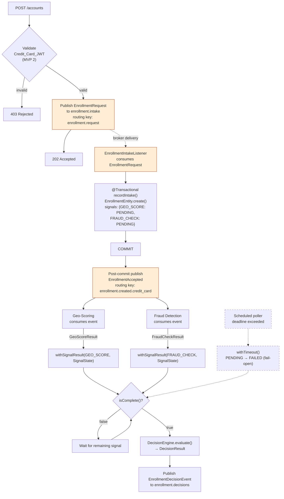
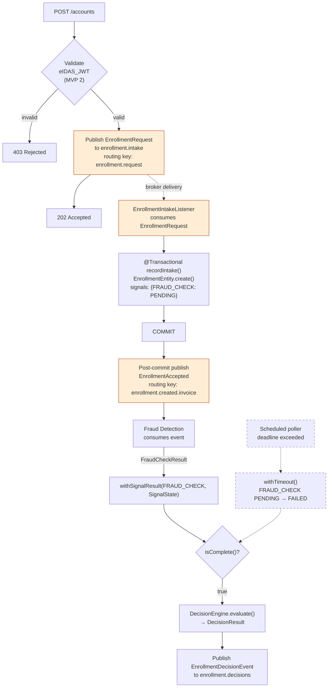

## Decision Engine Design

> **Status.** This document specifies the target design. Sections describing the
> `enrollment.intake` queue, the separate `enrollment.decisions` exchange, the JWT
> prerequisite gate, and the scheduled timeout poller are **not yet implemented in
> MVP 1** — see ADR-003 §Layer 1 / §Layer 3, ADR-010, and ADR-007 / ADR-011 for the
> current implementation status. The Correlation Record schema, Domain Model, and
> Decision Engine sections describe the model that is implemented today (ADR-018).

### Enrollment Flow & Error Handling

The decision-engine uses an asynchronous, broker-backed pattern to ensure causal
consistency and durability. This implementation follows the standards in
**Architecture Document §8** and **ADR-003**.

---

#### 1. Synchronous Intake (REST)

The REST endpoint serves as a thin gateway. It performs request-payload validation
and, in MVP 2, synchronous JWT validation (see §REST entry point). No database
writes occur in this path.

* **Action:** Publishes an `EnrollmentRequest` to the `enrollment.intake` exchange.
* **Result:** Returns `202 Accepted` only after the broker acknowledges receipt via **Publisher Confirms**.
* **Constraint:** No database writes on the REST critical path — the correlation
  record is created by `EnrollmentIntakeListener` after the broker delivers the
  intake message.

#### 2. Asynchronous Processing & Idempotency

The `EnrollmentIntakeListener` consumes requests from the `enrollment.intake.queue` and delegates to the `EnrollmentIntakeProcessor`.

To maintain a **causal guarantee**, the processor follows a strict linear execution:

1. **Persist:** Initiates a database transaction to create a durable correlation record.
2. **Commit:** Confirms the transaction is committed and visible.
3. **Publish:** Only after the commit is successful, it publishes `EnrollmentAccepted` to the `enrollment.events` exchange.

#### 3. Failure Handling & Redelivery

The pipeline is designed to be resilient and idempotent:

* **Retries:** If a transient failure occurs (e.g., network timeout), the message is redelivered to the `enrollment.intake.queue` for reprocessing.
* **Idempotency (No-op):** If a redelivered message attempts to insert a record that already exists, the resulting **unique constraint violation** is handled as a **no-op**. The processor treats the record as already processed and proceeds without duplicating data or triggering error alerts.

> **Note:** This ordering ensures downstream services never receive an event for a record that isn't yet durable in the database.


### Enrollment Intake

The enrollment intake system is designed for **eventual consistency** and **durable idempotency**, utilizing Spring AOP and RabbitMQ to maintain architectural guarantees.

---

#### 1. Transactional Integrity & Bean Separation

To ensure `@Transactional` semantics are honored, the logic is split across two beans:

* **`CorrelationRecordService`:** Manages the database transaction.
* **`EnrollmentIntakeProcessor`:** Coordinates intake orchestration and downstream publishing.

**Why the split?** Calling the service from the processor ensures the request crosses a Spring AOP proxy boundary. Inlining these methods would lead to "self-invocation," causing the transaction to fail silently and corrupting the durability guarantee at runtime.

#### 2. Idempotency & Convergence

The system uses a "check-then-act" pattern backed by a database constraint to handle message redeliveries (e.g., from nacks, timeouts, or channel closures).

* **Existence Check:** An indexed `SELECT EXISTS` act as the primary idempotency gate.
* **Race Condition Handling:** A `unique` constraint on `request_id` backstops the narrow window where concurrent transactions might pass the existence check. If a second commit fails via constraint violation, the listener throws an exception, the broker redelivers the message, and the next pass results in a clean no-op.
* **Trade-offs:** We use JPA for code uniformity. While a native `INSERT ... ON CONFLICT` would save a round-trip, the current RPM-based throughput makes the performance gain negligible compared to the benefits of maintainable, idiomatic code.

#### 3. The Causal Guarantee (Publishing)

Downstream publishing to `enrollment.events` occurs **after** `recordIntake` returns.

* **Ordering:** Because the transactional proxy commits before the publish call, the correlation row is guaranteed to be durable and visible before any check service receives the event.
* **Failure Recovery:** If publishing fails (e.g., broker timeout), the exception propagates, triggering a `nack` under `AcknowledgeMode.AUTO`. The broker then redelivers the message, triggering the idempotent path described above.
* **Observability:** Failures are tracked via the `enrollment_intake_publish_failures_total` counter.

#### 4. Design Rationale: Why not a full Outbox/ADR?

While the system implements a "broker-backed durability" pattern (per **ADR-003**), it stops short of a full transactional outbox.

* **Simplicity:** Given the low-frequency nature of enrollments, the complexity of a dedicated outbox table and poller is avoided.
* **Durability:** The broker-redelivery loop provides sufficient resilience without the overhead of additional infrastructure, while the unique constraint ensures we never suffer from silent duplication.

### Poison Pill Handling & Dead Letter Topology

Even with a robust retry strategy, certain "poison pill" messages — such as those with malformed JSON, invalid schemas, or unrecoverable business logic errors — will never succeed. To prevent these from blocking the pipeline or wasting CPU cycles, we implement a **Dead Letter Exchange (DLX)** strategy.

#### Failure Circuit & DLQ

When a message exhausts its retry budget (e.g., after 5 attempts) or encounters a non-retryable exception, it must be moved out of the primary flow.

* **The DLX Mechanism:** The `enrollment.intake.queue` is configured with the `x-dead-letter-exchange` argument. When the application rejects a message without requeuing, the broker automatically routes it to the `enrollment.intake.dlx`.
* **The DLQ:** A dedicated `enrollment.intake.dlq` (Dead Letter Queue) captures these messages. This acts as a "holding pen" for manual triage, allowing engineers to inspect the `x-death` headers to determine why the message failed (e.g., stack trace snippets or retry counts).

#### Poison Pill Defense

To avoid "hot-loops" where a failing message immediately returns to the head of the queue and consumes 100% of the consumer's resources:

1. **`default-requeue-rejected: false`:** This Spring setting ensures that any exception not handled by the retry interceptor results in a `basicNack(requeue=false)`, sending the message straight to the DLQ.
2. **Quorum Queue Limits (Optional):** By setting `x-delivery-limit`, the broker itself acts as a backstop. If the application misbehaves or the consumer crashes mid-processing, the broker will force-route the message to the DLX once the delivery limit is reached.

#### Monitoring the "Failure Surface"

Monitoring shifts from "is it working?" to "how hard is it working to stay alive?":

* **DLQ Depth:** This is a **Critical Alert**. In a healthy system, the DLQ depth should be zero. Any message here represents a failure that the automated system could not resolve.
* **Retry Distribution:** Using Micrometer metrics, we track the frequency of retries. A shift in the median retry count (e.g., messages consistently succeeding only on the 3rd attempt) serves as a leading indicator of downstream instability before actual data loss occurs.

### REST entry point

The REST endpoint is thin. It constructs an `EnrollmentRequest` and publishes it to
the intake exchange. No correlation record is created here, and no business state is
touched.

> **MVP-2 scope.** Synchronous JWT validation (Credit_Card_JWT for CREDIT_CARD,
> eIDAS_JWT for INVOICE) is planned for MVP 2 per ADR-007 and ADR-011. In MVP 1 the
> endpoint accepts requests without a prerequisite gate; the JwtValidator call shown
> below is the target shape for MVP 2.

```java
// decisionengine / api / EnrollmentController.java
//
// Target:  JDK 25 / Spring Boot 4.x / Spring AMQP 4.x
// Status:  Reference

@RestController
class EnrollmentController {

    private final JwtValidator jwtValidator;                          // MVP 2
    private final EnrollmentIntakePublisher enrollmentIntakePublisher;

    @PostMapping("/accounts")
    ResponseEntity<Void> accept(@RequestBody EnrollmentCommand command,
                                @RequestHeader("Authorization") String bearerToken) {
        // [MVP 2] Synchronous prerequisite gate — rejected requests never enter
        // the pipeline. See ADR-007 / ADR-011 for the eIDAS JWT contract and the
        // prerequisite gate decision.
        jwtValidator.validate(bearerToken, command.paymentType());

        EnrollmentRequest request = EnrollmentRequest.from(command, UUID.randomUUID());

        enrollmentIntakePublisher.accept(request);

        return ResponseEntity.accepted().build();
    }
}
```

The REST handler forwards incoming requests to the `EnrollmentIntakePublisher`. The
publisher confirm provides the durability guarantee that the broker has accepted the
message before the 202 response is returned. If the publish ultimately fails after
retries, the request surfaces as a 5xx to the client; intake-side dead-lettering is
handled by `EnrollmentIntakePublisher` and is described under
§"Poison Pill Handling & Dead Letter Topology".

### RabbitMQ routing key strategy

`EnrollmentIntakeListener` publishes `EnrollmentAccepted` to the `enrollment.events` topic exchange. The routing key
encodes the payment type:

```
payment_type = CREDIT_CARD → routing key: enrollment.created.credit_card
payment_type = INVOICE     → routing key: enrollment.created.invoice
```

Queue bindings on `enrollment.events`:

| Service                        | Binding key                      | Activated on     |
|--------------------------------|----------------------------------|------------------|
| Geo-Scoring queue              | `enrollment.created.credit_card` | CREDIT_CARD only |
| Internal Fraud Detection queue | `enrollment.created.*`           | Both routes      |

There is no Identity queue. The eIDAS Connector issues a signed JWT as a prerequisite
gate validated synchronously by the REST endpoint (MVP 2 — see ADR-007 / ADR-011); it
does not subscribe to RabbitMQ events. Identity is not represented as a signal in the
correlation record's signal map — prerequisites are outside the ADR-018 signal
classification model.

Internal Fraud Detection is active in MVP 1 as a stub: it subscribes to
`enrollment.created.*`, consumes `EnrollmentAccepted`, and always emits
`FraudCheckResult(OK)` without performing any real analysis. The `FRAUD_CHECK` signal
is therefore initialised to `PENDING` on both routes in MVP 1. The stub exists to
validate the full end-to-end wiring so that a real implementation can be substituted
in Phase 2 with no decision-engine changes.

### Correlation Record

```
enrollment_hub.enrollments
  - request_id           UUID         PRIMARY KEY   ← idempotency key for intake redelivery; never published downstream
  - payment_type         VARCHAR(20)  NOT NULL       ← CREDIT_CARD | INVOICE — routing discriminator
  - original_request     JSONB        NOT NULL       ← full enrollment data captured at intake; forwarded in EnrollmentDecisionEvent
  - signals              JSONB        NOT NULL       ← Map<SignalConfig, SignalState>; only applicable signals are present
  - decision_result      VARCHAR(30)  NULL          ← APPROVED | REJECTED | CONDITIONAL_APPROVED — set when all signals settle
  - decision_id          UUID         NULL          ← fresh UUID generated at decision time; published instead of request_id
  - created_at           TIMESTAMPTZ  NOT NULL
  - timeout_at           TIMESTAMPTZ  NOT NULL
  - decided_at           TIMESTAMPTZ  NULL

Indexes:
  - idx_enrollments_timeout_undecided  (timeout_at) WHERE decision_result IS NULL   ← timeout poller (ADR-010)
  - idx_enrollments_signals_jsonb      GIN (signals)
```

The `request_id` PRIMARY KEY is what makes the intake listener idempotent against
broker redelivery. It is not optional — without it, a redelivered intake message
could create a duplicate correlation row, which would in turn produce a duplicate
`EnrollmentAccepted` event and have the signal services run twice for the same
request.

`decision_id` is a freshly generated UUID set when the decision is recorded; it is
published in `EnrollmentDecisionEvent` *instead of* `request_id` to avoid exposing
the internal correlation primary key.

Absent fields by design:
- **No per-signal status / result columns.** All signal state lives in the
  `signals` JSONB map keyed by `SignalConfig` (ADR-018). Adding a new signal does
  not require a schema migration.
- **No `payment_token_status` / `identity_check_status`.** Prerequisite gates are
  resolved synchronously at the REST entry point (MVP 2) and never enter the
  signal map.
- **No `overall_status`.** Completeness is derived from the `signals` map via
  `SignalConfig.allSettled(signals)`; "decided" is implied by
  `decision_result IS NOT NULL`.
- **No `decision_reason`.** The ADR-018 model captures decision drivers as the
  settled `signals` map on the decision event; no separate reason enum is kept.

### Correlation Record Domain Model

The correlation record is modelled per ADR-018's Signal Classification Model. The
domain is an immutable record (`EnrollmentProcess`); the JPA entity
(`EnrollmentEntity`) holds the persisted state and exposes a read-only view of the
domain. State transitions on the domain return new instances; the entity's in-place
updates are localised to the persistence layer.

**Domain types** (`decision-engine/domain`):

| Type                       | Role                                                                                              |
|----------------------------|---------------------------------------------------------------------------------------------------|
| `SignalProcessingState`    | Lifecycle: `PENDING`, `SETTLED`, `FAILED` (timeout or crash)                                      |
| `SignalOutcome`            | Check-style result: `OK`, `FAILED`, `NO_RESULT` (used by `BEST_EFFORT` / `REQUIRED` signals)      |
| `RiskLevel`                | Score-style result: `LOW`, `MEDIUM`, `HIGH`, `EXTREME` (used by `SCORING_SIGNAL` signals)         |
| `GateClassification`       | Aggregation metadata: `REQUIRED`, `BEST_EFFORT`, `SCORING_SIGNAL` (ADR-018)                       |
| `SignalConfig`             | Enum of signals — declares applicable routes + classification (`GEO_SCORE`, `FRAUD_CHECK`)        |
| `SignalState`              | Flat record: `(processingState, outcome, riskLevel, reason)` — serialises trivially to JSONB      |
| `EnrollmentProcess`        | Immutable aggregate: `(requestId, command, Map<SignalConfig, SignalState>, createdAt, timeoutAt)` |
| `DecisionResult`           | Domain decision: `APPROVED`, `REJECTED`, `CONDITIONAL_APPROVED`                                   |
| `EnrollmentDecisionResult` | Wrapper carrying the `DecisionResult` returned from the engine                                    |

**Signal initialization by route** — built by `SignalConfig.initializeFor(PaymentType)`.
Only applicable signals are present; absence from the map means *not applicable* on
this route (no sentinel value):

| PaymentType   | GEO_SCORE | FRAUD_CHECK |
|---------------|-----------|-------------|
| `CREDIT_CARD` | `PENDING` | `PENDING`   |
| `INVOICE`     | *absent*  | `PENDING`   |

Prerequisite gates (Credit_Card_JWT, eIDAS_JWT) are resolved synchronously at the
REST entry point (MVP 2 — ADR-007 / ADR-011). They produce no entry in the signal
map.

**Fact update methods on `EnrollmentProcess`:**

| Method                                            | Trigger                                     | Effect                                                                            |
|---------------------------------------------------|---------------------------------------------|-----------------------------------------------------------------------------------|
| `start(requestId, command, createdAt, timeoutAt)` | Intake listener after commit                | Builds process with `SignalConfig.initializeFor(paymentType)`                     |
| `withSignalResult(SignalConfig, SignalState)`     | Signal result listener                      | Returns new process with the named signal's state replaced                        |
| `withTimeout()`                                   | Scheduled timeout poller (ADR-010, planned) | Transitions all PENDING signals to FAILED (fail-open); leaves SETTLED unchanged   |
| `isComplete()`                                    | After any transition                        | True when every applicable signal has settled (status ≠ PENDING)                  |

**Scatter-gather flow (CREDIT_CARD route):**



**Scatter-gather flow (INVOICE route):**



**Completion predicate:** `isComplete()` returns `true` when every signal present
in the map has settled (`processingState ≠ PENDING`). Signals not present in the
map are by definition not applicable to the route and contribute nothing to the
predicate.

**Design decisions:**

- **Two flat result fields per signal.** `SignalState` carries both `outcome` and
  `riskLevel`; exactly one is populated per classification (check-style fills
  `outcome`, score-style fills `riskLevel`). Trade-off documented in ADR-018:
  preferred over a sealed type hierarchy for trivial JSONB serialisation.
- **Absence over sentinel.** Inapplicable signals are missing from the map; there
  is no `NOT_APPLICABLE` enum value. `NO_RESULT` outcomes and null `riskLevel`
  represent "settled but no value" — no `NOT_AVAILABLE` sentinel on the result
  enums.
- **Immutable domain updates.** `with*()` methods on `EnrollmentProcess` return a
  new aggregate. The JPA entity mutates internally for Hibernate's dirty-tracking;
  the domain record stays read-only.
- **Compatibility with contracts module.** Domain result enums (`SignalOutcome`,
  `RiskLevel`, `DecisionResult`) are a subset of the contracts enums. The contract
  enums may carry additional values that the decision-engine domain does not need.
  `EnumCompatibilityTest` asserts the subset relationship (ADR-009).
- **Extensibility.** Adding a new signal requires (1) declaring a new `SignalConfig`
  value with its applicable routes and `GateClassification`, (2) the consumer
  service publishing a result event the decision-engine listener consumes, and (3)
  no change to the aggregation logic — dispatch is on `GateClassification`, not on
  signal identity. No schema migration is required for the JSONB `signals` column.

**Event contracts** are defined as Java records in the shared `enrollment-hub:contracts`
module (ADR-009). The canonical field definitions for `EnrollmentAccepted`,
`GeoScoreResult`, `FraudCheckResult`, and `EnrollmentDecisionEvent` live in that
module. The `SignalProcessingState`, `SignalConfig`, and `GateClassification` types
are decision-engine-internal and not part of the shared contract. `EnrollmentRequest`
is also decision-engine-internal — it flows only between the REST endpoint and
`EnrollmentIntakeListener` and is not consumed by any other service.

### Decision Engine

`DecisionEngine.evaluate(EnrollmentProcess)` takes a completed correlation record
and returns an `EnrollmentDecisionResult`. It is a pure domain function — no Spring
dependencies, no I/O. After evaluation, the service layer maps the result to the
contracts `EnrollmentDecisionEvent` and publishes it to `enrollment.decisions`.

**The engine is route-agnostic.** It iterates the signal map and dispatches on each
signal's `GateClassification`, accumulating two booleans:

| `GateClassification` | Trigger condition (state must be `SETTLED`) | Accumulator             |
|----------------------|---------------------------------------------|-------------------------|
| `BEST_EFFORT`        | `outcome == FAILED`                         | `rejected = true`       |
| `REQUIRED`           | `outcome == FAILED`                         | `rejected = true`       |
| `SCORING_SIGNAL`     | `riskLevel ∈ {HIGH, EXTREME}`               | `reviewRequired = true` |

Resolution after the loop, in priority order:

1. `rejected` → `REJECTED`
2. else `reviewRequired` → `CONDITIONAL_APPROVED`
3. else → `APPROVED`

**Fail-open by omission.** A `FAILED` processing state (timeout or crash) and a
SETTLED no-result (e.g. geocoding failure, `NO_RESULT` outcome, null `riskLevel`)
contribute nothing to either accumulator. No explicit fail-open branch is needed.

**Asymmetric guarantee** (ADR-018): `SCORING_SIGNAL` signals cannot drive
`REJECTED`. Enforced by control flow — the scoring branch can only set
`reviewRequired`; the `rejected` accumulator is physically unreachable from that
branch. A future change proposing a scoring signal drive rejection would require a
visible edit to that branch.

**`REQUIRED` classification** has no current assignment. It is reserved for future
fail-closed signals (e.g. sanctions screening, regulated KYC) that must block the
completion predicate until they settle. ADR-010 escalation ensures a `REQUIRED`
signal is always `SETTLED` by the time aggregation runs.

**Guards:**

- `evaluate()` throws `IllegalStateException` if `isComplete()` returns `false` —
  the engine must never be called on an in-flight record.
- The aggregation loop throws `AggregationPreconditionException` if it encounters a
  `PENDING` signal — that would indicate a bug in the completion predicate.

**Pure function.** No state, no side effects. The service layer calls `evaluate()`
after `isComplete()` returns true, then maps `EnrollmentDecisionResult` and the
settled signal map into the contracts `EnrollmentDecisionEvent` for publishing.

### Consumer-owned bindings

The exchange declarations live in each service that owns a publish path. The decision-engine declares
`enrollment.intake` (because it consumes from it) and `enrollment.events` and `enrollment.decisions` (because it
publishes to them):

```java
// decisionengine / config / AmqpTopology.java
@Bean
DirectExchange enrollmentIntake() {
    return ExchangeBuilder.directExchange("enrollment.intake").durable(true).build();
}

@Bean
TopicExchange enrollmentEvents() {
    return ExchangeBuilder.topicExchange("enrollment.events").durable(true).build();
}

@Bean
TopicExchange enrollmentDecisions() {
    return ExchangeBuilder.topicExchange("enrollment.decisions").durable(true).build();
}

@Bean
Queue intakeQueue() {
    return QueueBuilder.durable("enrollment.intake.queue")
            .withArgument("x-dead-letter-exchange", "enrollment.intake.dlx")
            .withArgument("x-dead-letter-routing-key", "enrollment.intake.dead-letter")
            .build();
}

@Bean
Binding intakeBinding(Queue intakeQueue, DirectExchange enrollmentIntake) {
    return BindingBuilder.bind(intakeQueue).to(enrollmentIntake).with("enrollment.request");
}
```

Each consumer service declares its own queue and binding on `enrollment.events`:

```java
// geo-scoring / config / GeoScoringAmqpConfig.java
@Bean
Queue geoScoringQueue() {
    return QueueBuilder.durable("geo.scoring.queue")
            .withArgument("x-dead-letter-exchange", "geo.scoring.dlx")
            .withArgument("x-dead-letter-routing-key", "geo.scoring.dead-letter")
            .build();
}

@Bean
Binding geoScoringBinding(Queue geoScoringQueue, TopicExchange enrollmentEvents) {
    return BindingBuilder.bind(geoScoringQueue).to(enrollmentEvents)
            .with("enrollment.created.credit_card");
}
```

```java
// fraud-detection / config / FraudDetectionAmqpConfig.java
@Bean
Queue fraudDetectionQueue() {
    return QueueBuilder.durable("fraud.detection.queue")
            .withArgument("x-dead-letter-exchange", "fraud.detection.dlx")
            .withArgument("x-dead-letter-routing-key", "fraud.detection.dead-letter")
            .build();
}

@Bean
Binding fraudDetectionBinding(Queue fraudDetectionQueue, TopicExchange enrollmentEvents) {
    return BindingBuilder.bind(fraudDetectionQueue).to(enrollmentEvents)
            .with("enrollment.created.*");   // both routes — fraud detection runs on CREDIT_CARD and INVOICE
}
```

### Operational metrics

Two metrics on the intake path are worth wiring into the dashboard from day one.
The first, `enrollment_intake_publish_failures_total`, increments whenever the
post-commit publish of `EnrollmentAccepted` throws. A non-zero value means the
broker redelivery path is being exercised — the correlation record was committed
but the downstream publish failed and the intake message was nacked for retry.
This is recoverable in steady state but indicates broker instability or a
downstream binding problem if it is sustained. The second is the depth of
`enrollment.intake.queue.dlq`, which captures intake messages that exhausted
their retry budget without succeeding. A non-zero depth here means an intake
message could not be processed even after retries and requires manual inspection.

> ADR-003 §Step 0 names this step the **"`afterCommit` hook"**. This document
> uses *post-commit publish* for the concrete two-bean implementation
> (see §"The Causal Guarantee (Publishing)"). Both achieve the same
> nack-on-failure semantics — `TransactionSynchronization.afterCommit()`
> exceptions *do* propagate to the `@Transactional` caller (verified against
> Spring source: `TransactionSynchronizationUtils.invokeAfterCommit` has no
> try/catch around the callback; the silently-swallowed behaviour belongs to
> `afterCompletion()` only). The two-bean split is preferred for explicit
> ordering, easier unit testing, and to avoid the case where one
> `afterCommit` callback's exception short-circuits the others in the
> synchronization list.

These two metrics together cover the residual orphan-record window described in
architecture document §8: a correlation record exists but `EnrollmentAccepted`
was not published. Either the metric is non-zero (post-commit publish failed) or
the intake DLQ has a message (retry budget exhausted). If both are zero, no
orphan records exist.

### Intake reference implementation

The intake listener, processor, and correlation-record service. The
`EnrollmentController` lives in §REST entry point above.

```java
// decision-engine
//
// Target:  JDK 25 / Spring Boot 4.x / Spring AMQP 4.x
// Status:  Reference — requires integration testing before production use
// Assumes: RabbitTemplate configured with Publisher Confirms (ADR-003);
//          enrollment.intake.queue declared with DLX (ADR-003 §Failure Handling);
//          enrollment_hub.enrollments table has request_id as PRIMARY KEY.

@Component
class EnrollmentIntakePublisher {
    private final RabbitTemplate rabbitTemplate;

    EnrollmentIntakePublisher(RabbitTemplate rabbitTemplate) {
        this.rabbitTemplate = rabbitTemplate;
    }

    // Publisher Confirms — convertAndSend blocks until the broker acknowledges
    // (or times out, which throws). See ADR-003 §Delivery Guarantees.
    public void accept(EnrollmentRequest request) {
        rabbitTemplate.convertAndSend(
                "enrollment.intake",
                "enrollment.request",
                request);
    }
}

@Component
class EnrollmentIntakeProcessor {
    private final RabbitTemplate rabbitTemplate;
    private final CorrelationRecordService correlationRecordService;
    private final Counter publishFailures;

    EnrollmentIntakeProcessor(RabbitTemplate rabbitTemplate,
                              CorrelationRecordService correlationRecordService,
                              MeterRegistry meterRegistry) {
        this.rabbitTemplate = rabbitTemplate;
        this.correlationRecordService = correlationRecordService;
        this.publishFailures = meterRegistry.counter("enrollment_intake_publish_failures_total");
    }

    public void intakeAndPublish(EnrollmentRequest request) {
        correlationRecordService.recordIntake(request);
        publishAccepted(request);
    }

    private void publishAccepted(EnrollmentRequest request) {
        try {
            rabbitTemplate.convertAndSend(
                    "enrollment.events",
                    routingKey(request.paymentType()),
                    EnrollmentAccepted.from(request));
        } catch (Exception ex) {
            log.error("Publish after intake failed for requestId={}", request.requestId(), ex);
            publishFailures.increment();
            throw ex;  // surface to listener for redelivery
        }
    }

    private static String routingKey(PaymentType type) {
        return switch (type) {
            case CREDIT_CARD -> "enrollment.created.credit_card";
            case INVOICE     -> "enrollment.created.invoice";
        };
    }
}

@Service
class CorrelationRecordService {

    private final EnrollmentRepository repository;

    CorrelationRecordService(EnrollmentRepository repository) {
        this.repository = repository;
    }

    @Transactional
    public void recordIntake(EnrollmentRequest request) {
        // Check-then-act idempotency gate; the PRIMARY KEY on request_id is the
        // backstop for the narrow race where two redeliveries pass the existence
        // check concurrently. See §Idempotency & Convergence above.
        if (repository.existsByRequestId(request.requestId())) {
            return;
        }
        repository.save(EnrollmentEntity.create(
                request.requestId(),
                request.paymentType(),
                request.toOriginalRequestJson(),
                clock.instant(),
                clock.instant().plus(scatterGatherTimeout)));
    }
}

@Component
class EnrollmentIntakeListener {

    private final EnrollmentIntakeProcessor intakeProcessor;

    EnrollmentIntakeListener(EnrollmentIntakeProcessor intakeProcessor) {
        this.intakeProcessor = intakeProcessor;
    }

    @RabbitListener(queues = "enrollment.intake.queue")
    void handle(EnrollmentRequest request) {
        intakeProcessor.intakeAndPublish(request);
    }
}
```