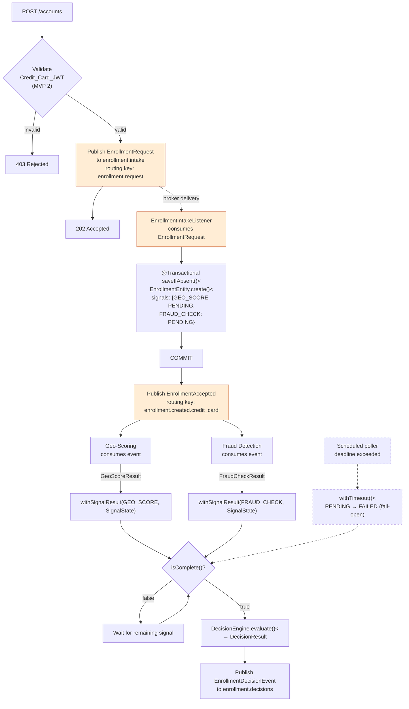

## Decision Engine Design

> **Status.** This document specifies the target design. The separate
> `enrollment.decisions` exchange, the JWT prerequisite gate, and the scheduled timeout
> poller are **not yet implemented in MVP 1** — see ADR-003 §Layer 3, ADR-010, and
> ADR-007 / ADR-011. The Correlation Record schema, Domain Model, and Decision Engine
> sections describe what is implemented today (ADR-016).

### REST entry point

The REST endpoint is thin. It constructs an `EnrollmentRequest` and publishes it to
the intake exchange. No correlation record is created here, and no business state is
touched.

> **MVP-2 scope.** Synchronous JWT validation (Credit_Card_JWT for CREDIT_CARD,
> eIDAS_JWT for INVOICE) is planned for MVP 2 per ADR-007 and ADR-011. In MVP 1 the
> endpoint accepts requests without a prerequisite gate; the JwtValidator call shown
> below is the target shape for MVP 2.

```java
// decisionengine / api / EnrollmentController.java
//
// Target:  JDK 25 / Spring Boot 4.x / Spring AMQP 4.x
// Status:  Reference

@RestController
class EnrollmentController {

    private final JwtValidator jwtValidator;                          // MVP 2
    private final EnrollmentIntakePublisher enrollmentIntakePublisher;

    @PostMapping("/accounts")
    ResponseEntity<Void> accept(@RequestBody EnrollmentCommand command,
                                @RequestHeader("Authorization") String bearerToken) {
        // [MVP 2] Synchronous prerequisite gate — rejected requests never enter
        // the pipeline. See ADR-007 / ADR-011 for the eIDAS JWT contract and the
        // prerequisite gate decision.
        jwtValidator.validate(bearerToken, command.paymentType());

        EnrollmentRequest request = EnrollmentRequest.from(command, UUID.randomUUID());

        enrollmentIntakePublisher.accept(request);

        return ResponseEntity.accepted().build();
    }
}
```

The REST handler forwards incoming requests to the `EnrollmentIntakePublisher`. The
publisher confirm provides the durability guarantee that the broker has accepted the
message before the 202 response is returned. If the publish ultimately fails after
retries, the request surfaces as a 5xx to the client; dead-lettering is described in
ADR-003 §Dead-letter topology.

### Intake Listener and Causal Ordering

The intake listener is the single sequential gatekeeper for the entire pipeline. It
performs two operations in strict order, across separate failure domains:

1. **Persist the correlation record** via `EnrollmentCorrelationService.saveIfAbsent()`,
   an inner `@Transactional` service. The transaction commits and releases before control
   returns to the listener.
2. **Publish the downstream trigger event** to `enrollment.events`. This occurs only
   after the database commit is durable.

This commit-before-publish sequence provides the causal ordering guarantee described
in ADR-003. If the publish fails, the exception propagates to the Spring AMQP listener
container, which negative-acknowledges the intake message and triggers broker
redelivery. On redelivery, `saveIfAbsent()` finds the existing correlation record
(idempotency guard via `enrollmentId` unique constraint) and returns immediately;
the listener retries the publish. 
The `EnrollmentCorrelationService` handles the transactional boundary and idempotent delivery.

### RabbitMQ routing key strategy

`EnrollmentIntakeListener` publishes `EnrollmentAccepted` to the `enrollment.events` topic exchange. The routing key
encodes the payment type:

```
payment_type = CREDIT_CARD → routing key: enrollment.created.credit_card
payment_type = INVOICE     → routing key: enrollment.created.invoice
```

Queue bindings on `enrollment.events`:

| Service                        | Binding key                      | Activated on     |
|--------------------------------|----------------------------------|------------------|
| Geo-Scoring queue              | `enrollment.created.credit_card` | CREDIT_CARD only |
| Internal Fraud Detection queue | `enrollment.created.*`           | Both routes      |

There is no Identity queue. The eIDAS Connector issues a signed JWT as a prerequisite
gate validated synchronously by the REST endpoint (MVP 2 — see ADR-007 / ADR-011); it
does not subscribe to RabbitMQ events. Identity is not represented as a signal in the
correlation record's signal map — prerequisites are outside the ADR-016 signal
classification model.

Internal Fraud Detection is active in MVP 1 as a stub: it subscribes to
`enrollment.created.*`, consumes `EnrollmentAccepted`, and always emits
`FraudCheckResult(OK)` without performing any real analysis. The `FRAUD_CHECK` signal
is therefore initialised to `PENDING` on both routes in MVP 1. The stub exists to
validate the full end-to-end wiring so that a real implementation can be substituted
in Phase 2 with no decision-engine changes.

### Correlation Record

```
enrollment_hub.enrollments
  - enrollment_id           UUID         PRIMARY KEY   ← idempotency key for intake redelivery; never published downstream
  - payment_type         VARCHAR(20)  NOT NULL       ← CREDIT_CARD | INVOICE — routing discriminator
  - original_request     JSONB        NOT NULL       ← full enrollment data captured at intake; forwarded in EnrollmentDecisionEvent
  - signals              JSONB        NOT NULL       ← Map<<SignalConfig, SignalState>; only applicable signals are present
  - decision_result      VARCHAR(30)  NULL          ← APPROVED | REJECTED | CONDITIONAL_APPROVED — set when all signals settle
  - decision_id          UUID         NULL          ← fresh UUID generated at decision time; published instead of enrollment_id
  - created_at           TIMESTAMPTZ  NOT NULL
  - timeout_at           TIMESTAMPTZ  NOT NULL
  - decided_at           TIMESTAMPTZ  NULL

Indexes:
  - idx_enrollments_timeout_undecided  (timeout_at) WHERE decision_result IS NULL   ← timeout poller (ADR-010)
  - idx_enrollments_signals_jsonb      GIN (signals)
```

The `enrollment_id` PRIMARY KEY is what makes the intake listener idempotent against
broker redelivery. It is not optional — without it, a redelivered intake message
could create a duplicate correlation row, which would in turn produce a duplicate
`EnrollmentAccepted` event and have the signal services run twice for the same
request.

`decision_id` is a freshly generated UUID set when the decision is recorded; it is
published in `EnrollmentDecisionEvent` *instead of* `enrollment_id` to avoid exposing
the internal correlation primary key.

Absent fields by design:
- **No per-signal status / result columns.** All signal state lives in the
  `signals` JSONB map keyed by `SignalConfig` (ADR-016). Adding a new signal does
  not require a schema migration.
- **No `payment_token_status` / `identity_check_status`.** Prerequisite gates are
  resolved synchronously at the REST entry point (MVP 2) and never enter the
  signal map.
- **No `overall_status`.** Completeness is derived from the `signals` map via
  `SignalConfig.allSettled(signals)`; "decided" is implied by
  `decision_result IS NOT NULL`.
- **No `decision_reason`.** The ADR-016 model captures decision drivers as the
  settled `signals` map on the decision event; no separate reason enum is kept.

### Signal-map persistence pattern

The `signals` JSONB column is written via explicit `UPDATE` statements
issued through the repository — **not** via in-place mutation of a
JPA-mapped `Map` field. The architectural rationale (and the failure mode
this protects against) lives in **ADR-015 §"Write path — explicit `UPDATE`
for the JSON-mapped column"**. This section covers the JPA implementation.

**Service flow.** The handler computes the new signal map via the immutable
domain transition `EnrollmentProcess.withSignalResult(...)`, serialises it
via the injected `JsonMapper`, and calls `updateSignals(...)` inside the
same `@Transactional` boundary that holds the row lock from ADR-015. The
returned row count is asserted to be `1`; any other value throws — the row
not being present is structurally impossible because the load + lock at the
top of the handler has already proven its existence. When the completion
predicate fires, `recordDecision(...)` follows the same shape: row-count
checked, mismatches handled (logged and the publish skipped — the guard
implies another path already recorded the decision).

**Re-reading the entity after the UPDATE is unsupported.** Hibernate's L1
cache still holds the loaded entity with its pre-UPDATE state; refreshing
it would require an explicit `EntityManager.refresh(...)` and an extra
round-trip. The service does not re-read — the new state is the
application's input to the `UPDATE` and the canonical reference for the
downstream `DecisionEventMapper`. This is the pattern callers follow
elsewhere when adopting the convention.

**Regression test.** `EnrollmentRepositoryIT$UpdateSignals` round-trips the
column through real PostgreSQL: write a map via `updateSignals(...)`, read
the raw JSONB back via JdbcTemplate, deserialise, assert structure equality.
A second test verifies that a follow-up UPDATE **replaces** the previous
JSON wholesale rather than merging — important because a `jsonb_set`-style
partial update would be a different operation with different concurrency
semantics. The companion test for `recordDecision` proves the
`decisionResult IS NULL` guard prevents a second write from overwriting an
existing decision.

> **Do not** "simplify" this back to `signals.put(...)` mutation under the
> assumption that JPA dirty-tracking handles it. It does today, on this
> Hibernate version, by `MutabilityPlan` resolution rather than by JPA
> contract — see ADR-015 §Write path for the full rationale and the failure mode that
> the explicit `UPDATE` protects against.

### Repository: two locking idioms

The `EnrollmentRepository` exposes two methods that both take row-level locks
but with **opposite** semantics. Both are intentional. Picking the wrong one
for a given call site would either re-introduce the ADR-015 lost-update race
(no lock) or undermine poller throughput (lock with WAIT instead of SKIP).
The architectural rationale for choosing WAIT vs SKIP lives in
ADR-010 §"Lock semantics"; this section covers the JPA implementation.

**Why the `"-2"` literal.** `@QueryHint(value = ...)` requires a compile-time
`String` constant; the Jakarta Persistence sentinel for `SKIP LOCKED` is the
integer `-2` (matching `org.hibernate.LockOptions.SKIP_LOCKED`). There is no
way to reference the typed Hibernate constant from the annotation, so the
literal appears in the source. The next paragraph explains how a future
reader is protected from "simplifying" it.

**Regression test.**
`SkipLockedClaimIT.skipsRowsLockedByAnotherTransaction` pins the runtime
behaviour empirically: it holds a `PESSIMISTIC_WRITE` on one row from a
second thread and asserts the claim query returns only the *other* row. A
`@Timeout` on the test method turns the regression "the hint was silently
lost or its sentinel value changed" — which would otherwise manifest as
the claim query blocking on the lock indefinitely — into a fast, loud test
failure. If a future Hibernate major version reassigns the SKIP LOCKED
sentinel or renames the hint property, this test catches it.

> **Do not** add the `SKIP LOCKED` hint to `findByEnrollmentIdForUpdate`.
> Result handlers on the same row must serialise; ADR-015 §"Decision"
> requires the second handler to observe the first handler's committed
> state. `SKIP LOCKED` there would change the semantics from "wait" to
> "return empty if locked," which would silently drop signal results that
> arrived concurrently.

### Correlation Record Domain Model

The correlation record is modeled per ADR-016's Signal Classification Model. The
domain is an immutable record (`EnrollmentProcess`); the JPA entity
(`EnrollmentEntity`) holds the persisted state and exposes a read-only view of the
domain. State transitions on the domain return new instances; the entity's in-place
updates are localised to the persistence layer.

**Domain types** (`decision-engine/domain`):

| Type                       | Role                                                                                                 |
|----------------------------|------------------------------------------------------------------------------------------------------|
| `SignalProcessingState`    | Lifecycle: `PENDING`, `SETTLED`, `FAILED` (timeout or crash)                                         |
| `SignalOutcome`            | Check-style result: `OK`, `FAILED`, `NO_RESULT` (used by `BEST_EFFORT` / `REQUIRED` signals)         |
| `RiskLevel`                | Score-style result: `LOW`, `MEDIUM`, `HIGH`, `EXTREME` (used by `SCORING_SIGNAL` signals)            |
| `GateClassification`       | Aggregation metadata: `REQUIRED`, `BEST_EFFORT`, `SCORING_SIGNAL` (ADR-016)                          |
| `SignalConfig`             | Enum of signals — declares applicable routes + classification (`GEO_SCORE`, `FRAUD_CHECK`)           |
| `SignalState`              | Flat record: `(processingState, outcome, riskLevel, reason)` — serialises trivially to JSONB         |
| `EnrollmentProcess`        | Immutable aggregate: `(enrollmentId, command, Map<<SignalConfig, SignalState>, createdAt, timeoutAt)` |
| `DecisionResult`           | Domain decision: `APPROVED`, `REJECTED`, `CONDITIONAL_APPROVED`                                      |
| `EnrollmentDecisionResult` | Wrapper carrying the `DecisionResult` returned from the engine                                       |

**Signal initialization by route** — built by `SignalConfig.initializeFor(PaymentType)`.
Only applicable signals are present; absence from the map means *not applicable* on
this route (no sentinel value):

| PaymentType   | GEO_SCORE | FRAUD_CHECK |
|---------------|-----------|-------------|
| `CREDIT_CARD` | `PENDING` | `PENDING`   |
| `INVOICE`     | *absent*  | `PENDING`   |

Prerequisite gates (Credit_Card_JWT, eIDAS_JWT) are resolved synchronously at the
REST entry point (MVP 2 — ADR-007 / ADR-011). They produce no entry in the signal
map.

**Scatter-gather flow (CREDIT_CARD route):**



**Completion predicate:** `isComplete()` returns `true` when every signal present
in the map has settled (`processingState ≠ PENDING`). Signals not present in the
map are by definition not applicable to the route and contribute nothing to the
predicate.

**Fact update methods on `EnrollmentProcess`:**

| Method                                            | Trigger                                     | Effect                                                                            |
|---------------------------------------------------|---------------------------------------------|-----------------------------------------------------------------------------------|
| `start(enrollmentId, command, createdAt, timeoutAt)` | Intake listener after commit                | Builds process with `SignalConfig.initializeFor(paymentType)`                     |
| `withSignalResult(SignalConfig, SignalState)`     | Signal result listener                      | Returns new process with the named signal's state replaced                        |
| `withTimeout()`                                   | Scheduled timeout poller (ADR-010, planned) | Transitions all PENDING signals to FAILED (fail-open); leaves SETTLED unchanged   |
| `isComplete()`                                    | After any transition                        | True when every applicable signal has settled (status ≠ PENDING)                  |

**Design decisions:**

- **Two flat result fields per signal.** `SignalState` carries both `outcome` and
  `riskLevel`; exactly one is populated per classification (check-style fills
  `outcome`, score-style fills `riskLevel`). Trade-off documented in ADR-016:
  preferred over a sealed type hierarchy for trivial JSONB serialisation.
- **Absence over sentinel.** Inapplicable signals are missing from the map; there
  is no `NOT_APPLICABLE` enum value. `NO_RESULT` outcomes and null `riskLevel`
  represent "settled but no value" — no `NOT_AVAILABLE` sentinel on the result
  enums.
- **Immutable domain updates.** `with*()` methods on `EnrollmentProcess` return a
  new aggregate. The JPA entity mutates internally for Hibernate's dirty-tracking;
  the domain record stays read-only.
- **Compatibility with contracts module.** Domain result enums (`SignalOutcome`,
  `RiskLevel`, `DecisionResult`) are a subset of the contracts enums. The contract
  enums may carry additional values that the decision-engine domain does not need.
  `EnumCompatibilityTest` asserts the subset relationship (ADR-009).
- **Extensibility.** Adding a new signal requires (1) declaring a new `SignalConfig`
  value with its applicable routes and `GateClassification`, (2) the consumer
  service publishing a result event the decision-engine listener consumes, and (3)
  no change to the aggregation logic — dispatch is on `GateClassification`, not
  on signal identity. No schema migration is required for the JSONB `signals` column.

**Event contracts** are defined as Java records in the shared `enrollment-hub:contracts`
module (ADR-009). The canonical field definitions for `EnrollmentAccepted`,
`GeoScoreResult`, `FraudCheckResult`, and `EnrollmentDecisionEvent` live in that
module. The `SignalProcessingState`, `SignalConfig`, and `GateClassification` types
are decision-engine-internal and not part of the shared contract. `EnrollmentRequest`
is also decision-engine-internal — it flows only between the REST endpoint and
`EnrollmentIntakeListener` and is not consumed by any other service.

### Decision Engine

`DecisionEngine.evaluate(EnrollmentProcess)` takes a completed correlation record
and returns an `EnrollmentDecisionResult`. It is a pure domain function — no Spring
dependencies, no I/O. After evaluation, the service layer maps the result to the
contracts `EnrollmentDecisionEvent` and publishes it to `enrollment.decisions`.

**The engine is route-agnostic.** It iterates the signal map and dispatches on each
signal's `GateClassification`, accumulating two booleans:

| `GateClassification` | Trigger condition (state must be `SETTLED`) | Accumulator             |
|----------------------|---------------------------------------------|-------------------------|
| `BEST_EFFORT`        | `outcome == FAILED`                         | `rejected = true`       |
| `REQUIRED`           | `outcome == FAILED`                         | `rejected = true`       |
| `SCORING_SIGNAL`     | `riskLevel ∈ {HIGH, EXTREME}`               | `reviewRequired = true` |

Resolution after the loop, in priority order:

1. `rejected` → `REJECTED`
2. else `reviewRequired` → `CONDITIONAL_APPROVED`
3. else → `APPROVED`

**Fail-open by omission.** A `FAILED` processing state (timeout or crash) and a
SETTLED no-result (e.g. geocoding failure, `NO_RESULT` outcome, null `riskLevel`)
contribute nothing to either accumulator. No explicit fail-open branch is needed.

**Asymmetric guarantee** (ADR-016): `SCORING_SIGNAL` signals cannot drive
`REJECTED`. Enforced by control flow — the scoring branch can only set
`reviewRequired`; the `rejected` accumulator is physically unreachable from that
branch. A future change proposing a scoring signal drive rejection would require a
visible edit to that branch.

**`REQUIRED` classification** has no current assignment. It is reserved for future
fail-closed signals (e.g. sanctions screening, regulated KYC) that must block the
completion predicate until they settle. ADR-010 escalation ensures a `REQUIRED`
signal is always `SETTLED` by the time aggregation runs.

**Guards:**

- `evaluate()` throws `IllegalStateException` if `isComplete()` returns `false` —
  the engine must never be called on an in-flight record.
- The aggregation loop throws `AggregationPreconditionException` if it encounters a
  `PENDING` signal — that would indicate a bug in the completion predicate.

**Pure function.** No state, no side effects. The service layer calls `evaluate()`
after `isComplete()` returns true, then maps `EnrollmentDecisionResult` and the
settled signal map into the contracts `EnrollmentDecisionEvent` for publishing.

### Operational metrics

Two metrics on the intake path are worth wiring into the dashboard from day one.
The first, `enrollment_intake_publish_failures_total`, increments whenever the
post-commit publish of `EnrollmentAccepted` throws. A non-zero value means the
broker redelivery path is being exercised — the correlation record was committed
but the downstream publish failed and the intake message was nacked for retry.
This is recoverable in steady state but indicates broker instability or a
downstream binding problem if it is sustained. The second is the depth of
`enrollment.intake.queue.dlq`, which captures intake messages that exhausted
their retry budget without succeeding. A non-zero depth here means an intake
message could not be processed even after retries and requires manual inspection.

These two metrics together cover the residual orphan-record window described in
architecture document §8: a correlation record exists but `EnrollmentAccepted`
was not published. Either the metric is non-zero (post-commit publish failed) or
the intake DLQ has a message (retry budget exhausted). If both are zero, no
orphan records exist.
