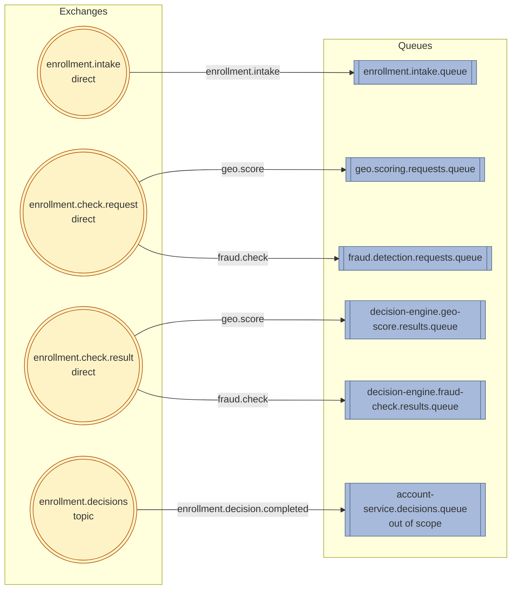
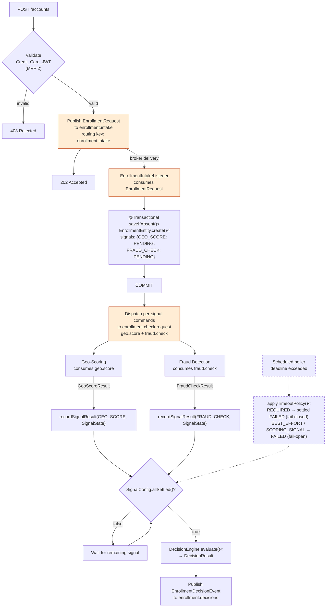

## Decision Engine Design

> **Status.** This document specifies the target design. The synchronous JWT prerequisite
> gate is **not yet implemented in MVP 1** — see ADR-03 / ADR-19. The separate
> `enrollment.decisions` exchange (§Exchange and queue topology), the timeout policy
> (ADR-15, `EnrollmentService.processExpiredTimeouts`), and the decision dispatch outbox
> (ADR-17, `DecisionDispatcher`) are now implemented. Both the timeout finalize and the dispatch
> backstop run as the two phases of a single scheduled `EnrollmentSweepJob` (§Decision outbox and
> dispatch relay).
> The Correlation Record schema, Domain Model, and Decision Engine sections describe what is
> implemented today (ADR-14).

### REST entry point

The REST endpoint is thin. It constructs an `EnrollmentRequest` and publishes it to
the intake exchange. No correlation record is created here, and no business state is
touched.

> **MVP-2 scope.** Synchronous JWT validation (Credit_Card_JWT for CREDIT_CARD,
> eIDAS_JWT for INVOICE) is planned for MVP 2 per ADR-03 and ADR-19. In MVP 1 the
> endpoint accepts requests without a prerequisite gate; the JwtValidator call shown
> below is the target shape for MVP 2.

```java
// decision engine / api / EnrollmentController.java
//
// Target:  JDK 25 / Spring Boot 4.x / Spring AMQP 4.x
// Status:  Reference

@RestController
class EnrollmentController {

    private final JwtValidator jwtValidator;                          // MVP 2
    private final EnrollmentIntakePublisher enrollmentIntakePublisher;

    @PostMapping("/accounts")
    ResponseEntity<Void> accept(@RequestBody EnrollmentCommand command,
                                @RequestHeader("Authorization") String bearerToken) {
        // [MVP 2] Synchronous prerequisite gate — rejected requests never enter
        // the pipeline. See ADR-03 / ADR-19 for the eIDAS JWT contract and the
        // prerequisite gate decision.
        jwtValidator.validate(bearerToken, command.paymentType());

        EnrollmentRequest request = EnrollmentRequest.from(command, UUID.randomUUID());

        enrollmentIntakePublisher.accept(request);

        return ResponseEntity.accepted().build();
    }
}
```

The REST handler forwards incoming requests to the `EnrollmentIntakePublisher`. The
publisher confirm provides the durability guarantee that the broker has accepted the
message before the 202 response is returned. If the publish ultimately fails after
retries, the request surfaces as a 5xx to the client; dead-lettering is described in
§Dead-letter topology.

### Intake Listener and Causal Ordering

The intake listener is the single sequential gatekeeper for the entire pipeline. It drives the
consumer-side idempotency ledger of ADR-13 §Ingress Inversion as a `PENDING → COMPLETED` state
machine. Each database step runs in its own transaction, across separate failure domains:

1. **Persist the correlation record (PENDING)** via `EnrollmentCorrelationService.saveIfAbsent()`,
   an inner `@Transactional` service. The `INSERT … ON CONFLICT (enrollment_id) DO NOTHING` is
   guarded by the primary-key unique constraint and commits before control returns to the listener.
   The row's `intake_status` starts at `PENDING`.
2. **Dispatch the per-signal commands** to `enrollment.check.request`, only after the record is
   durable. The dispatch is idempotent, so a redelivery can repeat it safely.
3. **Transition the ledger to COMPLETED** via `EnrollmentCorrelationService.markIntakeCompleted()`,
   committed before the listener acknowledges the intake message.

This commit-before-publish ordering provides the causal ordering guarantee: no check worker can
observe a command for a correlation record that has not committed.

On redelivery the listener reads the ledger. A record already `COMPLETED` means the previous
delivery dispatched and then crashed before its acknowledgment; the duplicate is acknowledged with
no re-dispatch. A record still `PENDING` means the previous delivery failed before completing the
ledger (the dispatch threw, or the consumer crashed between the dispatch and the COMPLETED commit);
the listener re-dispatches and then completes the ledger. The narrow window between a successful
dispatch and the COMPLETED commit can still emit a duplicate dispatch, which is absorbed by
downstream idempotency rather than prevented.

This dedup covers broker redelivery of a given `enrollmentId`; client-retry idempotency is out of
scope for MVP and would require a client-supplied idempotency key (the `enrollmentId` is minted
server-side per request, so a client retry after a lost `202` yields a distinct `enrollmentId`).

This sequence implements the **Idempotent Consumer pattern** with an explicit completion marker.
Because an unacknowledged message on the intake queue serves as the system-of-record cursor for
active work-in-flight, it side-steps the overhead of a separate engine-side ingress outbox table:
the correlation record itself carries the ledger state.

When a downstream command publish fails post-commit, the exception escaping to the Spring AMQP
container forces a channel negative-acknowledgment (`basic.nack` with `requeue=true`). The
broker-driven redelivery re-enters the `PENDING` branch above and re-attempts the dispatch against
the pre-existing record.

### RabbitMQ dispatch strategy

After committing the correlation record, `EnrollmentIntakeListener` dispatches one command per applicable signal to the
`enrollment.check.request` direct exchange, routed by signal name. The applicable set is derived from
`SignalConfig.initializeFor(paymentType)` — the same source that seeds the correlation record's signal map, so the
dispatch-set and the gather-set are identical by construction.

| PaymentType   | Commands dispatched (routing key → payload)                        |
|---------------|--------------------------------------------------------------------|
| `CREDIT_CARD` | `geo.score` → shipping address; `fraud.check` → enrollment data    |
| `INVOICE`     | `fraud.check` → enrollment data                                    |

Each command carries a least-privilege payload: geo-scoring receives only the shipping address it needs to geocode;
fraud detection receives the full enrollment data. The decision engine owns the `enrollment.check.request` exchange and
the per-signal request queues (`geo.scoring.requests.queue`, `fraud.detection.requests.queue`); check services attach as
`@RabbitListener`s without redeclaring them (ADR-13 §Channel Ownership). Results return on the
`enrollment.check.result` direct exchange, keyed by signal name (`geo.score`, `fraud.check`), into the decision engine's
per-signal result queues (`decision-engine.geo-score.results.queue`, `decision-engine.fraud-check.results.queue`).

There is no Identity queue. The eIDAS Connector issues a signed JWT as a prerequisite
gate validated synchronously by the REST endpoint (MVP 2 — see ADR-03 / ADR-19); it
does not subscribe to RabbitMQ events. Identity is not represented as a signal in the
correlation record's signal map — prerequisites are outside the ADR-14 signal
classification model.

Internal Fraud Detection runs as a stub: the decision engine dispatches `fraud.check` commands to
`fraud.detection.requests.queue`; the fraud worker consumes them, approves unconditionally
(`SignalOutcome.OK`), and replies on `enrollment.check.result`, which `FraudCheckResultListener` records against the
`FRAUD_CHECK` signal. The `FRAUD_CHECK` signal is initialised to `PENDING` on both routes; a real fraud service replaces
the stub with no decision-engine changes.

### Exchange and queue topology

The decision engine coordinates the pipeline over four exchanges. Their rationale and the
ownership model are in ADR-13. This section fixes the concrete topology: exchange and queue
names, routing keys, and dead-letter wiring.


```mermaid
flowchart LR
subgraph Exchanges
    EX_INTAKE(((enrollment.intake<br/>direct))):::ex
    EX_REQ(((enrollment.check.request<br/>direct))):::ex
    EX_RES(((enrollment.check.result<br/>direct))):::ex
    EX_DECISIONS(((enrollment.decisions<br/>topic))):::ex
end
    subgraph Queues
        Q_INTAKE[[enrollment.intake.queue]]:::q
        Q_GEO[[geo.scoring.requests.queue]]:::q
        Q_FRAUD[[fraud.detection.requests.queue]]:::q
        Q_DE_GEO[[decision-engine.geo-score.results.queue]]:::q
        Q_DE_FRAUD[[decision-engine.fraud-check.results.queue]]:::q
        Q_AS[[account-service.decisions.queue<br/>out of scope]]:::q
    end
    EX_INTAKE -->|"enrollment.intake"| Q_INTAKE
    EX_REQ -->|"geo.score"| Q_GEO
    EX_REQ -->|"fraud.check"| Q_FRAUD
    EX_RES -->|"geo.score"| Q_DE_GEO
    EX_RES -->|"fraud.check"| Q_DE_FRAUD
    EX_DECISIONS -->|"enrollment.decision.completed"| Q_AS
    classDef ex fill:#fef3c7,stroke:#b45309
    classDef q fill:#a7badb,stroke:#54698c
```

**Layer 1 — ingress: `enrollment.intake`.** A single publisher and a single consumer (the
decision engine) bound on the fixed routing key `enrollment.intake`. There is no fan-out; this is
the only entry point into the async pipeline. Payment-type differentiation is handled in Layer 2.

**Layer 2 — scatter-gather: `enrollment.check.request` + `enrollment.check.result`.** Two direct
exchanges, one per direction. The decision engine publishes one command per applicable signal on
`enrollment.check.request`, routed by signal name (`geo.score`, `fraud.check`); workers reply on
`enrollment.check.result` keyed by the same names. Direction is encoded by the exchange rather than
the key, so the shared key namespace is unambiguous. The per-signal command and result mapping is
in §"RabbitMQ dispatch strategy". The decision engine owns the request exchange and the per-signal
request queues (`geo.scoring.requests.queue`, `fraud.detection.requests.queue`); results land in
`decision-engine.geo-score.results.queue` and `decision-engine.fraud-check.results.queue`. A worker
attaches a `@RabbitListener` to its request queue by name and does **not** redeclare it — declaring
on both sides risks argument conflicts, and Spring AMQP consumes an existing queue without declaring
it. Because the queue may not exist when the worker starts (it may start before the decision engine,
or in isolation under test), the worker sets `missingQueuesFatal=false` so it retries declaration
instead of failing fatally. The ownership rationale is in ADR-13 §Channel Ownership.

Because the queue may not exist when the worker starts (it may start before the decision engine, or in isolation under
test), the worker sets `missingQueuesFatal=false` so it retries declaration instead of failing fatally.

This reflects a strict architectural constraint: **the decision engine exclusively owns the request command topology** (
`enrollment.check.request` and the individual worker request queues). This point-to-point command paradigm ensures that
the orchestrator retains total authority over its routing boundaries. It structurally decouples deployment life cycles:
if a specific check worker service is offline during a deployment window, the engine can still safely dispatch commands;
the broker accumulates them on the engine-owned request queue without returning unroutable errors.

**Layer 3 — outbound: `enrollment.decisions`.** A single logical publisher (the decision engine) on
a dedicated topic exchange with routing key `enrollment.decision.completed`. The Account Service consumes it
and owns `account-service.decisions.queue`, whose binding and DLX are out of scope. The publish is
not a direct send from the result handler or the timeout poller: the decision is computed once and
persisted on the correlation record, then dispatched through one shared path (`DecisionDispatcher`)
with two triggers — an after-commit eager dispatch owning steady-state latency, and the
`EnrollmentSweepJob` dispatch phase claiming decided-but-undispatched rows as the durability backstop.
Both publish with Publisher Confirms and mark the row dispatched only after the confirm returns
(ADR-17). The backstop reads from the database, not a queue, so it adds no internal queue or DLQ of
its own.

#### Dead-letter topology

Each consumer queue is paired with a dedicated direct DLX and DLQ. Naming convention: `<queue>.dlq`
for the dead-letter queue and `<service>.dlx` for its DLX. All entries are durable.

| Live queue                                    | DLX                                         | DLQ                                               | Owner — declares (consumed by)                 |
|-----------------------------------------------|---------------------------------------------|---------------------------------------------------|------------------------------------------------|
| `enrollment.intake.queue`                     | `enrollment.intake.dlx`                     | `enrollment.intake.queue.dlq`                     | decision-engine                                |
| `geo.scoring.requests.queue`                  | `geo.scoring.requests.dlx`                  | `geo.scoring.requests.queue.dlq`                  | decision-engine (consumed by geo-scoring)      |
| `fraud.detection.requests.queue`              | `fraud.detection.requests.dlx`              | `fraud.detection.requests.queue.dlq`              | decision-engine (consumed by fraud-detection)  |
| `decision-engine.geo-score.results.queue`     | `decision-engine.geo-score.results.dlx`     | `decision-engine.geo-score.results.queue.dlq`     | decision-engine                                |
| `decision-engine.fraud-check.results.queue`   | `decision-engine.fraud-check.results.dlx`   | `decision-engine.fraud-check.results.queue.dlq`   | decision-engine                                |
| `account-service.decisions.queue`             | (owned by account-service)                  | (owned by account-service)                        | account-service *(out of scope)*               |

The outbound `enrollment.decisions` exchange has no decision-engine-side DLQ: the decision engine is
the producer there, and undelivered decisions are retained on the correlation-record outbox until
the relay confirms publication (ADR-17) rather than dead-lettered. The consuming queue's DLX is the
account service's concern.

#### Delivery guarantees

The guarantee model and its reasoning are in ADR-13 §Delivery & Concurrency Guarantees. The enforcement points:

| Guarantee                                   | Mechanism                                                                                  | Consumer obligation                          |
|---------------------------------------------|--------------------------------------------------------------------------------------------|----------------------------------------------|
| At-least-once delivery (all channels)       | Publisher Confirms + mandatory routing                                                     | Idempotent receiver on natural key           |
| Causal ordering (record before trigger)     | Commit-before-publish in intake listener                                                   | N/A — enforced by producer                   |
| Exactly-once decision **computation**       | Row-level pessimistic locking + completion predicate; one decider (result handler or timeout poller) records the decision | N/A — enforced by aggregator                 |
| At-least-once decision **delivery**         | Persist-then-publish outbox on the correlation record + eager after-commit dispatch + relay with Publisher Confirms (ADR-17) | Idempotent receiver on `decisionId` (frozen at decide time; replays are byte-identical) |
| Poison-pill containment                     | DLX after bounded retry                                                                    | Ops review, manual replay                    |

### Correlation Record

```
enrollment_hub.enrollments
  - enrollment_id           UUID         PRIMARY KEY   ← idempotency key for intake redelivery; never published downstream
  - payment_type         VARCHAR(20)  NOT NULL       ← CREDIT_CARD | INVOICE — routing discriminator
  - original_request     JSONB        NOT NULL       ← full enrollment data captured at intake; forwarded in EnrollmentDecisionEvent
  - signals              JSONB        NOT NULL       ← Map<<SignalConfig, SignalState>; only applicable signals are present
  - intake_status        VARCHAR(20)  NOT NULL       ← intake idempotency ledger: PENDING → COMPLETED (ADR-13 §Ingress Inversion); default 'PENDING'
  - decision_result      VARCHAR(30)  NULL          ← APPROVED | REJECTED | CONDITIONAL_APPROVED — set when all signals settle
  - decision_id          UUID         NULL          ← fresh UUID generated at decision time; published instead of enrollment_id
  - created_at           TIMESTAMPTZ  NOT NULL
  - timeout_at           TIMESTAMPTZ  NOT NULL
  - decided_at           TIMESTAMPTZ  NULL
  - dispatched_at        TIMESTAMPTZ  NULL          ← outbox marker (ADR-17): stamped after the publisher confirm; decided + NULL = awaiting delivery

Indexes:
  - idx_enrollments_timeout_undecided  (timeout_at) WHERE decision_result IS NULL   ← timeout poller (ADR-15)
  - idx_enrollments_signals_jsonb      GIN (signals)
  - idx_enrollments_undispatched       (decided_at) WHERE decision_result IS NOT NULL AND dispatched_at IS NULL   ← dispatch relay (ADR-17)
```

The `enrollment_id` PRIMARY KEY is what makes the intake listener idempotent against
broker redelivery. It is not optional — without it, a redelivered intake message
could create a duplicate correlation row, which would in turn produce duplicate
check commands and have the signal services run twice for the same
request.

`decision_id` is a freshly generated UUID set when the decision is recorded; it is
published in `EnrollmentDecisionEvent` *instead of* `enrollment_id` to avoid exposing
the internal correlation primary key.

Absent fields by design:
- **No per-signal status / result columns.** All signal state lives in the
  `signals` JSONB map keyed by `SignalConfig` (ADR-14). Adding a new signal does
  not require a schema migration.
- **No `payment_token_status` / `identity_check_status`.** Prerequisite gates are
  resolved synchronously at the REST entry point (MVP 2) and never enter the
  signal map.
- **No `overall_status`.** Completeness is derived from the `signals` map via
  `SignalConfig.allSettled(signals)`; "decided" is implied by
  `decision_result IS NOT NULL`.
- **No `decision_reason`.** The ADR-14 model captures decision drivers as the
  settled `signals` map on the decision event; no separate reason enum is kept.

### Signal-map persistence pattern

The `signals` JSONB column is written via explicit `UPDATE` statements
issued through the repository — **not** via in-place mutation of a
JPA-mapped `Map` field. The architectural rationale (and the failure mode
this protects against) lives in **ADR-16 §"Write path — explicit `UPDATE`
for the JSON-mapped column"**. This section covers the JPA implementation.

**Service flow.** The handler copies the entity's signal map, records the
arriving result in the copy, serialises it
via the injected `JsonMapper`, and calls `updateSignals(...)` inside the
same `@Transactional` boundary that holds the row lock from ADR-16. The
returned row count is asserted to be `1`; any other value throws — the row
not being present is structurally impossible because the load + lock at the
top of the handler has already proven its existence. When the completion
predicate fires, `recordDecision(...)` follows the same shape: row-count
checked, mismatches handled (logged and the publish skipped — the guard
implies another path already recorded the decision).

**Re-reading the entity after the UPDATE is unsupported.** Hibernate's L1
cache still holds the loaded entity with its pre-UPDATE state; refreshing
it would require an explicit `EntityManager.refresh(...)` and an extra
round-trip. The service does not re-read — the new state is the
application's input to the `UPDATE` and the canonical reference for the
downstream `DecisionEventMapper`. This is the pattern callers follow
elsewhere when adopting the convention.

**Regression test.** `EnrollmentRepositoryIT$UpdateSignals` round-trips the
column through real PostgreSQL: write a map via `updateSignals(...)`, read
the raw JSONB back via JdbcTemplate, deserialise, assert structure equality.
A second test verifies that a follow-up UPDATE **replaces** the previous
JSON wholesale rather than merging — important because a `jsonb_set`-style
partial update would be a different operation with different concurrency
semantics. The companion test for `recordDecision` proves the
`decisionResult IS NULL` guard prevents a second write from overwriting an
existing decision.

> **Do not** "simplify" this back to `signals.put(...)` mutation under the
> assumption that JPA dirty-tracking handles it. It does today, on this
> Hibernate version, by `MutabilityPlan` resolution rather than by JPA
> contract — see ADR-16 §Write path for the full rationale and the failure mode that
> the explicit `UPDATE` protects against.

### Repository: two locking idioms

The `EnrollmentRepository` exposes two methods that both take row-level locks
but with **opposite** semantics. Both are intentional. Picking the wrong one
for a given call site would either re-introduce the ADR-16 lost-update race
(no lock) or undermine poller throughput (lock with WAIT instead of SKIP).
The architectural rationale for choosing WAIT vs SKIP lives in
ADR-13 §"Delivery & Concurrency Guarantees"; this section covers the JPA implementation.

**Why the `"-2"` literal.** `@QueryHint(value = ...)` requires a compile-time
`String` constant; the Jakarta Persistence sentinel for `SKIP LOCKED` is the
integer `-2` (matching `org.hibernate.LockOptions.SKIP_LOCKED`). There is no
way to reference the typed Hibernate constant from the annotation, so the
literal appears in the source. The next paragraph explains how a future
reader is protected from "simplifying" it.

**Regression test.**
`SkipLockedClaimIT.skipsRowsLockedByAnotherTransaction` pins the runtime
behaviour empirically: it holds a `PESSIMISTIC_WRITE` on one row from a
second thread and asserts the claim query returns only the *other* row. A
`@Timeout` on the test method turns the regression "the hint was silently
lost or its sentinel value changed" — which would otherwise manifest as
the claim query blocking on the lock indefinitely — into a fast, loud test
failure. If a future Hibernate major version reassigns the SKIP LOCKED
sentinel or renames the hint property, this test catches it.

These two behaviors map directly to SQL syntax options executed against PostgreSQL:

1. **`findByEnrollmentIdForUpdate`** compiles to a standard `SELECT ... FOR UPDATE`. It uses blocking **WAIT** semantics
   because incoming concurrent signals for the same enrollment must serialize sequentially. The second arriving thread
   must block until the first thread commits its signal changes and releases the row lock, ensuring that the completion
   predicate evaluates against a fully updated, fresh snapshot of all preceding signals.
2. **The `EnrollmentSweepJob` phases** (`claimUndispatched` for dispatch, `claimPendingTimeouts` for timeouts)
   utilize the Hibernate sentinel to generate
   `SELECT ... FOR UPDATE SKIP LOCKED`. The **SKIP LOCKED** modifier prevents a background engine poller from blocking
   behind an active result handler thread. If a result handler is currently updating a row, the poller gracefully
   bypasses it, preventing thread starvation across instances and allowing the engine to maintain a flat, scale-agnostic
   scheduling throughput.

> **Do not** add the `SKIP LOCKED` hint to `findByEnrollmentIdForUpdate`.
> Result handlers on the same row must serialise; ADR-16 §"Decision"
> requires the second handler to observe the first handler's committed
> state. `SKIP LOCKED` there would change the semantics from "wait" to
> "return empty if locked," which would silently drop signal results that
> arrived concurrently.

### Correlation Record Domain Model

The correlation record is modeled per ADR-14's Signal Classification Model. The JPA
entity (`EnrollmentEntity`) holds the persisted state; the signal map it carries is the
unit of domain state, and the domain types below describe that map's shape and
aggregation metadata. The map is never mutated in place — the service layer computes a
replacement and persists it by explicit `UPDATE` (ADR-16 §Write path).

**Domain types** (`decision-engine/domain`):

| Type                       | Role                                                                                                 |
|----------------------------|------------------------------------------------------------------------------------------------------|
| `SignalProcessingState`    | Lifecycle: `PENDING`, `SETTLED`, `FAILED` (timeout or crash)                                         |
| `SignalOutcome`            | Check-style result: `OK`, `FAILED`, `NO_RESULT` (used by `BEST_EFFORT` / `REQUIRED` signals)         |
| `RiskLevel`                | Score-style result: `LOW`, `MEDIUM`, `HIGH`, `EXTREME` (used by `SCORING_SIGNAL` signals)            |
| `GateClassification`       | Aggregation metadata: `REQUIRED`, `BEST_EFFORT`, `SCORING_SIGNAL` (ADR-14)                          |
| `SignalConfig`             | Enum of signals — declares applicable routes + classification (`GEO_SCORE`, `FRAUD_CHECK`)           |
| `SignalState`              | Flat record: `(processingState, outcome, riskLevel, reason)` — serialises trivially to JSONB         |
| `DecisionResult`           | Domain decision: `APPROVED`, `REJECTED`, `CONDITIONAL_APPROVED`                                      |
| `EnrollmentDecisionResult` | Wrapper carrying the `DecisionResult` returned from the engine                                       |

**Signal initialization by route** — built by `SignalConfig.initializeFor(PaymentType)`.
Only applicable signals are present; absence from the map means *not applicable* on
this route (no sentinel value):

| PaymentType   | GEO_SCORE | FRAUD_CHECK |
|---------------|-----------|-------------|
| `CREDIT_CARD` | `PENDING` | `PENDING`   |
| `INVOICE`     | *absent*  | `PENDING`   |

Prerequisite gates (Credit_Card_JWT, eIDAS_JWT) are resolved synchronously at the
REST entry point (MVP 2 — ADR-03 / ADR-19). They produce no entry in the signal
map.

**Scatter-gather flow (CREDIT_CARD route):**


```mermaid
flowchart TD
    POST["POST /accounts"] --> validate{"Validate<br/>Credit_Card_JWT<br/>(MVP 2)"}
    validate -- invalid --> reject["403 Rejected"]
    validate -- valid --> intakePub["Publish EnrollmentRequest<br/>to enrollment.intake<br/>routing key: enrollment.intake"]
    intakePub --> http202["202 Accepted"]

    intakePub -.->|broker delivery| intakeListen["EnrollmentIntakeListener<br/>consumes EnrollmentRequest"]
    intakeListen --> startTx["@Transactional saveIfAbsent()<<br/>EnrollmentEntity.create()<<br/>signals: {GEO_SCORE: PENDING,<br/>FRAUD_CHECK: PENDING}"]
    startTx --> commit["COMMIT"]
    commit --> postCommit["Dispatch per-signal commands<br/>to enrollment.check.request<br/>geo.score + fraud.check"]

    postCommit --> geo["Geo-Scoring<br/>consumes geo.score"]
    postCommit --> fraud["Fraud Detection<br/>consumes fraud.check"]

    geo -- "GeoScoreResult" --> wGeo["recordSignalResult(GEO_SCORE, SignalState)"]
    fraud -- "FraudCheckResult" --> wFraud["recordSignalResult(FRAUD_CHECK, SignalState)"]

    wGeo --> complete{"SignalConfig.allSettled()?"}
    wFraud --> complete

    complete -- "false" --> wait["Wait for remaining signal"]
    wait --> complete

    complete -- "true" --> decision["DecisionEngine.evaluate()<<br/>→ DecisionResult"]
    decision --> event["Publish EnrollmentDecisionEvent<br/>to enrollment.decisions"]

    timeout["Scheduled poller<br/>deadline exceeded"] -.-> wTimeout["applyTimeoutPolicy()<<br/>REQUIRED → settled FAILED (fail-closed)<br/>BEST_EFFORT / SCORING_SIGNAL → FAILED (fail-open)"]
    wTimeout -.-> complete

    style timeout stroke-dasharray: 5 5
    style wTimeout stroke-dasharray: 5 5
    style intakePub fill:#ffedd5,stroke:#c2410c
    style intakeListen fill:#ffedd5,stroke:#c2410c
    style postCommit fill:#ffedd5,stroke:#c2410c
```

**Completion predicate:** `SignalConfig.allSettled(signals)` returns `true` when every
signal present in the map has settled (`processingState ≠ PENDING`). Signals not present
in the map are by definition not applicable to the route and contribute nothing to the
predicate. `EnrollmentEntity.isComplete()` delegates to it.

**Signal-map transitions.** The map is the unit of state, and every transition replaces it
wholesale rather than mutating it in place (ADR-16 §Write path). The transitions are applied
by the service layer on the entity's map:

| Transition                                | Applied by                                  | Effect                                                                                                                          |
|-------------------------------------------|---------------------------------------------|---------------------------------------------------------------------------------------------------------------------------------|
| `SignalConfig.initializeFor(paymentType)` | `EnrollmentEntity.create(...)` at intake    | Seeds the map with every applicable signal `PENDING`                                                                            |
| copy-and-replace on the arriving signal   | `EnrollmentService.recordSignalResult`      | Records the result in a copy of the map; the copy is serialised and persisted by explicit `UPDATE`                              |
| `applyTimeoutPolicy(signals)`             | `EnrollmentService.processExpiredTimeouts` (ADR-15) | Per classification: `REQUIRED` settles with outcome `FAILED` (fail-closed); `BEST_EFFORT` / `SCORING_SIGNAL` become `FAILED` (fail-open). Terminal signals unchanged |
| `SignalConfig.allSettled(signals)`        | After any transition                        | True when every applicable signal has settled (`processingState ≠ PENDING`)                                                     |

**Design decisions:**

- **Two flat result fields per signal.** `SignalState` carries both `outcome` and
  `riskLevel`; exactly one is populated per classification (check-style fills
  `outcome`, score-style fills `riskLevel`). Trade-off documented in ADR-14:
  preferred over a sealed type hierarchy for trivial JSONB serialisation.
- **Absence over sentinel.** Inapplicable signals are missing from the map; there
  is no `NOT_APPLICABLE` enum value. `NO_RESULT` outcomes and null `riskLevel`
  represent "settled but no value" — no `NOT_AVAILABLE` sentinel on the result
  enums.
- **Whole-map replacement over in-place mutation.** A transition builds a new signal
  map and persists it by explicit `UPDATE`; the JSONB column is never dirty-tracked.
  ADR-16 §Write path covers the failure mode this avoids.
- **Compatibility with contracts module.** Domain result enums (`SignalOutcome`,
  `RiskLevel`, `DecisionResult`) are a subset of the contracts enums. The contract
  enums may carry additional values that the decision-engine domain does not need.
  `EnumCompatibilityTest` asserts the subset relationship (ADR-06).
- **Extensibility.** Adding a new signal requires (1) declaring a new `SignalConfig`
  value with its applicable routes and `GateClassification`, (2) a request builder and
  request queue so the decision engine dispatches its command, (3) a result listener
  that records the reply, and (4) the worker itself as a pure listener. The aggregation
  logic is untouched — dispatch is on `GateClassification`, not on signal identity — and
  no schema migration is required for the JSONB `signals` column.

**Event contracts** are defined as Java records in the shared `enrollment-hub:contracts`
module (ADR-06). The canonical field definitions for the per-signal request commands
(`GeoScoreRequest`, `FraudCheckRequest`), the result events (`GeoScoreResult`,
`FraudCheckResult`), and `EnrollmentDecisionEvent` live in that module. The `SignalProcessingState`, `SignalConfig`, and `GateClassification` types
are decision-engine-internal and not part of the shared contract. `EnrollmentRequest`
is also decision-engine-internal — it flows only between the REST endpoint and
`EnrollmentIntakeListener` and is not consumed by any other service.

### Decision Engine

`DecisionEngine.evaluate(signals, enrollmentId)` takes a fully-settled signal map
and returns an `EnrollmentDecisionResult`. It is a pure domain function — no Spring
dependencies, no I/O. After evaluation, the service layer maps the result to the
contracts `EnrollmentDecisionEvent` and publishes it to `enrollment.decisions`.

**The engine is route-agnostic.** It iterates the signal map and dispatches on each
signal's `GateClassification`, accumulating two booleans:

| `GateClassification` | Trigger condition (state must be `SETTLED`) | Accumulator             |
|----------------------|---------------------------------------------|-------------------------|
| `BEST_EFFORT`        | `outcome == FAILED`                         | `rejected = true`       |
| `REQUIRED`           | `outcome == FAILED`                         | `rejected = true`       |
| `SCORING_SIGNAL`     | `riskLevel ∈ {HIGH, EXTREME}`               | `reviewRequired = true` |

Resolution after the loop, in priority order:

1. `rejected` → `REJECTED`
2. else `reviewRequired` → `CONDITIONAL_APPROVED`
3. else → `APPROVED`

**Fail-open by omission.** A `FAILED` processing state (timeout or crash) and a
SETTLED no-result (e.g. geocoding failure, `NO_RESULT` outcome, null `riskLevel`)
contribute nothing to either accumulator. No explicit fail-open branch is needed.

**Asymmetric guarantee** (ADR-14): `SCORING_SIGNAL` signals cannot drive
`REJECTED`. Enforced by control flow — the scoring branch can only set
`reviewRequired`; the `rejected` accumulator is physically unreachable from that
branch. A future change proposing a scoring signal drive rejection would require a
visible edit to that branch.

**`REQUIRED` classification** has no current assignment. It is reserved for future
fail-closed signals (e.g. sanctions screening, regulated KYC). On timeout these fail
*closed* rather than open: `applyTimeoutPolicy` (ADR-15) settles a still-`PENDING`
`REQUIRED` signal with outcome `FAILED` instead of marking it `FAILED` processing
state, so aggregation sees an explicit `FAILED` outcome and drives `REJECTED`. A
missing required check rejects; a missing `BEST_EFFORT`/`SCORING_SIGNAL` check fails
open.

**Guards:**

- `evaluate()` throws `IllegalStateException` if `isComplete()` returns `false` —
  the engine must never be called on an in-flight record.
- The aggregation loop throws `AggregationPreconditionException` if it encounters a
  `PENDING` signal — that would indicate a bug in the completion predicate.

**Pure function.** No state, no side effects. The service layer calls `evaluate()`
after `isComplete()` returns true, then maps `EnrollmentDecisionResult` and the
settled signal map into the contracts `EnrollmentDecisionEvent` for publishing.

### Decision outbox and dispatch relay

> Implemented (`DecisionDispatcher`, with the after-commit eager trigger registered by
> `EnrollmentService.finalizeDecision` and the scheduled backstop running as the dispatch phase of
> `EnrollmentSweepJob`). The rationale — why commit-then-publish, and why the correlation row is the
> outbox — is in ADR-17; the single-marker, eager-trigger, and single-sweep decisions below are
> recorded in ADR-17 §Amendment.

Deciding and dispatching are separated and ordered commit-then-publish, with the correlation record
itself serving as the transactional outbox. No separate outbox table is introduced.

**Decide — under the row lock, by whichever component completes the row.** The result handler or the
sweep's timeout phase settles its signal, evaluates the completion predicate (§Correlation Record Domain
Model), and if complete computes the decision (ADR-14) and writes the decision payload — including
the frozen `decision_id` and `decided_at` — onto the row, then commits. Neither component publishes;
the decide step registers the eager dispatch trigger for after its commit.

```
finalizeIfComplete(row):                 -- shared by handler and timeout phase, under the row lock
  if completionPredicate(row.signals):
      row.decision    := aggregate(row.signals)   -- ADR-14
      row.decision_id := fresh UUID               -- frozen here; every publish replays it
      row.decided_at  := now()
      register afterCommit → dispatch(row)        -- eager trigger; fires once the commit is durable
  -- COMMIT;  (handler only) ACK the inbound result message
```

**Dispatch — one shared path (`DecisionDispatcher`), two triggers.** The after-commit hook
dispatches eagerly (milliseconds after the decide commit, off the row lock; failures are logged,
never rethrown — the commit is already durable). The dispatch phase of the `@Scheduled`
`EnrollmentSweepJob` sweeps decided-but-undispatched rows on a loose interval as the durability
backstop: it only finds work after an eager publish failed or a crash hit the commit-to-publish gap.
Both publish, await the publisher confirm, and only then stamp `dispatched_at`.

```
claim = SELECT * FROM correlation
        WHERE decision_result IS NOT NULL AND dispatched_at IS NULL
        ORDER BY decided_at
        FOR UPDATE SKIP LOCKED
        LIMIT batch
for row in claim:
    publish EnrollmentDecisionEvent(row.decision)   -- Publisher Confirms; replays row.decision_id
    await confirm
    UPDATE correlation SET dispatched_at = now()
     WHERE id = row.id AND dispatched_at IS NULL    -- guard: eager and relay cannot double-stamp
```

**Markers on the correlation row.**

- `decision_result` / `decision_id` — the aggregated decision and its published identity, frozen in
  the decide transaction; never recomputed. `decision_id` is the consumer-side dedup key.
- `decided_at` — set in the same UPDATE; doubles as the outbox-ready marker (the sketched
  `ready_for_dispatch_at` was folded into it — same transaction, same information, ADR-17
  §Amendment). `dispatched_at − decided_at` is dispatch latency;
  `now() − decided_at > threshold AND dispatched_at IS NULL` is the stuck-outbox alert.
- `dispatched_at` — set after the publisher confirm; predicate "delivered to the broker." Guarded
  (`IS NULL`) so the two triggers racing on one row produce at most a byte-identical duplicate,
  never a double-stamp.

**Ordering rule.** Publish → await confirm → stamp `dispatched_at`. Never stamp before the confirm: a
nacked publish would otherwise look delivered and the row would never be re-claimed, losing the
decision.

**Retention ordering.** Any cleanup of terminal rows deletes only rows with `dispatched_at IS NOT
NULL`, never a row in the `decision_result NOT NULL, dispatched_at NULL` outbox state, which is
the dispatch phase's durable work item.

**Crash-window recovery.**

| Crash point | State after crash | Recovery |
|---|---|---|
| Before the decide-commit | signal write and decision both roll back | inbound result redelivers (handler) or the row stays `PENDING` (timeout phase); nothing was emitted |
| After decide-commit, before publish | `decision_result NOT NULL, dispatched_at NULL` | the sweep's dispatch phase re-claims next tick and publishes |
| After publish, before `dispatched_at` | message on broker, `dispatched_at` NULL | the sweep's dispatch phase re-claims and re-publishes; duplicate absorbed by consumer idempotency |

In every case dispatch re-reads the frozen `decision_result` / `decision_id` and never recomputes,
so recovery yields only byte-identical duplicates — which is what makes `decisionId` a valid
consumer-side dedup key.

**One sweep, two phases.** The dispatch backstop is not a job of its own: it runs as the second
phase of `EnrollmentSweepJob`, after the timeout-finalize phase (ADR-15). Because the eager trigger
owns steady-state delivery latency, the backstop is latency-insensitive — the same loose class as
timeout detection — so both share one `@Scheduled` cadence. The phases keep separate transactions
(each a distinct `@Transactional` service call per batch) and are contained independently, so a
broker outage in the dispatch phase does not block timeout processing and a DB hiccup in the timeout
phase does not skip the dispatch backstop. Timeouts run first so a row decided this tick can be
backstopped in the same tick. This merge is valid *because* eager dispatch exists; removing it would
make the backstop latency-sensitive again and warrant splitting it back onto its own schedule.

**Two claim queries, not one.** Sharing a job does not mean sharing a query. The timeout claim
(`decision_result IS NULL AND timeout_at <= now`) and the dispatch claim (`decision_result IS NOT
NULL AND dispatched_at IS NULL`) select disjoint rows — undecided versus decided — so there is
nothing to collapse: they already scan different rows through different partial indexes
(`idx_enrollments_timeout_undecided`, `idx_enrollments_undispatched`) and sort differently
(oldest-deadline versus oldest-decided). A single `OR` claim was rejected because it would lock both
populations in one transaction — dragging network-bound publishing back into the DB-only finalize
transaction and re-coupling the failure domains — and because one `LIMIT` would let one phase's
backlog starve the other. The rationale is in ADR-17 §Amendment.

**Configuration.** `decision-engine.sweep.interval` and `.batch-size` tune the sweep; the interval
is the shared cadence (default 10s, the tighter timeout requirement), not delivery latency — the
eager trigger owns the steady state, so the dispatch phase is a single probe of the (almost always
empty) partial index. `EnrollmentSweepIT` covers both phases against real infrastructure and pins
the no-recompute property — the routine proof of the recovery path, which the eager trigger
otherwise leaves cold.

### Operational metrics

Three signals are wired into the Prometheus rules (`monitoring/prometheus/rules/`), each backing
one of this document's guarantees.

The first, `decisionengine_publish_failures_total` (tagged `reason=nack|returned`), increments
whenever a publisher confirm fails on any decision-engine publish — a broker nack or an
unroutable return under mandatory publishing. It does not count every dispatch failure: a
connection loss during the check-command dispatch throws without a confirm callback, nacks the
intake message, and surfaces through broker redelivery instead. Sustained increments indicate
broker instability or a missing binding (`DecisionPublishFailures` alert).

The second is DLQ depth, `rabbitmq_dlq_depth` (tagged by `queue`, gauged in
`RabbitDlqMetricsConfig`), which captures messages that exhausted their retry budget — or were
fast-routed on a non-retryable failure — without succeeding. Non-zero depth requires manual
inspection (`DlqNonEmpty` alert; procedure in `docs/runbook-dlq-replay.md`).

Together these cover the residual orphan-record window described in architecture document §8:
a correlation record exists but the check commands were not dispatched. A confirm-level failure
shows on the counter; every other dispatch failure ends, after redelivery, either in success or
on the intake DLQ. If the counter is flat and the DLQs are empty, no orphan records exist.

The third is the ADR-17 outbox signal, `decisionengine_outbox_oldest_age_seconds`
(`OutboxMetricsConfig`) — the age of the oldest decided-but-undispatched row. Zero in steady
state (the eager dispatch drains the outbox within milliseconds); growth means both emission
triggers are failing and fires `StuckDecisionOutbox` before downstream consumers notice missing
decisions.

### Security

The REST entry point is an OAuth2 **resource server**. It validates bearer JWTs issued by the
[authorization-server](../authorization-server) via its `jwk-set-uri` (no issuer discovery at startup,
so the service boots offline and the Testcontainers ITs need no IdP). `POST
/enrollment/public/v1/enrollments` requires the `enrollment:write` scope; actuator
health/info/prometheus and the OpenAPI docs stay public. The [gateway](../gateway) performs the user
login and relays the access token here via its `TokenRelay` filter — the decision-engine never calls
the IdP except to fetch signing keys. See `config/SecurityConfiguration`.
