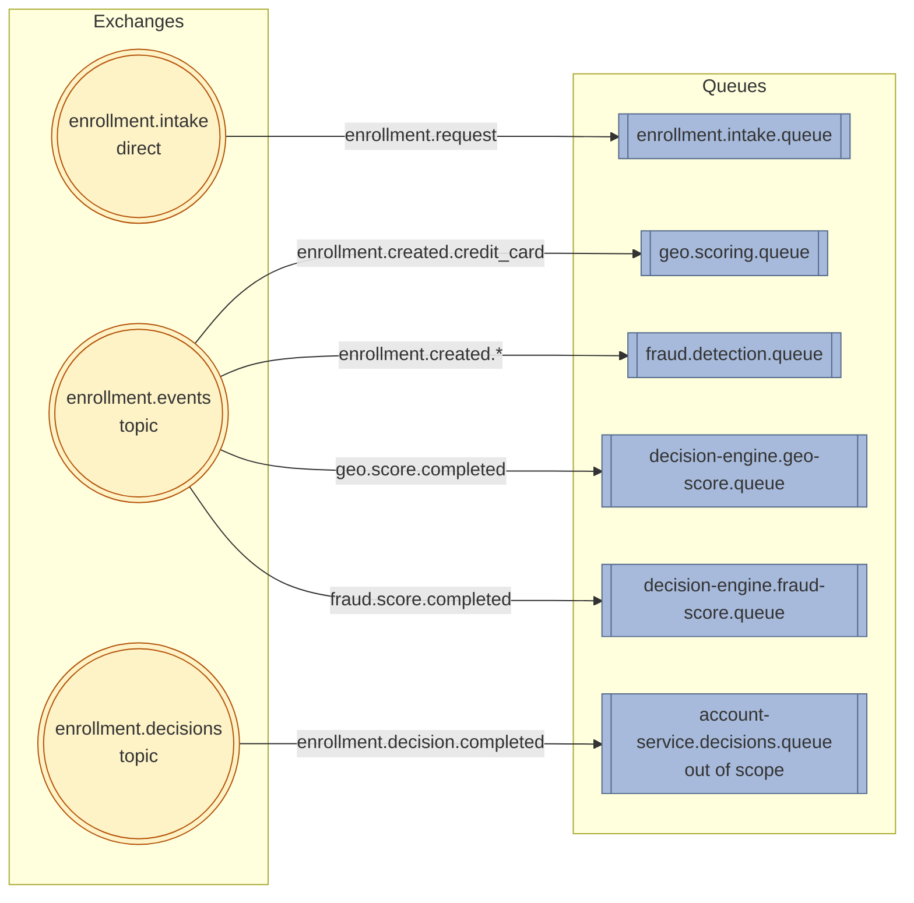

## ADR-003: Enrollment Pipeline — Messaging Architecture

**Status:** Accepted  
**Date:** May 2026

---

### Context

#### Why scatter-gather within each route, not sequential

Fraud detection is an open-ended problem. The initial two checks (route-specific geo-scoring + internal fraud detection)
are not expected to be the final set. Device fingerprinting, IP clustering, email domain analysis, velocity checks, and
shipping address history are all plausible future additions — each a separate signal source, independently maintained.
Scatter-gather is the extensibility seam that accommodates this growth without modifying the decision engine per new
check.

Sequential dispatch would require explicit orchestration per check, separate timeout management, and result threading
through a chain. Coordination complexity scales with check count; scatter-gather absorbs it via the pattern.

Latency reduction and failure isolation follow from parallel execution: total latency is bounded by the slowest check,
not their sum. A failure in one check does not block another. The fail-open policy applies per signal independently.

#### Why asynchronous messaging, not synchronous HTTP with circuit breaker

Synchronous dispatch is incompatible with the async end-to-end constraint: the user submits data and receives a decision
later by email. Holding HTTP connections across minutes of external check latency (geocoding) is impractical. More
critically, synchronous dispatch does not survive process restarts mid-pipeline — a restart after dispatching but before
receiving results loses track of in-flight checks. The durable correlation record is the durability mechanism; it only
functions correctly in an async, event-driven model.

---

### Decision

```
Decision:        Three-layer messaging architecture: intake (point-to-point ingress),
                 internal pipeline (topic-exchange scatter-gather), and decisions
                 (outbound delivery to account service).
                 
Solves:          Route-appropriate fraud detection; failure isolation; parallel check
                 execution; durability across process restarts; causal ordering
                 guarantee between correlation INSERT and check-service delivery;
                 broker-backed crash recovery at the entry point; low-friction
                 extensibility path for new checks; poison pill containment.
                 
Doesn't solve:   Checks with sequential dependencies (check B requires check A's
                 output); compensation logic for reversing approved enrollments after
                 late scores arrive.
                 
Trade-off:       Three exchanges instead of one; intake layer adds one queue and one
                 listener; DLQ per queue adds ops monitoring responsibility.
                 
Simpler first:   Sequential HTTP dispatch with circuit breaker is simpler but
                 incompatible with the async pipeline constraint and does not survive
                 process restarts. A flat scatter-gather (all checks on all routes)
                 is simpler but contaminates signal spaces. A single exchange without
                 an intake layer eliminates the causal ordering guarantee.
                 
Simplicity gate: Would a single service solve this? No — failure isolation is a hard
                 quality goal. Geo-scoring failure must not block enrollment.
                 That constraint alone justifies the service boundary and async model.
```

---

### Causal Ordering at the Entry Point

The pipeline entry point inverts the classic dual-write problem. Rather than committing a database record and publishing
an event within the same request thread — a pattern with no cross-system transaction coordinator — the REST endpoint
performs a single, broker-durable write. It publishes the enrollment intent to a point-to-point intake queue and returns
`202 Accepted`. The database correlation record is created later, by a consumer, after the message has been durably
handed off to the broker.

This inversion makes the intake queue the **system of record for work-in-flight**. The broker's at-least-once delivery
contract replaces the need for an outbox table or a relay poller: an unacknowledged message is the only cursor of
unprocessed work.This is a variant of the Idempotent Consumer pattern (Hohpe & Woolf, Enterprise Integration Patterns):
the queue provides durability and at-least-once delivery, while the consumer ensures exactly-once processing via an
idempotency guard on its side — in this case, a database unique constraint on the request identifier.

The intake listener is the single sequential gatekeeper for the entire pipeline. It commits the correlation record
before publishing the downstream trigger event. This commit-before-publish sequence provides the **causal ordering
guarantee**: no check service on the internal bus can observe a trigger event for a correlation record that has not yet
committed. The database is the authority; the event bus is the notification.

If the downstream publish fails, the exception propagates to the AMQP container, which negative-acknowledges the intake
message and triggers broker redelivery. The listener re-executes the idempotency guard (unique constraint on the request
identifier), detects the already-persisted record, and retries the publish. This provides at-least-once intake
processing with exactly-once correlation persistence, without distributed transactions or outbox infrastructure.

The trade-off accepted is a small volume of duplicate trigger events on the internal bus during redelivery. This is
harmless because all downstream consumers are designed to be idempotent. The alternative — a transactional outbox with
relay polling — is reserved for volume envelopes where broker redelivery latency or duplicate internal traffic becomes
operationally significant.

---

### Exchange and Queue Topology



#### Layer 1 — Ingress: `enrollment.intake`

Single publisher. Single consumer (decision-engine), bound on the fixed routing key `enrollment.request`. No fan-out:
the only entry point into the async pipeline. Payment-type differentiation is the concern of Layer 2.

#### Layer 2 — Internal Pipeline: `enrollment.events`

Multiple publishers (decision-engine, geo-scoring, fraud-detection). Multiple consumers across services. Topic exchange
routes by payment type (`enrollment.created.*`) on the trigger path and by result type (`geo.score.completed`,
`fraud.score.completed`) on the return path.

#### Layer 3 — Outbound: `enrollment.decisions`

Single publisher (decision-engine), publishing to the dedicated `enrollment.decisions` topic exchange with routing key
`enrollment.decision.completed`. Consumed by the account service, which owns `account-service.decisions.queue` — its
binding and DLX configuration are out of scope.

---

### Dead-Letter Topology

Each consumer queue is paired with a dedicated direct DLX and DLQ. Naming follows the convention: `<queue>.dlq` for the
dead-letter queue, `<service>.dlx` for its DLX. All entries below are durable.

| Live queue                            | DLX                                 | DLQ                                       | Owner                            |
|---------------------------------------|-------------------------------------|-------------------------------------------|----------------------------------|
| `enrollment.intake.queue`             | `enrollment.intake.dlx`             | `enrollment.intake.queue.dlq`             | decision-engine                  |
| `geo.scoring.queue`                   | `geo.scoring.dlx`                   | `geo.scoring.queue.dlq`                   | geo-scoring                      |
| `fraud.detection.queue` †             | `fraud.detection.dlx` †             | `fraud.detection.queue.dlq` †             | fraud-detection †                |
| `decision-engine.geo-score.queue`     | `decision-engine.geo-score.dlx`     | `decision-engine.geo-score.queue.dlq`     | decision-engine                  |
| `decision-engine.fraud-score.queue` † | `decision-engine.fraud-score.dlx` † | `decision-engine.fraud-score.queue.dlq` † | decision-engine †                |
| `account-service.decisions.queue`     | (owned by account-service)          | (owned by account-service)                | account-service *(out of scope)* |

† **Not yet implemented in MVP 1.** Internal Fraud Detection runs as a stub; the dedicated fraud worker queue, the
decision-engine fraud-result listener queue, and their DLX/DLQ pairs are part of the target topology.

---

### Delivery Guarantees

| Guarantee                               | Mechanism                                            | Consumer obligation                |
|-----------------------------------------|------------------------------------------------------|------------------------------------|
| At-least-once delivery                  | Publisher Confirms + mandatory routing               | Idempotent receiver on natural key |
| Causal ordering (record before trigger) | Commit-before-publish in intake listener             | N/A — enforced by producer         |
| Exactly-once decision                   | Row-level pessimistic locking + completion predicate | N/A — enforced by aggregator       |
| Poison-pill containment                 | DLX after bounded retry                              | Ops review, manual replay          |

---

### Consequences

**Gains:**

- Extensibility seam — new check services self-subscribe without publisher changes
- Causal ordering without outbox infrastructure
- Broker-backed crash recovery at entry point
- Poison-pill containment via DLX

**Loses:**

- Correlation record schema migration per new signal
- Completion predicate update per new signal
- Manual DLQ monitoring and replay
- Small duplicate event volume during intake redelivery
- Adding DLX arguments to existing queues requires delete/recreate

---

### Trigger to Revisit

- **Transactional Outbox:** ≥50 RPS sustained, or audit mandate requiring durable publish log. At current volume, broker
  redelivery + idempotency is sufficient.
- **Workflow engine (Temporal, Step Functions):** Signal count or interdependencies exceed scatter-gather capacity.

---
