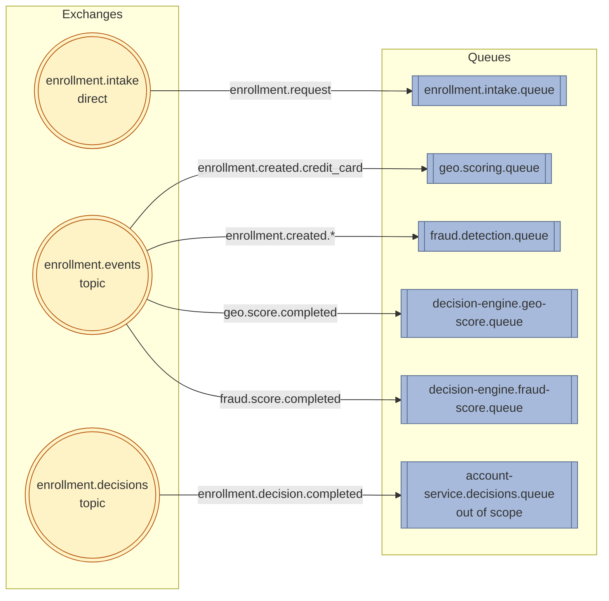

# ADR-003: Enrollment Pipeline — Messaging Architecture

**Status:** Accepted  
**Date:** May 2026

---

## Context

### Why scatter-gather within each route, not sequential

The scatter-gather pattern is chosen primarily because **fraud detection is an open-ended problem**. The two checks in
the initial design (route-specific primary check + Internal Fraud Detection) are not expected to be the final set.
Device fingerprinting, IP clustering, email domain pattern analysis, velocity checks, and shipping address history
checks are all plausible additions — each a separate signal source, each independently maintained. The scatter-gather
pattern is the extensibility seam that accommodates this with minimal changes.

Without scatter-gather — with sequential dispatch instead — each new check requires modifying the decision-engine to call
it explicitly, managing its timeout separately, and threading its result through the chain. The coordination complexity
scales with the number of checks rather than being absorbed by the pattern. Given that fraud signal libraries are
expected to grow, scatter-gather is the correct foundation even when only two checks are active initially.

The two additional properties — **latency reduction** and **failure isolation** — follow from the parallel execution
model. Primary check and Internal Fraud Detection execute concurrently; total latency is bounded by the slowest, not the
sum. A failure in Internal Fraud Detection does not block the primary check result, and vice versa. The fail-open policy
applies per check column.

### Why asynchronous messaging, not synchronous HTTP with circuit breaker

A synchronous dispatch model is simpler to reason about but incompatible with the system's async-end-to-end constraint.
Enrollment is not request-response — the user submits data and receives a decision later by email. The
decision engine would need to hold open connections across potentially minutes of external check latency (geocoding).
Synchronous dispatch also does not survive process restarts mid-pipeline: a restart after dispatching but before
receiving results would lose track of in-flight checks. The durable correlation record in PostgreSQL is the durability
mechanism — it only functions correctly in an async, event-driven model.

---

## Decision

```
Decision:        Three-layer messaging architecture: intake (point-to-point ingress),
                 internal pipeline (topic-exchange scatter-gather), and decisions
                 (outbound delivery to account service).
Solves:          Route-appropriate fraud detection; failure isolation; parallel check
                 execution; durability across process restarts; causal ordering
                 guarantee between correlation INSERT and check-service delivery;
                 broker-backed crash recovery at the entry point; low-friction
                 extensibility path for new checks; poison pill containment.
Doesn't solve:   Checks with sequential dependencies (check B requires check A's
                 output); compensation logic for reversing approved enrollments after
                 late scores arrive.
Trade-off:       Three exchanges instead of one; intake layer adds one queue and one
                 listener; DLQ per queue adds ops monitoring responsibility.
Simpler first:   Sequential HTTP dispatch with circuit breaker is simpler but
                 incompatible with the async pipeline constraint and does not survive
                 process restarts. A flat scatter-gather (all checks on all routes)
                 is simpler but contaminates signal spaces. A single exchange without
                 an intake layer eliminates the causal ordering guarantee.
Simplicity gate: Would a single service solve this? No — failure isolation is a hard
                 quality goal. Geo-scoring failure must not block enrollment.
                 That constraint alone justifies the service boundary and async model.
```

---

## Exchange and Queue Topology

### Topology Overview


The pipeline is organized across three exchange layers. Each layer has a distinct responsibility and isolation
boundary. All exchanges and queues shown in the topology diagram above are **durable**; the layer descriptions
below cover only the additional context (semantics, publishers/consumers, implementation status) not visible in
the diagram. Dead-letter topology is consolidated in its own section further down.

### Layer 1 — Ingress: `enrollment.intake`

Single publisher (`EnrollmentIntakePublisher`). Single consumer
(`EnrollmentIntakeListener`, decision-engine), bound on the fixed routing key
`enrollment.request`. No fan-out: this is the only entry point into the async
pipeline. Payment-type differentiation is the concern of Layer 2; the intake
exchange only needs to route durably to one queue.

### Layer 2 — Internal Pipeline: `enrollment.events`

Multiple publishers (decision-engine, geo-scoring, fraud-detection). Multiple consumers across services.
Topic exchange routes by payment type (`enrollment.created.*`) on the trigger path and by result type
(`geo.score.completed`, `fraud.score.completed`) on the return path.

### Layer 3 — Outbound: `enrollment.decisions`

Single publisher (`EnrollmentDecisionPublisher`, decision-engine), publishing to the dedicated
`enrollment.decisions` topic exchange with routing key `enrollment.decision.completed`. Consumed by the account
service, which owns `account-service.decisions.queue` — its binding and DLX configuration are out of scope for
this ADR.

### Dead-letter topology

Each consumer queue is paired with a dedicated direct DLX and DLQ. Naming follows the convention in the next
section: `<queue>.dlq` for the dead-letter queue, `<service>.dlx` for its DLX. All entries below are durable.

| Live queue                          | DLX                              | DLQ                                    | Owner            |
|-------------------------------------|----------------------------------|----------------------------------------|------------------|
| `enrollment.intake.queue`           | `enrollment.intake.dlx`          | `enrollment.intake.queue.dlq`          | decision-engine  |
| `geo.scoring.queue`                 | `geo.scoring.dlx`                | `geo.scoring.queue.dlq`                | geo-scoring      |
| `fraud.detection.queue` †           | `fraud.detection.dlx` †          | `fraud.detection.queue.dlq` †          | fraud-detection †|
| `decision-engine.geo-score.queue`   | `decision-engine.geo-score.dlx`  | `decision-engine.geo-score.queue.dlq`  | decision-engine  |
| `decision-engine.fraud-score.queue` †| `decision-engine.fraud-score.dlx` †| `decision-engine.fraud-score.queue.dlq` †| decision-engine †|
| `account-service.decisions.queue`   | (owned by account-service)       | (owned by account-service)             | account-service *(out of scope)* |

† **Not yet implemented in MVP 1.** Internal Fraud Detection runs as a stub that
auto-emits `FraudCheckResult(OK)` (see §"Internal Fraud Detection" in
`decision-engine/design.md`); the dedicated fraud worker queue, the
decision-engine fraud-result listener queue, and their DLX/DLQ pairs are part
of the target topology and will be declared when the stub is replaced by a
real fraud service. Until then, fraud results flow through the stub's binding
on `enrollment.events` and the decision-engine's existing listener
infrastructure.

### Naming convention

```
Dead-letter exchange:    <service>.dlx
Dead-letter queue:       <queue>.dlq
Dead-letter routing key: <service>.dead-letter
```

Each service declares a **dedicated** direct exchange as its DLX rather than reusing any shared exchange. This keeps
dead-letter routing off the business event bus and prevents other services from accidentally binding to dead-letter
keys.

---

## Routing Mechanics

The pipeline entry point and the internal routing strategy are described as three sequential steps.

### Step 0 — Intake (entry-point ordering guarantee)

The REST endpoint publishes an `EnrollmentEvent` to `enrollment.intake`
(direct exchange) with the fixed routing key `enrollment.request`. Publisher Confirms with
`mandatory=true` ensure the 202 response is returned only after the broker
has accepted and bound-routed the message; an unroutable publish surfaces
as `AmqpException` to the client.

`EnrollmentIntakeListener` consumes from the intake queue and delegates to
`EnrollmentIntakeService.processEnrollment`, a separate `@Transactional`
bean. The cross-bean call crosses the Spring AOP proxy boundary so the
transaction is honoured. The handler:

1. `BEGIN` transaction (`@Transactional` on `processEnrollment`).
2. `INSERT` correlation record into PostgreSQL.
3. Publish `EnrollmentEvent` to `enrollment.events` (still inside the tx).
4. `COMMIT`.
5. `ACK` the intake message — automatic on listener-method success under
   `AcknowledgeMode.AUTO`.

This sequence is the causal ordering guarantee: no consumer on
`enrollment.events` can receive a request for a correlation record that has
not yet committed, because the publish is inside the same transaction as the
INSERT (ADR-015 §Decision; see also that ADR for the publish-before-commit
edge case and the downstream `enrollmentId` dedup that mitigates it).

The intake message stays unACKed until the `afterCommit` publish completes. If the decision-engine crashes between step 3
and step 5, the broker redelivers the intake message on restart. The correlation `INSERT` uses a unique constraint on
`enrollmentId` to absorb the redelivery idempotently — the second INSERT fails silently and the `afterCommit` publish
fires again. No outbox table or relay poller is required; the broker's at-least-once redelivery is the crash-recovery
mechanism.

**The one failure mode this does not close:** a crash between `COMMIT` (step 3) and the `afterCommit` publish
completing (step 4) where the intake message is also lost (broker crash). This is a narrower window than the original
dual-write but is not zero. The orphan-record monitoring metric (non-zero `enrollment_intake_publish_failures_total`)
is the detection mechanism. The trigger to introduce a Transactional Outbox at this boundary is observed message loss
in production or an audit mandate — the same trigger documented for downstream paths.

### Step 1 — Conditional routing by payment type

`EnrollmentIntakeListener` publishes a single `EnrollmentAccepted` event to `enrollment.events` with a
payment-type-specific routing key. RabbitMQ evaluates all registered queue bindings and delivers the message to each
queue whose pattern matches. No application-level routing code participates in this decision — the binding table is
the complete routing logic.

```
Routing key: enrollment.created.credit_card

geo.scoring.queue               bound to: enrollment.created.credit_card   ✓ delivered
fraud.detection.queue           bound to: enrollment.created.*             ✓ delivered
identity.queue                  bound to: enrollment.created.invoice       ✗ not delivered
decision-engine.geo-score.queue bound to: geo.score.completed              ✗ not delivered (result queue — Step 2)
decision-engine.fraud-score.queue bound to: fraud.score.completed          ✗ not delivered (result queue — Step 2)
```

Geo-scoring and fraud detection receive the trigger concurrently. The decision-engine's result queues
(`decision-engine.geo-score.queue`, `decision-engine.fraud-score.queue`) are bound to result routing keys and
do not receive the trigger event. Identity does not receive it either — wrong route.

### Step 2 — Scatter-gather within the route

Geo-scoring and fraud detection process in parallel. Each publishes its result back to `enrollment.events` with a
result-specific routing key. The decision-engine's result queues are bound to those keys. The decision-engine aggregates
results via the durable correlation record using `SELECT FOR UPDATE` (ADR-015).

### Consumer-owned bindings

Each consumer service declares its own queue and binding at startup. The decision-engine knows only the exchange name and
the routing key it publishes — it has no knowledge of which queues exist or which services are listening.

**Known risk:** if a consumer service is down during a routing key change, it can restart with a stale binding that no
longer matches anything. Messages are published, nothing consumes them, and no error is thrown. Mitigations: treat
routing key patterns as published contracts, monitor queue depth so abandoned queues become visible quickly, and
consider infrastructure-as-code for topology declarations as the authoritative source in production.

### Dedicated queues and competing consumers

Each consumer service binds to its own dedicated queue. A geo-scoring instance cannot accidentally consume a
`FraudCheckResult` reply — that event is never delivered to `geo.scoring.queue`. The queue boundary enforces the
contract structurally, not by convention.

When multiple instances of the same service run concurrently, all instances consume from the same queue. RabbitMQ
distributes messages round-robin; each message is delivered to exactly one instance. The queue is the unit of both
routing and load distribution.

---

## Delivery Guarantees

### At-least-once delivery and idempotent consumers

All events are delivered at-least-once over RabbitMQ. Publishers use **Publisher Confirms**
(`waitForConfirmsOrDie`) — a lost broker ack surfaces as a thrown exception so the caller's retry path re-publishes
rather than silently dropping the message. Because retries can re-publish a message the broker already accepted,
**all consumers must implement the Idempotent Receiver pattern** (Hohpe & Woolf, EIP) and dedup on the event's
natural key.

| Event                       | Dedup key                                                           |
|-----------------------------|---------------------------------------------------------------------|
| `EnrollmentAccepted`        | `enrollmentId` — unique constraint on `enrollments.enrollment_id`         |
| `GeoScoreResult`            | `enrollmentId` — idempotency guard on the correlation row's signal slot |
| `FraudCheckResult`          | `enrollmentId` — idempotency guard on the correlation row's signal slot |
| `IdentityCheckResult`       | `enrollmentId` — idempotency guard on the correlation row's signal slot |
| `EnrollmentDecisionEvent`   | `decisionId` — dedup on the account service's received-events table  |

### Publisher-side failure modes covered

| Failure mode                                              | Mechanism                                                                        | Observable as                                                                       |
|-----------------------------------------------------------|----------------------------------------------------------------------------------|-------------------------------------------------------------------------------------|
| Broker nack                                               | `ConfirmCallback` + `waitForConfirmsOrDie` throws                                | Exception → listener retry; `reason=nack` counter                                   |
| Lost ack (network drop after publish)                     | `waitForConfirmsOrDie` timeout (default 5s)                                      | Exception → listener retry                                                          |
| Unroutable (bad exchange / routing key / missing binding) | `mandatory=true` + `basic.return` → `CorrelationData.getReturned()` check throws | Exception → listener retry; `reason=returned` counter; `ReturnsCallback` logs ERROR |
| Serialization / connection error                          | Thrown from `convertAndSend`                                                     | Exception → listener retry                                                          |

The `mandatory=true` flag is essential: a broker ack confirms the message was accepted, not that it was routed to a
queue. Without it, a misnamed routing key results in a silent discard with a positive ack. The
`CorrelationData.getReturned()` check is what converts an unroutable message into a retried publish.

### Dual-write scope

The intake queue pattern (Step 0) resolves the dual-write at the decision-engine entry point. Downstream publish paths
(`enrollment.events`, `enrollment.decisions`) remain subject to the standard Publisher Confirms + Idempotent Receiver
approach. A Transactional Outbox is not adopted for those paths at this stage. The trigger to introduce one is
observed message loss in production or an audit requirement for a durable publish log.

### ACK ordering

Consumer acknowledgement is set to manual mode on all queues. The ACK is issued only after the database transaction
commits. A message is never acknowledged before its side effects are durable.

---

## Failure Handling

### Retry policy

Stateless in-memory retry via Spring Retry interceptor on the `SimpleRabbitListenerContainerFactory`. Handles
transient failures without involving the broker.

| Parameter        | Value                           | Rationale                                                          |
|------------------|---------------------------------|--------------------------------------------------------------------|
| Max retries      | 3                               | First attempt + 3 retries. Sufficient for transient HTTP failures. |
| Initial interval | 1 000 ms                        | Gives downstream services time to recover.                         |
| Multiplier       | 2.0                             | Exponential backoff: ~1s, ~2s, ~4s.                                |
| Max interval     | 10 000 ms                       | Caps backoff to avoid excessive delays.                            |
| Recovery         | `RejectAndDontRequeueRecoverer` | After exhaustion, reject without requeue; broker routes to DLX.    |

Retry is configured **programmatically** via `RetryInterceptorBuilder.stateless()` on the container factory, not
declaratively in `application.yml`. Spring Boot's auto-configured retry properties are silently ignored when a service
defines its own `SimpleRabbitListenerContainerFactory`.

### Dead-letter handling strategy

Dead-lettered messages are **not automatically replayed**. The DLQ is a parking lot for inspection:

1. **Alert** — DLQ depth is exposed as a metric. A non-zero depth triggers an ops alert.
2. **Inspect** — Ops reviews via the RabbitMQ management UI. The original body, headers (`x-death` with failure
   reason, count, and timestamp), and routing information are preserved.
3. **Decide** — Transient failure resolved: replay by moving back to the main queue. Permanent failure (malformed
   payload): discard and fix the upstream bug. Schema mismatch: coordinate a fix, then replay.

Auto-replay is not used because permanent failures would loop indefinitely at current volume where dead-lettered
messages indicate a bug, not normal operation.

### Consumer concurrency

Each consumer service runs its `SimpleRabbitListenerContainerFactory` on a `VirtualThreadTaskExecutor`
(ADR-008) with **explicit** sizing for `concurrentConsumers`, `maxConcurrentConsumers`, and
`spring.rabbitmq.listener.simple.prefetch` — defaults are not relied on. Two principles govern the values:

- **Prefetch is held low when per-message latency is variable.** Spring Boot's default (250) assumes
  uniform-latency handlers; a workload with cache hits and external-API misses on the same queue would
  see high prefetch head-of-line-block slow messages behind one consumer. Low-and-multiply
  (`concurrentConsumers × prefetch` modest) beats high-and-concentrate when handler cost varies.
- **Sizing is per service, not pipeline-wide.** Each consumer has its own downstream bottlenecks and
  burst profile; one queue's concurrency settings tell you nothing about another's. Concrete values and
  in-flight ceilings live in each service's `design.md`.

### Dead-letter retention

Each DLQ declares an `x-message-ttl` queue argument so RabbitMQ silently drops dead-lettered messages
older than the TTL, bounding retention across long-running brokers. The TTL is a safety net — active
monitoring (DLQ depth alert + runbook) remains the primary signal. The specific TTL is a per-service
tuning decision (operator triage window vs. forensic retention), documented in each service's `design.md`.

### Queue argument migration

RabbitMQ queues are immutable once declared. Adding `x-dead-letter-exchange` and `x-dead-letter-routing-key` to an
existing queue fails with a precondition error. On existing brokers the queue must be deleted and re-created, or a
RabbitMQ policy applied without changing queue arguments. In development and test environments this is not an issue —
Testcontainers starts a fresh broker.

---

## Consequences

**Gains:**

- Extensibility seam — new check services subscribe to `enrollment.events` with localised changes: one queue binding,
  one correlation column, one completion predicate update, one decision rule addition. The publish path is untouched.
- Causal ordering guarantee — no check service receives `EnrollmentAccepted` for a correlation record that does not
  yet exist. The initialization race is eliminated by construction.
- Broker-backed crash recovery at the entry point — no outbox table or relay poller required.
- Poison pill containment — a bad message is parked in the DLQ after retry exhaustion; the queue is unblocked.
- Dead-lettered messages are preserved with full context for post-mortem analysis.

**Loses:**

- Correlation record schema migration required for each new signal.
- Completion predicate and decision engine must be updated per new signal.
- Manual coordination complexity grows linearly with signal count — workflow engine migration path (Temporal,
  AWS Step Functions) documented for when signal count or signal interdependencies exceed this pattern's capacity.
- Ops must monitor DLQ depth across all queues and act on alerts. This is a new operational responsibility per queue.
- Adding DLX arguments to an existing queue requires a delete/recreate (one-time migration per environment).
- A narrow orphan-record window remains at the intake boundary (crash between COMMIT and afterCommit publish + intake
  message loss). Detected via `enrollment_intake_publish_failures_total` metric.
