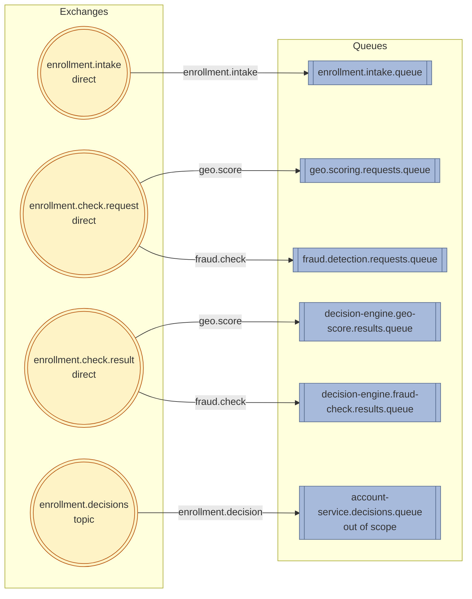

## ADR-003: Enrollment Pipeline — Messaging Architecture

**Status:** Accepted  
**Date:** May 2026

---

### Context

#### Why scatter-gather within each route, not sequential

Fraud detection is an open-ended problem. The initial two checks (route-specific geo-scoring + internal fraud detection)
are not expected to be the final set. Device fingerprinting, IP clustering, email domain analysis, velocity checks, and
shipping address history are all plausible future additions — each a separate signal source, independently maintained.
Scatter-gather facilitates extensibility: adding a signal is a localized, additive change
— declare it in `SignalConfig`, add a per-signal request builder, add a result listener — never a rework of the
aggregation logic, which dispatches on classification rather than signal identity.

Sequential dispatch would require explicit orchestration per check, separate timeout management, and result threading
through a chain. Coordination complexity scales with check count; scatter-gather absorbs it via the pattern.

Latency reduction and failure isolation follow from parallel execution: total latency is bounded by the slowest check,
not their sum. A failure in one check does not block another. The fail-open policy applies per signal independently.

#### Why asynchronous messaging, not synchronous HTTP with circuit breaker

Synchronous dispatch is incompatible with the async end-to-end constraint: the user submits data and receives a decision
later by email. Holding HTTP connections across minutes of external check latency (geocoding) is impractical. More
critically, synchronous dispatch does not survive process restarts mid-pipeline — a restart after dispatching but before
receiving results loses track of in-flight checks. The durable correlation record is the durability mechanism; it only
functions correctly in an async, event-driven model.

---

### Decision

```
Decision:        Four-exchange messaging architecture: intake (point-to-point ingress),
                 check.request and check.result (the scatter-gather split into a
                 command channel out and a result channel back), and decisions
                 (outbound delivery to account service).

Solves:          Route-appropriate signal dispatch; failure isolation; parallel check
                 execution; durability across process restarts; causal ordering
                 guarantee between correlation INSERT and check dispatch;
                 broker-backed crash recovery at the entry point; least-privilege
                 per-signal request payloads; single source of signal applicability;
                 poison pill containment.

Doesn't solve:   Checks with sequential dependencies (check B requires check A's
                 output); compensation logic for reversing approved enrollments after
                 late results arrive.

Trade-off:       Four exchanges; the decision engine declares and owns the request
                 channel and per-signal request queues (it dispatches commands and
                 must know every applicable signal anyway); one publish per applicable
                 signal instead of a single broadcast; DLQ per queue adds ops
                 monitoring responsibility.

Simpler first:   Sequential HTTP dispatch with circuit breaker is simpler but
                 incompatible with the async pipeline constraint and does not survive
                 process restarts. A single broadcast Event on one topic exchange is
                 simpler to publish but forces signal applicability to be encoded twice
                 — in SignalConfig and in each consumer's binding — which can drift;
                 per-signal command dispatch keeps applicability in SignalConfig alone.
                 A single exchange without an intake layer eliminates the causal
                 ordering guarantee.

Simplicity gate: Would a single service solve this? No — failure isolation is a hard
                 quality goal. Geo-scoring failure must not block enrollment.
                 That constraint alone justifies the service boundary and async model.
```

---

### Causal Ordering at the Entry Point

The pipeline entry point inverts the classic dual-write problem. Rather than committing a database record and publishing
an event within the same request thread — a pattern with no cross-system transaction coordinator — the REST endpoint
performs a single, broker-durable write. It publishes the enrollment intent to a point-to-point intake queue and returns
`202 Accepted`. The database correlation record is created later, by a consumer, after the message has been durably
handed off to the broker.

This inversion makes the intake queue the **system of record for work-in-flight**. The broker's at-least-once delivery
contract replaces the need for an outbox table or a relay poller: an unacknowledged message is the only cursor of
unprocessed work.This is a variant of the Idempotent Consumer pattern (Hohpe & Woolf, Enterprise Integration Patterns):
the queue provides durability and at-least-once delivery, while the consumer ensures exactly-once processing via an
idempotency guard on its side — in this case, a database unique constraint on the request identifier.

The intake listener is the single sequential gatekeeper for the entire pipeline. It commits the correlation record
before publishing the downstream trigger event. This commit-before-publish sequence provides the **causal ordering
guarantee**: no check service on the internal bus can observe a trigger event for a correlation record that has not yet
committed. The database is the authority; the event bus is the notification.

If the downstream publish fails, the exception propagates to the AMQP container, which negative-acknowledges the intake
message and triggers broker redelivery. The listener re-executes the idempotency guard (unique constraint on the request
identifier), detects the already-persisted record, and retries the publish. This provides at-least-once intake
processing with exactly-once correlation persistence, without distributed transactions or outbox infrastructure.

The trade-off accepted is a small volume of duplicate trigger events on the internal bus during redelivery. This is
harmless because all downstream consumers are designed to be idempotent. The alternative — a transactional outbox with
relay polling — is reserved for volume envelopes where broker redelivery latency or duplicate internal traffic becomes
operationally significant.

---

### Exchange and Queue Topology



#### Layer 1 — Ingress: `enrollment.intake`

Single publisher. Single consumer (decision-engine), bound on the fixed routing key `enrollment.intake`. No fan-out:
the only entry point into the async pipeline. Payment-type differentiation is the concern of Layer 2.

#### Layer 2 — Scatter-gather: `enrollment.check.request` + `enrollment.check.result`

The scatter-gather uses two `direct` exchanges, one per direction. The decision engine does not fire-and-forget — it
defers the final decision until a reply for every applicable signal has arrived. This is not a synchronous wait: no
thread blocks, replies are gathered asynchronously against the durable correlation record, and the decision is emitted
by whichever reply settles the last outstanding signal (or the timeout poller, ADR-010). That standing per-signal
expectation is a *Request-Reply* relationship, not an open event broadcast, so each dispatch is a **Command Message on a
Point-to-Point Channel** correlated by `enrollmentId` (the correlation record being the Aggregator).

**`enrollment.check.request` (out).** The decision engine publishes one command per applicable signal, routing by signal
name (`geo.score`, `fraud.check`). The applicable set is derived solely from `SignalConfig` — the same source that seeds
the correlation record's gather-set, so the dispatch-set and gather-set cannot drift. On the CREDIT_CARD route it
publishes two commands (`geo.score` + `fraud.check`); on INVOICE, one (`fraud.check`). Each command carries a
least-privilege payload — geo-scoring receives only the shipping address, fraud detection the full enrollment data.

**`enrollment.check.result` (back).** Each worker publishes its result keyed by signal name (`geo.score`,
`fraud.check`). The decision engine consumes them into per-signal result queues and records each against the correlation
record. The signal-name key reused across both exchanges is unambiguous because direction is encoded by the exchange,
not the key.

**Channel ownership.** Each party owns the channels it *initiates*. The decision engine owns the request exchange and the per-signal request queues (with their DLX/DLQ),
because it is the command sender and because the request queue must exist before its worker is deployed — otherwise a
`mandatory` publish would return as unroutable. Workers attach a `@RabbitListener` to the request queue by name and do
**not** redeclare it (declaring on both sides risks argument conflicts; Spring AMQP consumes an existing queue without
declaring it). Conversely, the decision engine owns its result queues, since it is the consumer there. Adding a new
check is therefore a localized decision-engine change — `SignalConfig` entry, request builder, request queue + binding,
result listener — plus deploying the worker as a pure listener.

#### Layer 3 — Outbound: `enrollment.decisions`

Single publisher (decision-engine), publishing to the dedicated `enrollment.decisions` topic exchange with routing key
`enrollment.decision`. Consumed by the account service, which owns `account-service.decisions.queue` — its binding and
DLX configuration are out of scope.

---

### Dead-Letter Topology

Each consumer queue is paired with a dedicated direct DLX and DLQ. Naming follows the convention: `<queue>.dlq` for the
dead-letter queue, `<service>.dlx` for its DLX. All entries below are durable.

| Live queue                                    | DLX                                         | DLQ                                               | Owner — declares (consumed by)                 |
|-----------------------------------------------|---------------------------------------------|---------------------------------------------------|------------------------------------------------|
| `enrollment.intake.queue`                     | `enrollment.intake.dlx`                     | `enrollment.intake.queue.dlq`                     | decision-engine                                |
| `geo.scoring.requests.queue`                  | `geo.scoring.requests.dlx`                  | `geo.scoring.requests.queue.dlq`                  | decision-engine (consumed by geo-scoring)      |
| `fraud.detection.requests.queue` †            | `fraud.detection.requests.dlx` †            | `fraud.detection.requests.queue.dlq` †            | decision-engine (consumed by fraud-detection †)|
| `decision-engine.geo-score.results.queue`     | `decision-engine.geo-score.results.dlx`     | `decision-engine.geo-score.results.queue.dlq`     | decision-engine                                |
| `decision-engine.fraud-check.results.queue` † | `decision-engine.fraud-check.results.dlx` † | `decision-engine.fraud-check.results.queue.dlq` † | decision-engine †                              |
| `account-service.decisions.queue`             | (owned by account-service)                  | (owned by account-service)                        | account-service *(out of scope)*               |

† **Not yet implemented.** Internal Fraud Detection has no worker yet. The decision engine declares
`fraud.detection.requests.queue` so it can dispatch `fraud.check` commands that simply accumulate until a consumer
attaches (the `FRAUD_CHECK` signal fail-opens via the timeout poller in the interim — ADR-010), plus the fraud-result
listener queue. The fraud worker is built as the final step of the topology rollout and attaches as a pure listener.

---

### Delivery Guarantees

| Guarantee                               | Mechanism                                            | Consumer obligation                |
|-----------------------------------------|------------------------------------------------------|------------------------------------|
| At-least-once delivery                  | Publisher Confirms + mandatory routing               | Idempotent receiver on natural key |
| Causal ordering (record before trigger) | Commit-before-publish in intake listener             | N/A — enforced by producer         |
| Exactly-once decision                   | Row-level pessimistic locking + completion predicate | N/A — enforced by aggregator       |
| Poison-pill containment                 | DLX after bounded retry                              | Ops review, manual replay          |

---

### Consequences

**Gains:**

- Single source of signal applicability — `SignalConfig` drives both dispatch and the gather-set; they cannot drift
- Least-privilege per-signal payloads — each worker receives only the data its check needs
- Direction encoded in the topology — separate request/result exchanges, exact (direct) routing, no shared key namespace
- Causal ordering without outbox infrastructure
- Broker-backed crash recovery at entry point
- Poison-pill containment via DLX

**Loses:**

- A localized decision-engine change per new check (`SignalConfig` entry + request builder + request queue + result listener) — but the aggregation logic is untouched (dispatch is on classification, not signal identity)
- One publish per applicable signal instead of a single broadcast (bounded; idempotent receivers absorb redelivery duplicates)
- Manual DLQ monitoring and replay
- Small duplicate command volume during intake redelivery
- Adding DLX arguments to existing queues requires delete/recreate

---

### Trigger to Revisit

- **Transactional Outbox:** ≥50 RPS sustained, or audit mandate requiring durable publish log. At current volume, broker
  redelivery + idempotency is sufficient.
- **Workflow engine (Temporal, Step Functions):** Signal count or interdependencies exceed scatter-gather capacity.

---
