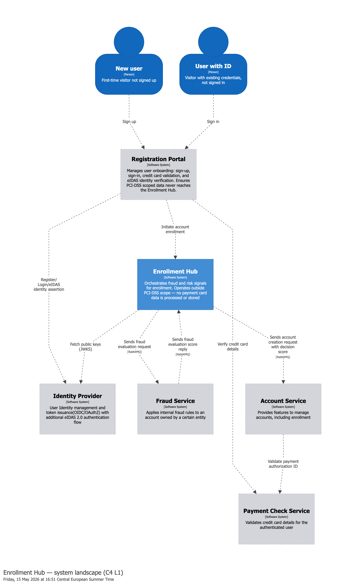
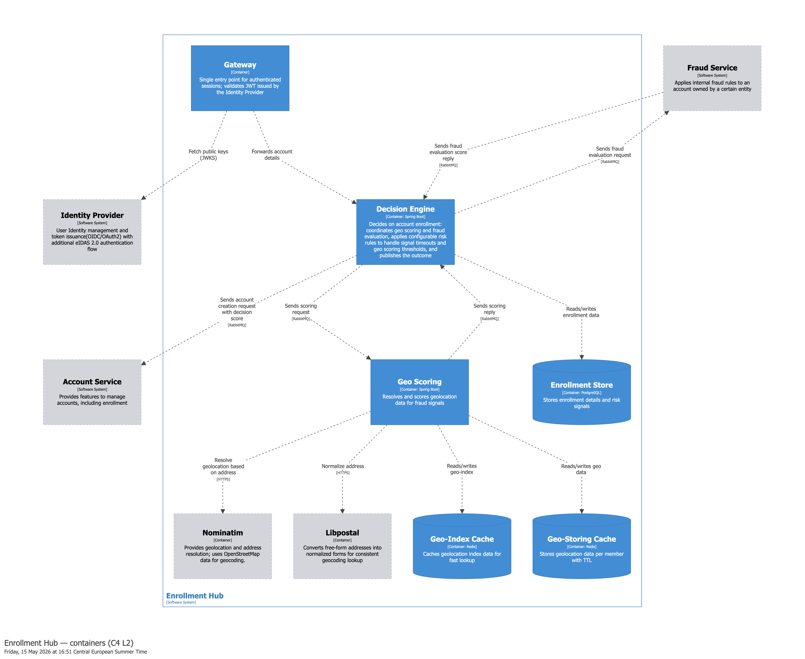
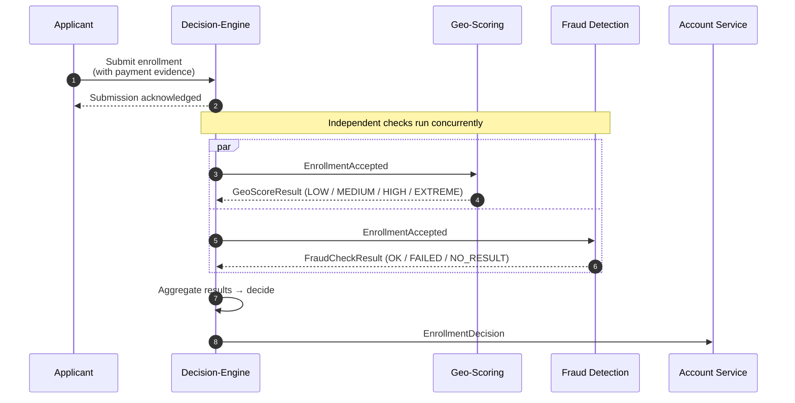

# Architecture: Event-Driven Enrollment

## 1. Introduction & Goals

The Enrollment Hub mediates between the registration frontend and downstream fulfillment services. Its primary job is to
accept enrollment requests durably, orchestrate asynchronous risk evaluation, and emit a deterministic decision.
At ≤5 requests per second, which is what is observed in production, throughput alone does not justify a distributed
architecture. The decomposition is driven by a binding constraint: the downstream Account Service and Fraud Detection
services both exhibit P99 latencies exceeding one second with availability below 100%. Synchronous coupling would
propagate these failures to the applicant. Durable messaging decouples ingress from evaluation, allowing the hub to
accept enrollments regardless of downstream health.

The architecture therefore decouples Ingress Availability (accepting the request) from Decision Correctness (evaluating
risk), using durable messaging to absorb downstream volatility without back-pressure on the applicant. An important
enhancement of the enrollment hub is to mitigate synthetic identity fraud rings by identifying geo-temporal clustering—detecting when
multiple fraudulent accounts are created within the same physical vicinity in a narrow time window. This approach
fills a specific detection gap that traditional fraud detection strategies relying on digital fingerprints (IP, device, email) or payment
verification cannot address.

At the core of the Hub is the Decision Engine, responsible for scoring enrollment intentions through a series
of extendable quality gates and fraud-detection signals. To guarantee deterministic scoring, the architecture ensures
that Signal Derivation receives only immutable derived signals — never raw, mutable inputs. To satisfy GDPR, the
Durability Hand-off layer alone persists PII, applying data minimization and time-bounded retention before any signal
reaches evaluation. By strictly isolating intake from scoring, the architecture prevents hidden state from affecting
risk outcomes while ensuring PII never enters the processing chain beyond its regulated persistence window.

---

### 1.1 Architectural Drivers (Distributed Design Justification)

The architecture prioritizes **End-to-End Correctness** and **Auditability** over raw throughput. The
structural design is dictated by the following prioritized Service Level Objectives (SLOs):

#### I. Extensibility

Fraud detection is an evolving threat landscape. The primary driver for structural separation is the need to 
provide an extensibility mechanism to accommodate future signals as they are identified.

* **Mechanism:** A RabbitMQ topic-exchange pattern allows new check services to self-subscribe and participate in the
  scatter-gather flow without touching the core enrollment logic.

#### II. Fault Isolation

The pipeline depends on external services — geocoding, spatial indexing, fraud scoring — that lack strong SLAs and fail
independently. Because these signals are augmentative rather than essential, each is isolated behind its own process
boundary so a Nominatim outage or fraud-service unavailability cannot stall the enrollment path.

* **Mechanism:** The system maintains a **fail-open** posture, ensuring that degraded detection services do not block
  legitimate customer enrollment.

#### III. Durability & Transactional Integrity

Enrollment is a "write-once" business event. Once the system acknowledges a submission with `202 Accepted`, that
work item must survive JVM restarts, broker partitions, or database lock contention.

* **Mechanism:** By utilizing an **Intake Queue** and a **Durable Correlation Record**, the architecture eliminates
  the "lost update" risks inherent in in-memory `@Async` processing or simple monolith thread pools.

> **Note on Scale:** These patterns are chosen for architectural integrity. While a single-instance deployment handles
> current volumes, the design includes explicit triggers (e.g., ADR-010, ADR-014) for scaling to higher RPS sustained
> loads.

#### IV. Latency Isolation & Dependency Resilience

Downstream services (Account Service, Fraud Detection) carry the P99 > 1s latency tails and best-effort availability
noted in §1. A synchronous call chain would either propagate these delays to the applicant or drop the enrollment during
a downstream outage.

* **Mechanism:** By decoupling ingress from evaluation via durable messaging, the hub accepts enrollments regardless of
  downstream health and delivers decisions out-of-band.

---

### 1.2 Threat Model: Architectural Implications

The architecture assumes a sophisticated adversary capable of diversifying digital fingerprints and passing standard
payment checks. The following table maps these capabilities to specific architectural safeguards:

| Adversary Capability                 | Architectural Safeguard                                                                                                 |
|--------------------------------------|-------------------------------------------------------------------------------------------------------------------------|
| **Synthetic Identity Proliferation** | **Geo-temporal density analysis:** Detects physical proximity invariants that digital fingerprints cannot hide.         |
| **Credential Diversification**       | **Prerequisite Gates:** Synchronous validation of signed tokens (eIDAS/Payment JWTs) before async processing begins.    |
| **Iterative Threshold Probing**      | **Idempotent Indexing:** Every enrollment attempt, including rejections, increases the future probability of detection. |
| **Exploitation of Latency**          | **Real-time Scoring:** Designed to reach a decision within 48 hours.                                                    |

### 1.3 Rationale for Non-Payment Signals

While payment verification (Credit Card/SCA) remains a prerequisite, it is insufficient to prevent synthetic identity 
fraud ring attacks in the European market:

* **AVS Limitations:** Address Verification Systems (AVS) are primarily North American/UK constructs and lack the
  granularity required to distinguish adjacent physical addresses in dense European urban centers.
* **Identity vs. Behavior:** Strong Customer Authentication (SCA) verifies the *cardholder*, but doesn't prevent a
  fraudster from using multiple legitimate instruments to create a cluster of synthetic accounts.

Consequently, **geo-temporal density** — the clustering of enrollment events in both physical space and time — 
is the primary invariant signal in the adjacent-address evasion scenario.

---

### 1.4 Scaling & Volume Baseline

The following figures establish the sizing baseline for all architectural decisions. These estimates are derived from
logistics platforms of comparable scale and serve as the foundation for the **Quality Goals** in §1.5.

* **Daily Throughput:** <50,000 enrollments.
* **Peak Request Rate:** 5 requests per second (RPS).
* **Observation Window:** 48 hours (estimated ≤100,000 concurrent data points in the spatial index).
* **Decision Latency:** Async processing allows for an internal SLA of seconds, while the business window to prevent exploitation of Latency is typically 48 hours.

| Downstream Service | Median Latency | P99 Latency   | Availability Target | Impact if Synchronous                         |
|--------------------|----------------|---------------|---------------------|-----------------------------------------------|
| Account Service    | ~200 ms        | **>1,000 ms** | 99.9%               | Applicant timeout; enrollment dropped on blip |
| Fraud Detection    | Variable       | **>1,000 ms** | Best-effort         | Enrollment blocked during outage              |

---
### 1.5 Quality Goals (SLOs)

The system is measured against these prioritized engineering targets:

| ID       | Goal                | Target Metric / Scenario                                                                                                                                                                                                                                  |
|----------|---------------------|-----------------------------------------------------------------------------------------------------------------------------------------------------------------------------------------------------------------------------------------------------------|
| **QG-1** | **Scoring Latency** | **P95 ≤ 2 seconds** for `GeoScoreResult` events under peak load                                                                                                                                                                                           |
| **QG-2** | **Resiliency**      | **Zero-Block Intake:** Downstream detection failures trigger a fail-open state (`APPROVED` or `CONDITIONAL_APPROVED`) rather than blocking enrollment  (see §1.6 — signal classification governs which signals fail-open versus which block the decision) |
| **QG-3** | **Privacy**         | **48-Hour TTL:** Automatic eviction of PII and spatial data from the geo-index to minimize GDPR exposure                                                                                                                                                  |
| **QG-4** | **Integrity**       | **Strict Gatekeeping:** decision engine rejects any request missing a valid `Credit_Card_JWT` or `eIDAS_JWT` prior to event emission  (prerequisite validation, §8.1 and ADR-007 — outside the gate classification model)                              |

---

### 1.6 Decision Engine Gate Classification Model

The Decision Engine's handling of each signal is governed by a typed `GateClassification` assigned as metadata on
every `SignalConfig`. Rather than encoding signal-specific conditional logic inside the aggregation method, the engine
dispatches on classification — which encodes two orthogonal properties: whether the signal's absence blocks the decision
or allows it to proceed fail-open, and whether the signal's result can drive the `DecisionResult` outcome directly or
can only contribute an advisory annotation.

Three classifications cover the meaningful combinations of these two properties:

| Classification    | Missing-signal behaviour                                           | Authority over outcome                                      | Current assignment                                                            |
|-------------------|--------------------------------------------------------------------|-------------------------------------------------------------|-------------------------------------------------------------------------------|
| `REQUIRED`        | Blocks decision until signal completes or escalation policy applies | Authoritative — can drive any outcome                      | Reserved; no current signal   (future: sanctions screening, regulated KYC) |
| `BEST_EFFORT`     | Fail-open; aggregation proceeds without the signal                 | Authoritative — can drive any outcome                       | Fraud Detection                                                               |
| `SCORING_SIGNAL`  | Fail-open; aggregation proceeds without the signal                 | Advisory — can flag for review, cannot drive rejection      | Geo-Scoring                                                                   |

Each `SignalConfig` also declares the payment routes on which it is applicable. Signals not applicable to the current
route are absent from the correlation record's signal map entirely; the aggregation method never sees them as missing
signals.

The `SCORING_SIGNAL` classification is what makes the asymmetric aggregation rule structurally enforceable rather than
merely documented. In the aggregation method, only `REQUIRED` and `BEST_EFFORT` results participate in the rejection
determination — `SCORING_SIGNAL` results are excluded from the rejection accumulator by construction. A geo-score at
`HIGH` or `EXTREME` therefore cannot escalate a fraud-clean `DecisionResult.APPROVED` to `DecisionResult.REJECTED`
regardless of threshold configuration; it produces `DecisionResult.CONDITIONAL_APPROVED` at most. This structural
guarantee is what makes the conservative-threshold deployment strategy safe: misconfiguring the `HIGH` threshold inflates
the analyst review queue but cannot cause wrongful rejection.

Prerequisite validation — payment-instrument tokens on the credit-card route, eIDAS JWTs on the invoice route — is
outside this classification model. Prerequisite checks run synchronously at the entry point before the scatter-gather
pipeline is initiated; they are not participants in the aggregation. They are documented in §8.1 and ADR-007.

The full classification model, the aggregation algorithm, and the rationale for retaining `REQUIRED` as a named
classification without a current assignment are specified in ADR-016.

---

### 1.7 Architectural Integrity & Scaling Triggers

The 5 RPS figure describes ingress volume only. The internal concurrency envelope is driven by downstream tail
latency (>1 s) and fan-out to multiple scoring services, not by raw request rate.

**Implications for the rest of this document.** The decisions that follow — including the three-exchange messaging
architecture (ADR-003), separate geo-scoring service (ADR-002), durable correlation record (ADR-015),
and atomic Redis Lua (ADR-014) — are justified against the three core forces of **Integrity, Correctness, and Privacy**,
rather than raw throughput.

Where a design decision would shift at higher volumes, the relevant ADR documents an explicit trigger. This ensures the
patterns are not represented as scale-invariant:

* ADR-010: Scaling to ≥50 RPS sustained.

* ADR-014: Transitioning from single-instance Redis to Cluster mode (at 10× peak).

* ADR-015: Addressing SELECT FOR UPDATE contention on the correlation record at ≥50 RPS.

## 2. Constraints

Constraints are the non-negotiable boundaries that define the "playing field" for the architecture. These are distinct
from goals in that they are fixed requirements or limitations of the environment.

### 2.1 Technical & Infrastructure Constraints

* **Localized Development Lifecycle:** The system must be capable of running entirely on localized, ARM64-based hardware
  using containerized services. This forces a reliance on portable open-source components (PostgreSQL/PostGIS, RabbitMQ,
  Redis) rather than proprietary cloud-native managed services.

* **Modern Java Runtime:** To align with the project's strategic upskilling goals, the implementation is restricted to
  JDK 25. The architecture must leverage Virtual Threads (Project Loom) to handle high-concurrency I/O and the
  asynchronous
  scatter-gather pattern without the memory overhead of traditional platform threads.

* **Transient Storage Purity:** To maintain the "Zero-Footprint" privacy goal, scoring modules are constrained to
  stateless execution or transient in-memory state. No persistent local disk storage is permitted for fraud signals; all
  evidence must reside in Redis with enforced TTLs.

### 2.2 Regulatory & Compliance Constraints

* **GDPR Data Minimization:** The system is legally constrained from the long-term retention of high-precision spatial
  data. Any data used for Signal Derivation is subject to an automatic, irreversible 48-hour eviction policy, ensuring
  no permanent behavioral or geographic map of users is created.

* **Identity Isolation:** The system is constrained to handle spatial data and identity data in separate logical silos.
  Spatial signals must be processed using anonymous identifiers to minimize the risk of PII correlation in the event of
  a single-service compromise.

* **Delegated Trust:** The Enrollment Hub cannot verify identity in isolation. It is constrained to trust only
  externally signed assertions (eIDAS or Payment JWTs) and authenticated sessions. If the trust chain is broken, the
  system must halt the intake process to maintain Input Integrity.

### 2.3 Operational & Business Constraints

* **Asynchronous UX:** The business model requires that the final enrollment outcome is delivered "out-of-band" (e.g.,
  via email). The architecture is constrained to avoid synchronous "wait loops" in the public API.

* **Resource Efficiency:** Despite its distributed nature, the system must remain efficient at its baseline volume (≤5
  RPS). It must not require a massive infrastructure footprint to function reliably at this scale.

## 3. Context & Scope

### 3.1 System Context (C4 Level 1)

The Enrollment Hub is the central mediator between the registration frontend and downstream fulfillment services. It
consumes authenticated enrollment requests, orchestrates asynchronous fraud evaluation signals, and emits deterministic
risk outcomes. While it manages the enrollment lifecycle, it remains out-of-scope for PCI-DSS and PII-heavy identity
verification by delegating those concerns to the external actors.

---

## 4. Solution Strategy
Four architectural mechanisms respond to the threat vectors identified in **§1.2**, mapping each to a concrete design decision and its governing ADR:

| Threat                                                                                                                                                                                                          | Architectural Response                                                                                                                                                                                                                                     | ADR              |
|-----------------------------------------------------------------------------------------------------------------------------------------------------------------------------------------------------------------|------------------------------------------------------------------------------------------------------------------------------------------------------------------------------------------------------------------------------------------------------------|------------------|
| **Spatial Evasion:** Fraudsters cluster at adjacent addresses to evade exact-match blacklists and coarse-grained AVS; spatial proximity becomes the invariant signal when digital fingerprints are diversified. | **Geo-temporal density detection:**  Each enrollment is scored against the spatial density of recent enrollments within multiple radii using a high-performance transient index.                                                                        | ADR-001          |
| **Single-Vector Evasion:** An adversary who defeats any individual detection check — diversifying payment instruments, rotating digital fingerprints — passes undetected if signals are not correlated.         | **Scatter-gather with durable correlation:**  All applicable signals execute concurrently and aggregate via a durable correlation record, ensuring that bypassing one detection layer does not defeat the combined risk assessment.                     | ADR-002, ADR-003 |
| **Credential Abuse:** Legitimate payment instruments or verified identities are necessary but insufficient; fraudsters use valid credentials across synthetic identities.                                       | **Synchronous prerequisite gates:**  Enrollment processing does not proceed without validated prerequisite tokens (JWT/eIDAS) matched to the requested payment type.                                                                                    | ADR-007          |
| **Service Degradation:** Detection service degradation must not block legitimate enrollment; the outcome reaches the applicant after evaluation completes, not at the point of submission.                      | **Classification-governed fail-open:**  Each check's classification (§1.6) determines whether its absence blocks the decision or allows enrollment to proceed; timed-out detection signals produce a flagged decision rather than a blocked enrollment. | ADR-010          |

---

## 5. Building Block View (C4 Level 2)

### 5.1 Decomposition Rationale

The four strategies in §4 imply a specific structural decomposition.

**Geo-temporal density detection** requires specialized geospatial infrastructure (geocoding, ephemeral geo-index,
coordinate noise) and domain expertise. It operates on a 48-hour data window with strict PII constraints. This isolation
justifies a dedicated Geo-Scoring module.

**Scatter-gather with durable correlation** requires a central coordinator that: (a) enforces synchronous prerequisite
gates before any async work begins, (b) tracks parallel check completion across distributed services, (c) applies
timeout and fail-open policies, and (d) emits a final decision. This coordination complexity justifies a dedicated
decision engine module.

**Extensibility for future fraud signals** requires that new checks plug in without changing dispatch logic. A
topic-exchange subscription pattern achieves this only if check services are independent deployable units. A dedicated
Internal Fraud Detection module demonstrates this seam, even as a stub.

Cross-service contract stability requires that event schemas evolve without forcing lockstep deployments. A shared
Contracts module, owned by the event producer, gives consumers forward-compatible deserialization without runtime
coupling.

These four modules map directly to the C4 container diagram in §5.2.

### 5.2 Container View

Traffic is split across three exchanges: one for intake, one for internal scoring events, and one for outbound
decisions.
An ingress exchange acts as the single durable entry point into the decision engine and is the only
channel through which a request enters the asynchronous pipeline. An internal pipeline exchange carries
scatter-gather traffic between the decision engine and the check services. An outbound exchange delivers final
decisions to the Account Service. Each service declares its own queues and bindings at startup, and new consumers
attach to the relevant exchange without changes to any publisher. The detailed topology — exchange names, queue
declarations, routing keys, dead-letter wiring — is documented in ADR-003.

Simplification: In production, Fraud and Account Service would likely use their own broker.

---

## 5.3 Container Specifications

The following containers represent the deployable units of the **Enrollment Hub**.

### 5.3.1 Gateway

* **Responsibilities:**
    * Terminates TLS and performs **authentication** (validates the **OIDC JWT** issued by the Identity Provider).
    * Routes to internal enrollment hub api.
* **Persistence:** Stateless; maintains no local persistence.

### 5.3.2 Decision Engine

* **Responsibilities:**
    * Performs flow specific **authorization** by checking contextual JWT claims
    * Manages the **Durable Correlation Record** using the `Enrollment Store`.
    * Implements the **Fail-open** logic (§4): handles timeouts and aggregates signals from the Geo-Spatial and external
      Fraud services.
* **Persistence:** PostgreSQL (`Enrollment Store`).

### 5.3.3 Geo Scoring

* **Responsibilities:**
    * Normalizes addresses via **Libpostal** and resolves coordinates via **Nominatim**.
    * Calculates **Geo-temporal density** scores using the `Geo-Index` and `Geo-Coding` caches.
    * Enforces the **48-hour TTL** on raw spatial data.
* **Persistence:** Redis (Dual-layer caching).

---

## 6. Runtime View

This chapter describes the system's behavior at the level of what the system does. Each scenario is intentionally
schematic; integration mechanics — gateway authentication, RabbitMQ exchange topology, geocoding, persistence, retry and
DLQ behavior — live in the component design documents (`decision-engine-design.md`, `geo-scoring-design.md`, etc.) and
in §5 and §8.

The three scenarios cover the architecturally relevant behaviors:

- **6.1** — CREDIT_CARD happy path (scatter-gather over two scoring signals)
- **6.2** — Prerequisite rejection at entry
- **6.3** — Timeout and fail-open

### 6.1 Happy Path: CREDIT_CARD Route

The decision engine coordinates two parallel risk evaluation checks and emits a single enrollment decision. Geo-Scoring and Fraud
Detection run concurrently and report back asynchronously; the decision engine aggregates results and decides.

The decision engine never dispatches to checks directly — it announces `EnrollmentAccepted` and the relevant checks
self-subscribe. The diagram is schematic: the acknowledgement returned to the applicant and the dispatch of
`EnrollmentAccepted` to the check services are mediated by the decision engine's ingress channel rather than happening
in the same code path.

### 6.2 Routing strategy

The decision engine publishes once; consumers subscribe by routing key.
The detailed mechanics, routing key strings, queue declarations, retry and DLQ configuration, live in ADR-003 and in the
decision engine design document. There are three steps:

**Step 0 - Durable ingress.** The REST endpoint validates the prerequisite token synchronously and, on success,
publishes a single durable message to the ingress exchange. No database write happens in the HTTP request thread.
The decision engine's own intake consumer then reads that message, creates the correlation record, commits, and
publishes the scatter-gather trigger event to the internal pipeline exchange, only after the correlation row is
durably committed. This sequencing eliminates the dual-write problem at the entry point and guarantees that no
check service can receive a trigger event for a correlation record that does not yet exist (section 8.6).

**Step 1 - Conditional routing.** The decision engine publishes a single `EnrollmentAccepted` event with a
payment-type-specific routing key. Geo-Scoring subscribes only to credit-card routes; identity verification
subscribes only to invoice routes. The decision engine publishes once; the broker delivers selectively based on
subscription bindings. The decision engine never dispatches directly to individual check services (ADR-002).

**Step 2 - Scatter-gather within the route.** Internal Fraud Detection subscribes to all enrollment events
regardless of payment type. All active subscribers consume the event concurrently; results arrive asynchronously
and are correlated by a unique request identifier. The decision engine aggregates results via a durable correlation
record before emitting the final decision (ADR-003).

New checks plug in by adding a queue binding — no changes to the decision engine are required (ADR-003).

### 6.3 Prerequisite Token Rejection

If the prerequisite evidence (payment instrument proof for CREDIT_CARD) is missing, expired, or does not match the
requested route, the decision engine rejects the request at entry:

1. Submission is rejected with a permission error.
2. The attempt is logged.
3. No correlation record is created.
4. No `EnrollmentAccepted` is published.
5. No downstream processing occurs.

This is the shortest path through the system. Validation rules and the specific token / payment-type combinations are in
ADR-007.

---

### 6.4 Timeout and Fail-Open

When a correlation record's `timeout_at` deadline is reached with one or more signals still `PENDING`, the timeout
poller (ADR-010) advances those slots to `FAILED`. The completion predicate then evaluates to true — every applicable
signal is in a terminal state — and the Decision Engine aggregation runs on whatever signals arrived before the deadline.

The aggregation contains no per-signal conditional logic for this scenario. It dispatches on `GateClassification` (§1.6):

1. A `BEST_EFFORT` signal that timed out contributes nothing to the outcome — fail-open. The resulting
   `DecisionResult` reflects only the signals that did settle in time.
2. A `SCORING_SIGNAL` that timed out contributes nothing to the outcome — fail-open with no routing consequence.
3. A `REQUIRED` signal that timed out does not release the completion predicate — the decision is held and the
   escalation policy in ADR-010 applies. No current `SignalConfig` carries this classification.

The `EnrollmentDecisionEvent` is emitted once all applicable signals are terminal. No signal can hold the decision open
beyond the deadline established by ADR-010.

**Late-arriving results.** A result event that arrives after the `EnrollmentDecision` has been published finds its
correlation slot in a non-`PENDING` terminal state. The idempotency guard (ADR-015) discards it without modifying the
record. Whether discarded late results should produce a `LateScoreArrived` event, a flag on the correlation record, or
remain observable only via the dead-letter queue is an open decision recorded in §10.1.

---

## 7. Infrastructure & Deployment

- Redis 7.2 or Valkey 7.x/8.x (geo-scoring cache)
- PostgreSQL (decision engine correlation DB)
- RabbitMQ (event bus)
- Nominatim (self-hosted geocoding — ADR-013)
- libpostal (address normalization — ADR-012)
- Keycloak (local identity provider for JWT issuance)
- Spring Cloud Gateway
- Five Spring Boot modules (gateway + decision-engine + geo-scoring + identity provider(stub) + fraud-detection(stub))

### 7.2 Target Environment Characteristics

Production deployment is vendor-neutral. The target environment must provide:

- **Container orchestration** with independent horizontal scaling per service
- **Managed PostgreSQL** with automated backups and point-in-time recovery for the decision engine correlation DB
- **Managed RabbitMQ-compatible broker** with durable queues and dead-letter support (ADR-003)
- **Managed Redis-compatible cache** supporting Lua scripting and per-member sorted-set operations (ADR-014)
- **TLS-terminating ingress** with health checks, network-level filtering, and DDoS protection
- **Secrets management** for connection strings, JWT signing keys, and the geocoding-cache HMAC pepper

Specific cloud-provider service mappings are out of scope for this document.

### 7.3 Portability Guardrails

Environment variables for all endpoints (`REDIS_HOST`, `DB_HOST`, `RABBITMQ_HOST`, `KEYCLOAK_ISSUER_URI`, etc.).
Standard
Redis AUTH. Standard AMQP connection. No vendor-specific auth mechanisms. Application code is identical across
environments — only connection strings change.

### 7.4 Single-Instance Components and Production Replication Posture

Local Docker Compose runs single-instance PostgreSQL, RabbitMQ, and Redis. This is intentional for portfolio scope and
is **not** the production posture. The application is replication-naive and relies on the broker and database to handle
failover transparently — no application-code changes are required to move from local to production.

| Component                     | Local           | Production expectation                                   | Failure mode if local posture deployed                                                                                                                           |
|-------------------------------|-----------------|----------------------------------------------------------|------------------------------------------------------------------------------------------------------------------------------------------------------------------|
| PostgreSQL (correlation DB)   | Single instance | Managed Postgres with synchronous replica + PITR backups | All in-flight enrollments lost; idempotency guard cannot recover state from broker alone                                                                         |
| RabbitMQ (event bus)          | Single broker   | Managed cluster with quorum queues; mirrored DLX         | In-flight messages lost on broker failure; Publisher Confirms (ADR-003) detect this and trigger retry, but the publishing process must survive the broker outage |
| Redis (geo-index + geocoding) | Single instance | Managed Redis with replica + persistence (RDB + AOF)     | 48h of geo-index lost; geo-scoring settles without a score (null risk level) → fail-open; no enrollment lost                                                                   |

Reference: DDIA Ch 5 (replication) and Ch 8 (failures) for the underlying single-leader / quorum / replica trade-offs
this table elides.

---

## 8. Crosscutting Concepts

### 8.1 Security & Access Control

**Three-layer model (ADR-007):**

| Layer                       | Responsibility                                                                    | Rejects                                                        |
|-----------------------------|-----------------------------------------------------------------------------------|----------------------------------------------------------------|
| Edge Ingress                | TLS termination, DDoS protection, network-level filtering                         | Malformed connections, blocked IPs/regions                     |
| Spring Cloud Gateway        | Routing, rate limiting, Keycloak JWT authentication (signature + expiry + issuer) | Missing/invalid/expired auth tokens, rate limit breaches       |
| Services (Resource Servers) | Authorization (role/scope), prerequisite token validation                         | Insufficient roles/scopes, missing/invalid prerequisite tokens |

**Prerequisite token format.** The decision engine expects signed JWTs containing: `sub` (subject
identifier), `type` (verification type: `credit_card_check` / `eidas_identity`), `iat` (issued-at), `exp` (expiry).
Signature verified against issuing service's public key. Invalid tokens → rejection + log.

**Key management.** Identity Provider public keys retrieved via JWKS endpoint (Spring Security handles automatically).
Prerequisite token public keys configured per issuer — key distribution managed by external services.

**Prerequisite check services (out of scope).** The decision engine does not integrate with any external verification
provider directly. Dedicated backend services absorb provider-specific details — Adyen communicates via HMAC-signed
webhooks, Onfido issues JWTs directly. Each service produces a standardized signed JWT. The decision engine only
validates
these JWTs. Provider replacement affects only the dedicated check service, not the decision engine.

**Webhook ingestion pattern.** External providers like Adyen deliver results via webhooks requiring a publicly reachable
endpoint. These bypass the gateway (no JWT issued by an Identity Provider). The straightforward approach routes webhook
paths directly through the edge ingress to the check service, secured by HMAC verification. A higher-isolation
alternative is to terminate webhooks in a dedicated edge function before forwarding internally. Either pattern is
transparent to the decision engine.

### 8.2 PII & Privacy Strategy

- **Two structures with different privacy rules:** The geocoding cache (keyed hash → coordinates; no identifiers)
  and the geo-index (per-enrollment members in time-bounded country partitions) carry different PII profiles and
  are protected differently — see `geo-scoring/design.md` for the keying scheme, score encoding, and per-member
  TTL mechanism.
- **Data minimization:** Only coordinates cached in the geo-index; no full names, phone numbers, or exact unit numbers.
  Geocoding cache stores only hashed address keys and coordinates.
- **Ephemeral storage (geo-index):** 48-hour TTL — automatic expiration. Data expires automatically, limiting retention.
- **Geo-indistinguishability (optional):** ±5m Laplacian noise on coordinates before geo-index insertion. Preserves
  density logic at 100m+ radii while preventing exact address reconstruction from the geo-index. Not applied to the
  geocoding cache (which needs exact coordinates for cache correctness).
- **Correlation DB:** Enrollment state and aggregated risk scores. Subject to GDPR retention policies — define
  retention period before production. The correlation record includes ``enrollment_data`` (JSON) containing the full
  enrollment payload. In production, the Account Service owns this data (ADR-006) and the decision engine would store
  only ``enrollment_id`` and ``payment_type`` at rest. Records are subject to the timeout window (default: [60 minutes])
  and a retention cleanup job (§10.1).
- **Prerequisite tokens:** Validated in memory, not persisted. Only validation result (pass/fail) and failure reason
  logged.

### 8.3 Observability

| Component                         | Role                                                                                                                                                                                        |
|-----------------------------------|---------------------------------------------------------------------------------------------------------------------------------------------------------------------------------------------|
| SLF4J + Logback                   | Logging facade and implementation. `traceId` and `spanId` are injected into MDC automatically by Micrometer Tracing; every log record carries trace context without manual instrumentation. |
| Micrometer Tracing + OTel bridge  | Spring Boot tracing abstraction (`micrometer-tracing-bridge-otel`) connecting Micrometer's `ObservationRegistry` to the OpenTelemetry SDK. Handles span lifecycle and MDC population.       |
| OpenTelemetry SDK + OTLP exporter | Exports traces, metrics, and log signals to the OTel Collector via OTLP.                                                                                                                    |
| OTel Collector                    | Receives all three signals (OTLP). Routes traces to Tempo, metrics to Prometheus, and logs to Loki via `lokiexporter`.                                                                      |
| Tempo                             | Distributed trace storage.                                                                                                                                                                  |
| Prometheus                        | Metrics: geocoding latency, cache hit rate, density check counts, threshold trigger rate, token rejection rate.                                                                             |
| Loki                              | Log storage. Logs arrive from the OTel Collector (`lokiexporter`), not from Promtail or log file scraping. Correlated to traces in Grafana via `traceId`.                                   |
| Grafana                           | Dashboards and alerts across all three signals. Correlates logs (Loki) and traces (Tempo) by `traceId`.                                                                                     |

**RabbitMQ trace context propagation.** Micrometer Tracing + the OTel bridge integrate with Spring AMQP via
`ObservationRegistry`. On publish, the W3C `traceparent` header is injected into the AMQP message headers automatically.
On consume, the `@RabbitListener` container extracts it and restores the trace context before the handler is invoked —
so spans from the decision engine and geo-scoring/fraud-detection appear in the same distributed trace without any
manual header handling. 

### 8.4 Data Ownership

Privacy boundaries keep modules separate: the decision engine never stores coordinates; Geo-Scoring owns the geo-index
and geocoding cache; raw addresses are transient in the event bus only. See §8.2 for the full privacy strategy.

| Data Point                             | Owner                          | Storage                            |
|----------------------------------------|--------------------------------|------------------------------------|
| Enrollment data (name, email, address) | Account Service (out of scope) | persistent store (out of scope)    |
| Enrollment state                       | Decision-Engine                | PostgreSQL (correlation DB)        |
| Raw address string                     | Decision-Engine → Geo-Scoring  | RabbitMQ event payload (transient) |
| Geocoded coordinates                   | Geo-Scoring                    | Redis/Valkey Geo-Index (48h TTL)   |
| Geocoding cache                        | Geo-Scoring                    | Redis/Valkey (90-day TTL by default; configurable) |
| Geo-score result                       | Geo-Scoring → decision engine  | RabbitMQ → correlation DB          |

### 8.5 DORA/NIS2 Alignment

| Requirement            | Technical Implementation                                                                                                                             |
|------------------------|------------------------------------------------------------------------------------------------------------------------------------------------------|
| **Service Continuity** | **Scatter-Gather Architecture (§5.1):** Failures in the Geo-Scoring or eIDAS path do not crash the primary account pipeline.                         |
| **Anomaly Detection**  | **Geo-temporal Density Scoring (ADR-001):** Real-time detection of synthetic identity fraud via fixed-radius neighborhood analysis.                  |
| **Data Minimization**  | **48-Hour TTL Asset (ADR-004):** Automatic expiration of PII and geo-coordinates in Redis after processing.                                          |
| **Identity Integrity** | **Prerequisite Token Validation (§8.1):** Ensures high-materiality transactions (Invoicing) are backed by legally non-repudiable identities (eIDAS). |

---

### 8.6 Entry-Point Durability and Causal Ordering

The original enrollment entry point performed two writes in a single request thread: it inserted a correlation record
into PostgreSQL and then published an `EnrollmentAccepted` event to RabbitMQ. Because no transaction spans both systems,
a crash between the two leaves an inconsistent state. The direction of the gap determines the symptom. If the publish
precedes the database commit, the broker may deliver the event to a fast check service before the in-flight `INSERT` is
visible under PostgreSQL's read-committed isolation; the result handler finds no correlation row and silently drops the
result. If the publish follows the commit, a crash before the publish completes produces an orphan record — acknowledged
to the applicant, known to the database, but never dispatched to the check services.

Three solution shapes were evaluated. The first is a **Transactional Outbox**: the correlation record and an outbox row
are written in the same database transaction, and a separate relay process polls the outbox and publishes to the broker.
This eliminates both failure modes at the cost of new infrastructure — an outbox table, a relay, and operational
monitoring of polling latency. The second **defers the publish to a post-commit synchronization hook** inside the
listener. This closes the race where the publish beats the commit, but it leaves the orphan-record window open because
the hook fires in process memory; a crash between commit and hook completion loses the downstream event with no broker
redelivery. The third **inverts the write order entirely**: the REST endpoint publishes a durable intake message to a
point-to-point queue and does nothing else. A single decision-engine consumer reads the intake message, delegates the
correlation record insertion to an inner `@Transactional` service (the transaction commits before control returns to the
listener), and then publishes the downstream `EnrollmentAccepted` event in non-transactional listener code. If the
publish fails, the exception propagates to the Spring AMQP container, which NACKs the intake message and causes the
broker to redeliver. The `enrollmentId` unique constraint guards against races, but the idempotency check is the primary
mechanism: the second pass finds the existing correlation record via existsById, returns without inserting, and retries
the publish.

The third option was chosen because it provides the same end-to-end durability as the Transactional Outbox without
additional infrastructure. The intake queue itself serves as the durable record of intent: an unacknowledged message is
the only cursor of work in flight. Because the database transaction is committed before the publish begins, no consumer
on the internal event bus can observe an `EnrollmentAccepted` for a correlation record that has not yet committed. The
listener is the single sequential gatekeeper for the entire pipeline.

On redelivery after a publish failure, the downstream `EnrollmentAccepted` may be published a second time. This is
harmless because all consumers on the internal pipeline are idempotent (ADR-003). The trade-off accepted in this design
is a small volume of duplicate internal events in exchange for avoiding an outbox table and relay process at the current
volume envelope.

This mechanism does not eliminate the need for the timeout poller documented in ADR-010. The two address different
failure modes. The intake queue closes the failure mode where a trigger event is never published to the internal bus, by
relying on broker redelivery to recover from crashes between the correlation insert and the downstream publish. The
timeout poller closes a different failure mode: check services going silent after a correctly published trigger, because
of geo-scoring downtime, Redis partition, or geocoding API exhaustion. Conflating the two would be a mistake — they
detect different classes of stall and trigger different remediation paths.

---
### 8.7 Messaging Semantics

Idempotent consumers achieve effectively-once semantics (at-least-once delivery + idempotent receiver), eliminating the
need for distributed transactions.

Entry-point durability and causal ordering—prerequisites that make this model safe at the decision engine's request
boundary—are described in §8.6. The rows below cover the cross-cutting messaging concerns that apply across all pipeline
participants.

| Concern                                           | Mechanism                                                                                                               | Source         |
|---------------------------------------------------|-------------------------------------------------------------------------------------------------------------------------|----------------|
| Publisher-side delivery confirmation              | Publisher Confirms + Returned-callback retry across all publish paths                                                   | ADR-003        |
| Consumer-side redelivery                          | Manual ACK after DB COMMIT; idempotency guard on the correlation row's check slot                                       | ADR-015        |
| Correlation-record race under concurrent arrivals | `SELECT FOR UPDATE` row-level lock; completion predicate evaluated inside the lock                                      | ADR-015        |
| Late-arriving result after decision               | Discarded by idempotency guard at status check; `LateScoreArrived` retroactive review is an open decision (§6.4, §10.1) | ADR-015, §10.1 |
| Poison-pill messages                              | DLX with bounded redelivery count                                                                                       | ADR-003        |

Each consumer must be written to be idempotent, including downstream consumers of `EnrollmentDecision` that must
tolerate the rare duplicate produced by a crash between COMMIT and ACK (ADR-015).

**Backpressure.** Consumer-side prefetch (`spring.rabbitmq.listener.simple.prefetch`) provides a natural backpressure: a
slow consumer does not receive new messages until it ACKs the in-flight ones. Virtual threads(ADR-008) make a high
prefetch value safe — pending I/O does not consume platform threads. There is no application-level rate limiting on
consumers. At the documented volume envelope (§1.5) this is sufficient; at ≥50 RPS sustained, revisit prefetch tuning
and consider a separate exchange per priority class.

### 8.8 Consistency Model

| Boundary                                        | Guarantee                                                                                             | Mechanism                                                  | Source           |
|-------------------------------------------------|-------------------------------------------------------------------------------------------------------|------------------------------------------------------------|------------------|
| Entry point: correlation record ↔ trigger event | Causal — no consumer observes `EnrollmentAccepted` for an uncommitted correlation record              | Intake queue + publish-after-commit                        | §8.6, ADR-003    |
| Correlation record (per `enrollmentId`)            | Serializable updates; exactly-once decision trigger under concurrent result arrivals                  | `SELECT FOR UPDATE` + ACK-after-commit + idempotency guard | ADR-015          |
| Geo-index density check + write (per request)   | Atomic across check and write; no TOCTOU race between concurrent enrollments                          | Single Redis Lua script                                    | ADR-014          |
| Cross-service event delivery                    | At-least-once + idempotent consumers (effectively-once)                                               | §8.7                                                       | ADR-003, ADR-015 |
| Cross-request ordering                          | None required — each request is processed independently (no causal link between distinct enrollments) | N/A                                                        | —                |
| Late-arriving score vs. emitted decision        | Causally inconsistent by design — late results discarded; retroactive review is an open decision      | §6.4 callout                                               | §10.1            |

There is no global linearizability requirement. Each `enrollmentId` is its own small consistency domain; no consensus
protocol crosses request boundaries. This is the simplest model that satisfies the workflow's correctness properties.
---

## 9. Architecture Decision Records

ADRs maintained as separate files in `docs/adr/`. Referenced by number throughout this document.

| ADR     | Title                                                                        | Status   |
|---------|------------------------------------------------------------------------------|----------|
| ADR-001 | Density Detection Algorithm — Fixed-Radius GEOSEARCH                         | Accepted |
| ADR-002 | Separate Scoring Microservice (Event-Driven)                                 | Accepted |
| ADR-003 | Enrollment Pipeline — Messaging Architecture                                 | Accepted |
| ADR-004 | 48-Hour TTL as Architectural Asset                                           | Accepted |
| ADR-005 | Technology Stack — Java, RabbitMQ, Lettuce, PostgreSQL, Spring MVC           | Accepted |
| ADR-006 | Account Service Boundary                                                     | Accepted |
| ADR-007 | Security Architecture — Gateway, JWT Auth, Prerequisite Tokens               | Accepted |
| ADR-008 | Virtual Threads over Reactive Streams                                        | Accepted |
| ADR-009 | Event Contract Ownership — Shared Library Module                             | Accepted |
| ADR-010 | Signal-Type-Specific Timeout Policy with DB Polling                          | Accepted |
| ADR-011 | eIDAS Integration via Connector-Issued JWT, Not In-Pipeline Async Check      | Accepted |
| ADR-012 | Address Normalization via Libpostal                                          | Accepted |
| ADR-013 | Geocoding Provider — Nominatim (Self-Hosted)                                 | Accepted |
| ADR-014 | Atomic Redis Geo-Index with Per-Member TTL                                   | Accepted |
| ADR-015 | Concurrent Scatter-Gather Completion — Transactional Safety and ACK Ordering | Accepted |
| ADR-016 | Decision Engine Signal Classification Model                                  | Accepted |

## 10. Risks & Open Decisions

### 10.1 Open Decisions

| Decision                               | Options                                                                                                                                                                              | Notes                                                                                                                                                                                                                                                                                                                                            |
|----------------------------------------|--------------------------------------------------------------------------------------------------------------------------------------------------------------------------------------|--------------------------------------------------------------------------------------------------------------------------------------------------------------------------------------------------------------------------------------------------------------------------------------------------------------------------------------------------|
| **Internal Fraud Detection signals**   | Velocity checks, device fingerprinting, email domain analysis, and IP clustering are the primary candidates                                                                          | The `FRAUD_CHECK` signal runs as a stub returning `SignalOutcome.OK` unconditionally in the current implementation. Which signals a real Fraud Detection service would evaluate, what data dependencies and stores they require, and when they are introduced are scoped as a separate workstream independent of the geo-scoring rollout. |
| **Correlation DB retention**           | 60 minutes (MVP); production retention to be determined by GDPR DPIA and investigation workflow requirements                                                                         | The Decision Engine retains workflow state for scatter-gather aggregation only. Long-term enrollment and decision history is the Account Service's responsibility (ADR-006). The GDPR DPIA must establish the production retention window before go-live.                                                                                        |
| **Identity provider**                  | Keycloak (self-managed) vs. a managed OIDC provider                                                                                                                                  | Keycloak is the current choice for local development parity. Production selection depends on operational burden and existing identity infrastructure.                                                                                                                                                                                            |
| **Late-arriving score after decision** | (1) Emit a `LateScoreArrived` event with a causal reference to the original decision; (2) Flag the correlation record and surface via a monitoring dashboard; (3) Reopen and rescore | The runtime behaviour — idempotent discard of the late result — is described in §6.4. The design response depends on the observed late-arrival rate in production; deferred until that rate is measurable.                                                                                                                                       |

---

### 10.2 Known Risks

| Risk                                  | Impact                                                                                                                                                                                                      | Mitigation                                                                                                                                                                                                                                                                                                                                       |
|---------------------------------------|-------------------------------------------------------------------------------------------------------------------------------------------------------------------------------------------------------------|--------------------------------------------------------------------------------------------------------------------------------------------------------------------------------------------------------------------------------------------------------------------------------------------------------------------------------------------------|
| **Nominatim capacity at peak volume** | 50K enrollments per day with a low geocoding cache hit rate could overload the self-hosted instance                                                                                                         | Geocoding cache absorbs repeated address lookups; monitor cache hit rate; scale Nominatim horizontally if the hit rate drops below an acceptable threshold (ADR-013).                                                                                                                                                                            |
| **Threshold calibration cold-start**  | No labeled fraud data exists to tune density thresholds against on initial deployment                                                                                                                       | Phase 1 Conservative Deployment (Geo-Scoring Business Analysis §5.1): geo-scoring is operational from day one with thresholds set high enough that flagging is rare. Real density distributions accumulate from production traffic and provide the empirical baseline for Phase 2 threshold calibration.                                         |
| **Dense urban false positives**       | Legitimate businesses in city centers trigger cluster alerts, inflating the analyst review queue                                                                                                            | 48-hour TTL prevents long-term density accumulation (ADR-004); per-region threshold tuning in Phase 2 establishes separate urban and rural baselines.                                                                                                                                                                                            |
| **Core hypothesis failure**           | Phase 1 production data shows that legitimate and fraudulent enrollment clusters are not statistically separable in DE/NL/AT cities                                                                         | Manifests as an inability to tighten thresholds without unacceptable review-queue inflation rather than as customer-facing harm. The feature can be stood down by leaving thresholds at conservative settings without operational disruption. The conservative-threshold design ensures this failure mode is discoverable before it causes harm. |
| **Adversarial adaptation**            | Sophisticated rings respond to operational geo-scoring by slow-rolling enrollments across time windows beyond the 48-hour detection scope, or by dispersing registrations beyond the fixed detection radius | Phase 3 instruments the adaptation indicators: enrollment time-distribution drift per cluster, geographic dispersion patterns, and threshold-probing behaviour. Countermeasures are designed against observed behaviour rather than committed to speculatively — see the triggered planning cycle in the Geo-Scoring Business Analysis §5.3.     |

---

