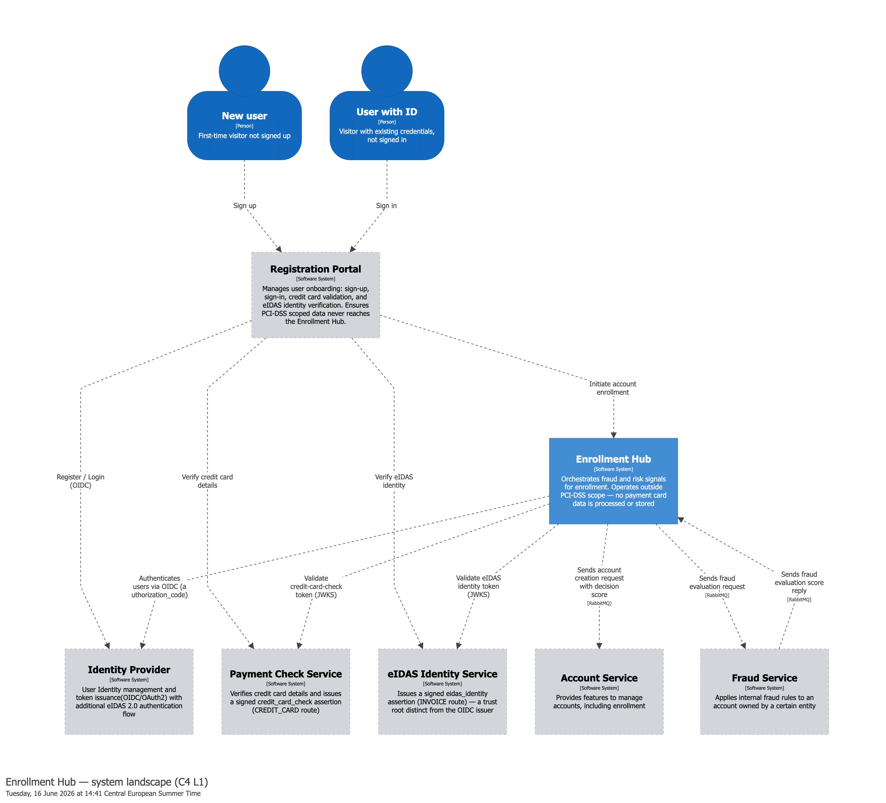
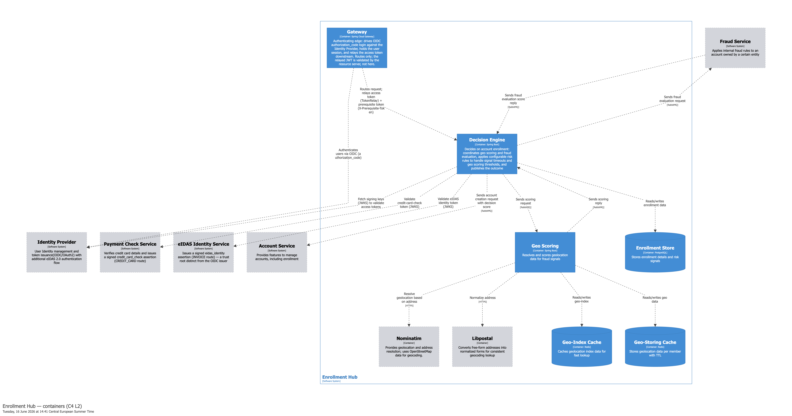
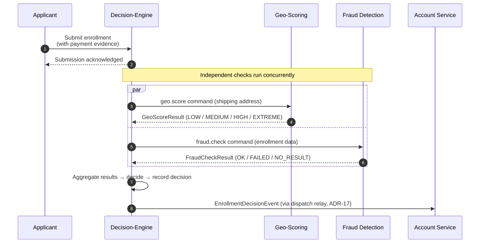

# Architecture: Event-Driven Enrollment

## Overview

**About this Project**

I built this portfolio project to showcase engineering decisions that are important to get right in a resilient, event-driven system. Specifically, ensuring guaranteed message delivery when downstream dependencies are slow or unreliable. The README has the longer version of why I built it and what it's meant to show. This document is the architecture itself.

**Architecture At a Glance**

The Enrollment Hub processes incoming registration requests, evaluates them against scoring modules, and emits auditable enrollment decisions. Positioned between the registration frontend and downstream fulfillment services, the system currently implements scoring within a fraud detection context.

At an estimated five requests a second, throughput was never the constraint. I designed the system around two hard operational requirements instead: an accepted request must never be lost, and the back-office services it depends on are slow at the tail (over a second) and prone to downtime.

One central design decision follows from that: the hub accepts requests immediately and durably, moves scoring to the background, and delivers the decision asynchronously.

Four decisions drive this design:

- Accepting a request and scoring it are separated by a durable queue, so a slow or failing downstream service never reaches the applicant (ADR-13).
- Each fraud check runs as its own service. The decision engine dispatches the checks in parallel, gathers the results, and aggregates a final decision (ADR-07).
- A slow or unresponsive check never blocks an enrollment. The system emits a decision and explicitly notes the missing signal, so the gap stays traceable (ADR-15).
- At ingress, requests are written to durable storage before checks begin to ensure data existence without a separate outbox table. Conversely, at egress, the decision is committed to the correlation record before publishing, allowing the record itself to function as the outbox (§8.7, ADR-17).

**Safety & Validation by Design**

One property I chose to enforce by construction rather than convention: Geo-Scoring can flag an enrollment for human review, but it can never reject one autonomously. By constraining the aggregation branch to only raise review flags, the worst a misconfigured threshold can do is temporarily expand the review queue — it cannot cause a wrongful automated rejection (§8.6).

I also required the design to be validated by empirical data, rather than merely asserted. Consequently, Geo-Scoring is deployed with cautious thresholds alongside a falsifiable hypothesis, so production data can confirm or refute the system's efficacy before it affects real users (see the Geo-Scoring Business Analysis, §5).

**Scope**

The system runs locally on single-instance Postgres, RabbitMQ, and Redis. That is not the production posture; what I would change for production is documented in §7.4, and where a decision would shift at higher volume, the relevant ADR says so.

As a portfolio artifact, this document is more detailed than a production architecture document would be. On a working team much of the rationale here would live in shared context or surface in review; a showcase has to make it explicit, so each decision is argued in full and its alternatives recorded rather than assumed as team knowledge.

The document follows arc42, tailored for portfolio scope: quality goals are folded into §1.2 rather than a separate quality-requirements chapter, §10 combines risks and open decisions, and §11 holds a short glossary of the terms this document coins.

---

## 1. Introduction & Goals

### 1.1 Architectural Drivers

Four primary forces shape the  design of the Enrollment Hub. Each defines a system pressure, followed by the architectural response.

**Extensibility.** Fraud is an evolving threat, so new checks are added over time. Each check runs as its own service that joins the scatter-gather as a listener, so adding one is a localized change — a `SignalConfig` entry, a request builder, a result listener — never a rewrite of the scoring logic.

**Fault isolation.** The pipeline depends on external services — geocoding, spatial indexing, fraud scoring — that lack strong SLAs and fail independently. Because each signal is augmentative rather than essential, each is isolated behind its own process boundary. The system fails open, so a Nominatim outage or a fraud-service failure degrades detection without stalling enrollment.

**Durability.** Enrollment is a write-once event: once the applicant has seen `202 Accepted`, the work must survive a JVM restart, a broker partition, or database lock contention. An intake queue and a durable correlation record hold that state, removing the lost-update risk of in-memory `@Async` processing.

**Latency isolation.** The downstream services carry P99 latencies over a second at best-effort availability. A synchronous call chain would pass those delays to the applicant or drop the enrollment during an outage, so ingress is decoupled from evaluation by durable messaging and the decision is delivered out of band.

---

### 1.2 Quality Goals

The quality attributes from §1.1 translate into concrete goals — split between measurable targets and architectural constraints.

| Quality Goal        | Target / Guarantee                                                                                                                                                                    |
|---------------------|---------------------------------------------------------------------------------------------------------------------------------------------------------------------------------------|
| **Scoring Latency** | **Bounded latency:** P95 ≤ 2 seconds for `GeoScoreResult` events under peak load                                                                                                      |
| **Resiliency**      | **Zero-block intake:** downstream detection failures trigger a fail-open state rather than blocking enrollment (§8.6)                                                                 | 
| **Privacy**         | **48-hour TTL:** automatic eviction of PII and spatial data from the geo-index to minimize GDPR exposure                                                                              |
| **Integrity**       | **Strict gatekeeping:** no enrollment is scored until its prerequisite payment and identity assertions are verified (§8.1, ADR-03, ADR-19)                                                   |
| **Reproducibility** | **Deterministic scoring:** identical request and geo-index state always yield the same score — no ML model, no run-to-run drift — decision is replayable and auditable after the fact |

---
### 1.3 Scale and When It Changes

The system is architected for a baseline workload of up to 50,000 enrollments per day, with a peak ingress throughput of 5 requests per second (RPS). Within a rolling 48-hour window, the spatial index maintains approximately 100,000 active data points. System performance is bound by an internal latency SLA of under five seconds per decision, while the business window for fraud ring mitigation is strictly constrained by this 48-hour index data retention period.

The 5 RPS baseline describes ingress volume only. Internal concurrency and resource utilization are primarily driven by downstream tail latency and request fan-out to multiple parallel checks, rather than ingress rate.

| Downstream Service | Median Latency | P99 Latency   | Availability Target | Impact if Synchronous                         |
|--------------------|----------------|---------------|---------------------|-----------------------------------------------|
| Account Service    | ~200 ms        | **>1,000 ms** | 99.9%               | Applicant timeout; enrollment dropped on blip |
| Fraud Detection    | Variable       | **>1,000 ms** | Best-effort         | Enrollment blocked during outage              |

 Where a decision would change at higher volume, the relevant ADR records the trigger:

- Sustained load at or above 50 requests a second changes the timeout and scaling story (ADR-15).
- At roughly ten times peak, the single Redis instance moves to cluster mode (ADR-11).
- At or above 50 requests a second, lock contention on the correlation record needs revisiting (ADR-16).

---

## 2. Constraints

The drivers in §1 specify what the system must achieve, while the following constraints define the bouondaries within which it must operate:

### 2.1 Technical & Infrastructure Constraints

**Local-first deployment.** The whole system must run on a single local machine in containers, which rules out managed cloud services and forces portable open-source components — PostgreSQL, RabbitMQ, Redis.

**Current Java runtime.** The project commits to JDK 25, which constrains the concurrency model to virtual threads (Project Loom) — well suited to the I/O-bound scatter-gather, avoiding one platform thread per in-flight request.

**Transient storage only.** Scoring runs statelessly: no fraud evidence is written to local disk, and any data needed for correlation or aggregation is held only in transient, TTL-bound remote storage.

### 2.2 Regulatory & Compliance Constraints

**Data minimization.** GDPR forbids long-term retention of high-precision spatial data, so anything used for signal derivation expires under an automatic, irreversible 48-hour policy — no permanent geographic map of users is created.

**Decision traceability.** GDPR Art. 22 requires that automated decisions affecting a person be reconstructable after the fact — which request, which signals settled, and why the outcome was reached. Trace context propagates across every service and message boundary, and the decision rationale is recorded alongside the outcome (§8.4).

**Identity isolation.** Spatial data and identity data are held in separate logical silos, and spatial signals use anonymous identifiers, so a single-service compromise cannot correlate location back to a person.

**Perimeter authenticates, downstream authorizes.** The hub cannot verify identity itself; it trusts only externally signed assertions — eIDAS or payment JWTs — and authenticated sessions. If the trust chain breaks, intake halts rather than proceeding on unverified input.

### 2.3 Security & Trust Boundary

**Delegated trust.** The hub does not authenticate users or verify identity itself. Authentication happens at the gateway against the identity provider; the decision engine then admits a request to an enrollment route only if its token carries the scope that route requires. A valid session with the wrong scope for its route is rejected before any scoring begins (§8.1, ADR-03).

### 2.4 Operational & Business Constraints

**Asynchronous outcome.** The final outcome is delivered out of band, so the public API must not hold synchronous wait loops.

**Resource efficiency.** Despite being distributed, the system must stay efficient at its baseline volume and must not demand a disproportionate infrastructure footprint to run reliably.

---

## 3. Context & Scope

### 3.1 System Context (C4 Level 1)

Five external parties interact with the hub. The registration frontend submits enrollment requests on behalf of an applicant. An identity provider authenticates that applicant and issues the session token each request carries. Separate verification services — a payment-check service, an eIDAS identity connector — issue the signed prerequisite tokens the hub requires before any processing begins. Once a decision is reached, the Account Service consumes it and owns everything that follows: provisioning, fulfillment, and the long-term enrollment record.

That last party also marks the scope boundary. The hub decides; it does not fulfill. It never touches raw card data, so it stays outside PCI-DSS. It does not verify identity itself — it delegates that to the external services and trusts only their signed assertions (§2.2). It does not own the enrollment record; that belongs to the Account Service (ADR-02). What the hub owns is the decision and the short-lived state needed to reach it.

---

## 4. Solution Strategy

The solution strategy is directly informed by our threat model. It is designed to neutralize an active, sophisticated adversary by anchoring detection on physical data invariants rather than transient digital signals.

An assumed adversary is capable of:

- **Synthetic Identity Proliferation** — building many synthetic personas by faking what is cheap to vary (IP, device, email) and spreading genuine credentials (real payment instruments, verified identities) across them, so each enrollment passes per-request validation while the physical address — needed to receive mail and documents — stays
  invariant across the cluster
- **Single-Vector Evasion** — defeating any one detection layer by diversifying instruments or rotating fingerprints, so that uncorrelated checks each pass it in isolation.
- **Iterative Threshold Probing** — submitting repeatedly to identify the threshold a cluster can stay under.
- **Exploitation of Latency** — exploiting the latency window between enrollment and detection.

Each capability maps to an architectural safeguard:

| Adversary Capability                 | Architectural Safeguard                                                                                                                                                                                   | 
|--------------------------------------|-----------------------------------------------------------------------------------------------------------------------------------------------------------------------------------------------------------|
| **Synthetic Identity Proliferation** | **Geo-temporal density analysis:** per-request validation can't catch valid credentials reused across personas, but physical-address density over a short window does.                                    | 
| **Single-Vector Evasion**            | **Scatter-gather with durable correlation:** all applicable signals run concurrently and aggregate on one durable correlation record, defeating one check does not defeat the combined assessment.        | 
| **Iterative Threshold Probing**      | **Unconditional indexing:** every scored enrollment is indexed regardless of its outcome, so each probe raises the local density it is measured against; the atomic check closes the burst-timing bypass. | 
| **Exploitation of Latency**          | **Scoring at enrollment time:** the decision lands in seconds (§1.3), well inside the 48-hour window in which a ring is actionable.                                                                       |

A Note on Why Geo-Scoring is needed:

Payment verification alone cannot catch synthetic identity proliferation, which is why a non-payment signal is needed. AVS is primarily a North American/UK construct; most European issuers do not support it, so it cannot be relied on in the European market — and where it does operate, it matches only at street and postcode level, too coarse to separate adjacent addresses. SCA verifies the cardholder but does not prevent one fraudster from using multiple legitimate instruments to build a cluster of synthetic accounts. Geo-temporal density is therefore the primary invariant signal in the adjacent-address scenario.

---
## 5. Building Block View (C4 Level 2)

A request enters the hub through the gateway, the authenticating perimeter; past it, the hub is a set of independently deployable services that communicate over RabbitMQ rather than by direct call. Traffic is split across four exchanges: one for intake, two for the scatter-gather — a request channel carrying commands out to the checks, a result channel carrying replies back — and one for outbound decisions (ADR-13). The message schemas are not redefined per service. They live in a single producer-owned library, so a contract mismatch surfaces as a compile error rather than a runtime deserialization failure. The blocks are specified perimeter first: the gateway, then the shared contract library every other block depends on, then each service as it is introduced.

### 5.1 Gateway

The gateway is the hub's edge and its authenticating perimeter, built on Spring Cloud Gateway Server WebMVC. It routes and relays and composes no responses, so it is an authenticating gateway rather than a backend-for-frontend. An unauthenticated request is redirected into the OIDC `authorization_code` login against the identity provider. Once the user holds a session, a `TokenRelay` filter attaches the access token to each proxied request. Signature, expiry, and issuer validation are not performed here but downstream at the decision-engine resource server, so the perimeter authenticates while the service that owns the data authorizes (ADR-03). It is stateful — it holds the OAuth2 login session, and scaling it horizontally requires a shared session store — but it holds no domain data. The login and token-relay flow is detailed in the gateway README.

---

### 5.2 Contracts

A shared Maven module holds every event record and shared enum that crosses a service boundary. The producer of an event owns its schema, and consumers depend on the library. The module is a library rather than a deployable unit, with no persistence and no runtime. ADR-06 records the choice of a shared module over a schema registry or per-service duplication, the forward-compatible evolution rules, and the conditions that would justify a registry.

The catalog comprises the intake event, the per-signal scatter-gather commands and their results, and the outbound decision:

| Event                     | Producer → Consumer               | Carries                                                                                   |
|---------------------------|-----------------------------------|-------------------------------------------------------------------------------------------|
| `EnrollmentEvent`         | decision-engine intake → pipeline | the submitted enrollment data                                                             |
| `GeoScoreRequest`         | decision-engine → geo-scoring     | the shipping address only                                                                 |
| `GeoScoreResult`          | geo-scoring → decision-engine     | a `RiskLevel`, or none with a reason when geocoding fails                                 |
| `FraudCheckRequest`       | decision-engine → fraud-detection | the full enrollment data                                                                  |
| `FraudCheckResult`        | fraud-detection → decision-engine | a `SignalOutcome`                                                                         |
| `EnrollmentDecisionEvent` | decision-engine → Account Service | a fresh `decisionId`, the original request, the `DecisionResult`, and the settled signals |

Payload designs follow the principle of least privilege. Each check receives only the fields it needs, and the outbound decision exposes a fresh `decisionId` while withholding the internal correlation key. Whether a signal reports a `RiskLevel` or a `SignalOutcome` follows the classification in ADR-14.

---

### 5.3 Geo-Scoring

Geo-Scoring is the non-payment signal against synthetic identity proliferation (§4). It measures how densely enrollments cluster around a physical address within a short window — a quantity that stays invariant when an adversary varies payment instruments, devices, and identities. It runs as its own service so that a geocoding outage degrades this one signal without stalling the pipeline, and because it carries infrastructure and a data-retention profile the rest of the system does not (ADR-07).

It consumes a `GeoScoreRequest` and replies with a `GeoScoreResult` carrying a `RiskLevel`. Its three-stage processing logic is backed entirely by Redis/Valkey and maintains no relational state.

- **Normalization.** A libpostal sidecar reduces the address to a deterministic canonical form, so formatting variants of the same address share one cache key. A libpostal failure falls back to the raw string rather than blocking (ADR-10).
- **Geocoding.** A self-hosted Nominatim resolves the address to coordinates, fronted by a keyed-hash cache that stores no enrollment identifiers. The provider sits behind an interface and can be swapped without touching the scoring logic (ADR-09).
- **Density scoring.** A fixed-radius neighbor count at 100, 250, and 500 meters over a country-partitioned Redis GEO set maps to a `RiskLevel`. Fixed concentric radii were chosen over a clustering algorithm such as DBSCAN because the thresholds are operationally tunable and the count is a single bounded Redis call (ADR-08). The count and the index write run as one atomic Lua script, closing the burst-timing race a simultaneous fraud ring would otherwise exploit (ADR-11).

Every scored enrollment is indexed regardless of outcome, and every member expires after 48 hours. The TTL is an architectural asset, not only a privacy control: it bounds the index to the window in which fraud rings can be actively detected and mitigated. Indexing every enrollment attempt regardless of its score or outcome makes threshold probing self-defeating, as each probe actively inflates the density metric of the target cluster (ADR-12).

The Redis data structures, the Lua scripts, and the retry and dead-letter behavior are in the Geo-Scoring design document; the radius and threshold calibration is in the Geo-Scoring Business Analysis.

---

### 5.4 Decision Engine
The Decision Engine coordinates the processing pipeline, manages short-lived correlation state, and enforces the system's security and resiliency boundaries. It acts as the resource server, validating gateway-relayed JWTs and applying flow-specific authorization before admitting requests into the asynchronous pipeline (ADR-03). Once a request is authorized, the engine assumes control of the enrollment lifecycle.

The engine aggregats concurrent signals against a durable correlation record (ADR-13) and evaluating them according to defined risk taxonomies (ADR-14). To protect upstream latency, the engine guarantees a deterministic decision deadline; downstream dependency failures or timeouts gracefully degrade individual signals rather than stalling the transaction (ADR-15). Once all available signals are resolved, the engine finalizes the assessment ensuring that late-arriving dependency responses cannot overwrite or reopen a settled decision (ADR-16).

To eliminate dual-write risks, the final decision is written to the correlation record and published asynchronously via an out-of-band dispatch relay (ADR-17). The engine owns the decision and the short-lived correlation state, not the enrollment record, which belongs to the Account Service (ADR-02).

---

### 5.5 Fraud-Detection

Fraud-Detection is a reference implementation providing the internal fraud signal and demonstrating how to extend the pipeline. It evaluates the enrollment data and returns a result classified as `BEST_EFFORT` (ADR-14): an explicit failure authoritatively drives rejection, while a timeout or missing result fails open.

In the current build, this component is a functional stub that unconditionally approves requests to showcase the integration pattern. Because the Decision Engine already declares the `FRAUD_CHECK` signal configuration and handles command dispatching, replacing this stub with a production-grade fraud service is completely confined to this single module.

---

## 6. Runtime View

### 6.1 The CREDIT_CARD Happy Path

The Decision Engine dispatches Geo-Scoring and Fraud-Detection checks concurrently, aggregating their asynchronous results as either a scored outcome or a graceful fail-open signal. For example, a geocoding failure yields an empty RiskLevel that the engine absorbs as a fail-open condition (§6.3). Once all available signals are settled, the engine applies its evaluation logic; within this flow, Geo-Scoring can only elevate a risk tier for manual review and never independently drive a rejection (§8.6).

```mermaid
sequenceDiagram
    autonumber
    participant A as Applicant
    participant O as Decision-Engine
    participant G as Geo-Scoring
    participant F as Fraud Detection
    participant AS as Account Service
    A ->> O: Submit enrollment<br/>(with payment evidence)
    O -->> A: Submission acknowledged
    Note over O, F: Independent checks run concurrently

    par
        O ->> G: geo.score command (shipping address)
        G -->> O: GeoScoreResult (LOW / MEDIUM / HIGH / EXTREME)
    and
        O ->> F: fraud.check command (enrollment data)
        F -->> O: FraudCheckResult (OK / FAILED / NO_RESULT)
    end

    O ->> O: Aggregate results → decide → record decision
    O ->> AS: EnrollmentDecisionEvent (via dispatch relay, ADR-17)
```

This diagram is schematic. To ensure resilience and eliminate dual-write problem, the intake and event publication paths are fully decoupled from the core execution flow. The initial applicant acknowledgment and command dispatch are isolated through the inbound messaging channel, while the final EnrollmentDecisionEvent utilizes a transactional outbox pattern—atomically persisting the decision to the correlation record for an out-of-band relay to publish asynchronously (ADR-17, detailed in §6.2).

### 6.2 Routing Strategy

The decision engine dispatches one command per applicable signal; each check consumes its own command and replies. The routing-key strings, queue declarations, and retry/DLQ configuration are in ADR-13 and the decision engine design document. The entire routing lifecycle executes in three core phases:

**Step 0 — Durable intake.** The REST endpoint authorizes the incoming request synchronously and publishes a durable message to the intake exchange, which feeds a point-to-point queue (§8.7). No database writes occur within the HTTP request thread. The Decision Engine's intake consumer then runs an idempotency ledger on the correlation record: it inserts the record in a `PENDING` state under a unique constraint, dispatches the per-signal commands, and transitions the record to `COMPLETED` before acknowledging the intake message. This sequencing eliminates the dual-write problem at the entry point and guarantees that no check service receives a command for a correlation record that does not yet exist. On message redelivery, the consumer checks the ledger; it either retries the dispatch if the record is still `PENDING` or acknowledges the duplicate without re-dispatching if already `COMPLETED`(ADR-13).

**Step 1 — Per-signal dispatch.** The Decision Engine derives the applicable signals for the specific route from a configuration and publishes one targeted command per signal to the request exchange, routed cleanly by signal name. For example, the credit-card route dispatches both spatial and fraud checks, while the invoice route dispatches the fraud check alone. Each command payload is structurally isolated, carrying only the specific data its corresponding check requires.

**Step 2 — Gather and aggregate.** Each check consumes its command, performs its work, and publishes a result on the result exchange keyed by signal name. Results are correlated and atomically recorded against the durable correlation record. Once every applicable signal has settled, the engine aggregates the findings, persists the final decision to the correlation record, and triggers an out-of-band dispatch relay to publish the final event (ADR-13, ADR-17). 

The applicable-signal set is defined statically within the configuration, which uniformly seeds both the dispatch routine and the gather-set to guarantee the two execution phases never drift (ADR-13).

### 6.3 Timeout and Fail-Open

A detection service can fail independently — an outage, a slow dependency, a Redis partition. When a correlation record's timeout deadline is reached with one or more signals still `PENDING`, the timeout poller (ADR-15) advances those slots to `FAILED`. The completion predicate then holds — every applicable signal is terminal — and aggregation runs on whatever settled before the deadline.

The aggregation carries no per-signal conditional logic for this case. It dispatches on the gate classification (ADR-14):

1. A `BEST_EFFORT` signal that timed out contributes nothing — fail-open. The `DecisionResult` reflects only the
   signals that settled in time.
2. A `SCORING_SIGNAL` that timed out contributes nothing — fail-open, with no routing consequence.
3. A `REQUIRED` signal that timed out does not release the completion predicate — the decision is held and the
   escalation policy in ADR-15 applies. No current `SignalConfig` carries this classification.

The decision is computed and recorded on the correlation record once all applicable signals are terminal — by whichever path completes the row, the result handler or the timeout poller running the same finalize step (ADR-17) — and a dispatch relay publishes the `EnrollmentDecisionEvent` out of band. No currently assigned signal holds the decision open beyond the deadline in ADR-15.

**Fail-open annotation.** A fail-open decision carries the normal outcome (`APPROVED` or `CONDITIONAL_APPROVED`) determined by the signals that settled, annotated with the reason code `APPROVED_SCORE_MISSING` and flagged for operational review. Internally the missing geo-signal is recorded as a null risk level; `APPROVED_SCORE_MISSING` is the externally emitted reason code — the same fact, internal state versus emitted annotation.

**Late-arriving results.** A result that arrives after the decision is recorded finds its correlation slot in a non-`PENDING` terminal state, and the idempotency guard (ADR-16) discards it without modifying the record. Whether a discarded late result should raise a `LateScoreArrived` event, flag the record, or remain visible only via the dead-letter queue is an open decision.

---

## 7. Infrastructure & Deployment

### 7.1 Local Stack

The system runs locally as host-run Spring Boot services against two Docker Compose stacks:

**Infrastructure (`docker-compose.yml`):**

- PostgreSQL — decision-engine correlation store and authorization-server persistence
- RabbitMQ — event bus
- Redis/Valkey — geo-scoring cache and geo-index
- Nominatim — self-hosted geocoding (ADR-09)
- libpostal — address normalization (ADR-10)

**Observability (`otel-local/docker-compose.yml`):**

- OTel Collector, Tempo, Loki — the trace/log pipeline (§8.4)
- Prometheus — metrics scraping and alert-rule evaluation (`monitoring/prometheus/`)
- Grafana — single pane across all three signals; datasources provisioned at startup

**Services (host-run):** gateway, authorization-server, decision-engine, geo-scoring, fraud-detection (stub) —
plus the shared `contracts` library.

### 7.2 Target Environment

Production deployment is vendor-neutral. The target environment provides:

- container orchestration with independent horizontal scaling per service;
- managed PostgreSQL with automated backups and point-in-time recovery for the correlation store;
- a managed RabbitMQ-compatible broker with durable queues and dead-letter support (ADR-13);
- a managed Redis-compatible cache supporting Lua scripting and per-member sorted-set operations (ADR-11);
- TLS-terminating ingress with health checks, network-level filtering, and DDoS protection;
- secrets management for connection strings, JWT signing keys, and the geocoding-cache HMAC pepper.

Specific cloud-provider service mappings are out of scope.

### 7.3 Portability Guardrails

Every endpoint is configured by environment variable (`REDIS_HOST`, `DB_HOST`, `RABBITMQ_HOST`, `IDP_JWKS_URI`,
and so on). Standard Redis AUTH, standard AMQP, no vendor-specific auth mechanisms. The application code is identical
across environments; only connection strings change.

### 7.4 Single-Instance Components and Production Replication Posture

Local Docker Compose runs single-instance PostgreSQL, RabbitMQ, and Redis. This is intentional for portfolio scope and is
**not** the production posture. The application is replication-naive: it relies on the broker and database to handle
failover transparently, so moving from local to production requires no application-code change.

| Component | Local | Production expectation | Failure mode if local posture deployed |
|---|---|---|---|
| PostgreSQL (correlation store) | Single instance | Managed Postgres with synchronous replica + PITR backups | All in-flight enrollments lost; idempotency guard cannot recover state from the broker alone |
| RabbitMQ (event bus) | Single broker | Managed cluster with quorum queues; mirrored DLX | In-flight messages lost on broker failure; Publisher Confirms (ADR-13) detect this and trigger retry, but the publishing process must survive the broker outage |
| Redis (geo-index + geocoding) | Single instance | Managed Redis with replica + persistence (RDB + AOF) | 48h of geo-index lost; geo-scoring settles without a score → fail-open (`APPROVED_SCORE_MISSING`); no enrollment lost |

---

## 8. Crosscutting Concepts

Concerns that cut across every module: security, privacy, observability, data ownership, regulatory alignment, and the messaging and consistency guarantees the pipeline depends on.

### 8.1 Security & Access Control

Three layers (ADR-03):

| Layer | Responsibility | Rejects |
|---|---|---|
| Edge Ingress | TLS termination, DDoS protection, network-level filtering | Malformed connections, blocked IPs/regions |
| Spring Cloud Gateway | Routing, rate limiting, OIDC login (session) + token relay | Unauthenticated requests (redirected to login), rate-limit breaches |
| Services (resource servers) | JWT validation (signature + expiry + issuer), authorization (role/scope), prerequisite token validation | Invalid/expired tokens, insufficient roles/scopes, missing/invalid prerequisite tokens |

The credit-card prerequisite is implemented end-to-end (ADR-18): the authorization-server issues a`credit_card_check` attestation under a distinct trust root, the gateway holds it server-side and relays it as `X-Prerequisite-Token`, and the decision-engine validates it conditionally on the CREDIT_CARD route. The full sequence — issuance, gateway custody, and two-trust-root validation — is in [prerequisite-token-flow.md](prerequisite-token-flow.md).

**Prerequisite token format.** The decision engine expects signed JWTs containing `sub` (subject), `type` (verification type: `credit_card_check` / `eidas_identity`), `iat` (issued-at), and `exp` (expiry). The signature is verified against the issuing service's public key; invalid tokens are rejected and logged.

**Key management.** Identity-provider public keys are retrieved via the JWKS endpoint (Spring Security handles this automatically). Prerequisite-token public keys are configured per issuer — key distribution is managed by the external services.

**Prerequisite check services (out of scope).** The decision engine does not integrate with any external verification provider directly. Dedicated backend services absorb the provider-specific details — Adyen communicates via HMAC-signed webhooks, Onfido issues JWTs directly — and each produces a standardized signed JWT. The decision engine only validates those JWTs, so replacing a provider affects only its dedicated check service, not the engine.

**Webhook ingestion.** Providers like Adyen deliver results via webhooks that need a publicly reachable endpoint, and these bypass the gateway (no identity-provider JWT). The straightforward approach routes webhook paths directly through the edge ingress to the check service, secured by HMAC verification; a higher-isolation alternative terminates webhooks in a dedicated edge function before forwarding internally. Either pattern is transparent to the decision engine.

### 8.2 PII & Privacy Strategy

- **Two structures, different privacy rules.** The geocoding cache (keyed hash → coordinates; no identifiers) and the geo-index (per-enrollment members in time-bounded country partitions) carry different PII profiles and are protected differently — see `geo-scoring/design.md` for the keying scheme, score encoding, and per-member TTL.
- **Data minimization.** Only coordinates are held in the geo-index — no full names, phone numbers, or exact unit numbers. The geocoding cache stores only hashed address keys and coordinates.
- **Pseudonymization (geo-index).** Members are single-use `enrollmentId` tokens, not identifiers; the link to identity is held separately in the access-controlled correlation store. This is pseudonymized personal data (GDPR Art. 4(5)), not anonymization — still in scope, but minimized and short-lived.
- **Ephemeral storage (geo-index).** A 48-hour TTL expires the data automatically, bounding retention.
- **Correlation store.** Holds enrollment state and aggregated risk scores, subject to GDPR retention policy (define the retention period before production). The correlation record includes `original_request` (JSON) with the full enrollment payload and retains it for the retention window: the payload is needed to assemble the `EnrollmentDecisionEvent` for account creation once the signals settle, and for the outbox sweep to replay that event after a crash (ADR-17). Long-term ownership of the enrollment data remains with the Account Service (ADR-02); the timeout window (default 60 minutes) bounds in-flight state, and the retention cleanup job (§10.1) removes the record, payload included, when the window closes.
- **Prerequisite tokens.** Validated in memory, not persisted. Only the validation result (pass/fail) and failure reason are logged.

**Pre-production GDPR tasks.** Before go-live: document the lawful basis for fraud processing (legitimate interest,
Art. 6(1)(f) + Recital 47) with a legitimate-interest assessment; complete a DPIA (Art. 35) covering the fraud profiling; and record the Art. 22 safeguards for the automated decision — the fail-open path and analyst review queue provide the human-intervention route.

### 8.3 Data Ownership

Privacy boundaries keep the modules separate: the decision engine never stores coordinates, Geo-Scoring owns the geo-index and geocoding cache, and raw addresses are transient on the event bus only. See §8.2 for the full strategy.

| Data point | Owner | Storage |
|---|---|---|
| Enrollment data (name, email, address) | Account Service (out of scope) | persistent store (out of scope) |
| Enrollment state | Decision Engine | PostgreSQL (correlation store) |
| Raw address string | Decision Engine → Geo-Scoring | `geo.score` command payload (transient) — shipping address only |
| Enrollment data (for fraud check) | Decision Engine → Fraud Detection | `fraud.check` command payload (transient) — full enrollment data |
| Geocoded coordinates | Geo-Scoring | Redis/Valkey geo-index (48h TTL) |
| Geocoding cache | Geo-Scoring | Redis/Valkey (90-day TTL by default; configurable) |
| Geo-score result | Geo-Scoring → Decision Engine | RabbitMQ → correlation store |

### 8.4 Observability

Three signals, two transport paths: traces and logs are **pushed** over OTLP through the OTel Collector; metrics are**pulled** — Prometheus scrapes each service's `/actuator/prometheus` endpoint directly and evaluates the alert rules.

| Component | Role |
|---|---|
| SLF4J + Logback | Logging facade and implementation. `traceId` and `spanId` are injected into MDC automatically by Micrometer Tracing; every log record carries trace context without manual instrumentation. |
| Micrometer Tracing + OTel bridge | Spring Boot tracing abstraction (`micrometer-tracing-bridge-otel`) connecting Micrometer's `ObservationRegistry` to the OpenTelemetry SDK. Handles span lifecycle and MDC population. |
| OpenTelemetry SDK + OTLP export | Exports trace and log signals to the OTel Collector (Spring Boot 4 per-signal export configuration, `management.opentelemetry.<signal>.export.otlp.*`). |
| OTel Collector | Receives traces and logs over OTLP; routes traces to Tempo and logs to Loki's native OTLP ingestion. |
| Tempo | Distributed trace storage. |
| Prometheus | Metrics: scrapes the Micrometer Prometheus registry of all five services; evaluates the alert rules in `monitoring/prometheus/rules/`. Domain metrics include geocoding latency and cache hit rate (eo-scoring), DLQ depth, publish-failure counters, and the outbox age (decision-engine). |
| Loki | Log storage. Logs arrive from the OTel Collector, not from Promtail or log-file scraping. Correlated to traces in Grafana via `traceId`. |
| Grafana | Single pane across all three signals; Prometheus/Tempo/Loki datasources are provisioned at startup. Correlates logs and traces by `traceId`. |

**RabbitMQ trace-context propagation.** Micrometer Tracing and the OTel bridge integrate with Spring AMQP via the`ObservationRegistry` on both sides of the broker: publishes inject the W3C `traceparent` header into the AMQP message, and the `@RabbitListener` container restores the trace context before the handler runs. One enrollment therefore produces a single distributed trace spanning HTTP entry, intake publish/consume, the scatter to geo-scoring and fraud-detection, the gathered results, and the decision publish — across every queue hop, with no manual header handling.

**Alerting.** The Prometheus rules encode the operational contracts the ADRs promise:

| Alert | Condition | Contract it enforces |
|---|---|---|
| `DlqNonEmpty` | `rabbitmq_dlq_depth > 0` for 5m | Poison-pill containment ends in ops review, not silent loss (ADR-13); procedure in `docs/runbook-dlq-replay.md` |
| `DecisionPublishFailures` | any `decisionengine_publish_failures_total` increase in 15m | Publisher Confirms failures are surfaced, not absorbed by retries (ADR-13) |
| `StuckDecisionOutbox` | `decisionengine_outbox_oldest_age_seconds > 300` for 5m | A decided enrollment is never silently undelivered — the outbox state is observable and alerts before consumers notice (ADR-17) |

### 8.5 DORA/NIS2 Alignment

| Requirement                          | Technical implementation                                                                                                                                                                                                            |
|--------------------------------------|-------------------------------------------------------------------------------------------------------------------------------------------------------------------------------------------------------------------------------------|
| **Service continuity & resilience**  | Scatter-gather with fail-open (§5.4, §6.3): a failing check degrades its signal without stalling enrollment. The production replication posture is specified per stateful component, with the failure mode if it is ignored (§7.4). |
| **Anomaly detection**                | Geo-temporal density scoring (ADR-08): real-time detection of synthetic-identity fraud via fixed-radius neighborhood analysis.                                                                                                      |
| **ICT third-party risk**             | Geocoding and normalization run self-hosted (Nominatim, libpostal) behind swappable interfaces (ADR-09, ADR-10), and the target environment is vendor-neutral (§7.2) — no critical function depends on a single external provider.  |
| **Incident detection & handling**    | The Prometheus alert rules encode the operational contracts the ADRs promise (§8.4); dead-letter containment ends in an operator runbook (`docs/runbook-dlq-replay.md`), not silent loss (ADR-13).                                  |
| **Identity integrity**               | Prerequisite token validation (§8.1): high-materiality transactions (invoicing) are backed by legally non-repudiable identities (eIDAS).                                                                                            |

GDPR data-minimization measures — the 48-hour TTL and the pseudonymized geo-index — are covered under the privacy strategy (§2.2, §8.2, ADR-12) rather than here; they are privacy obligations, not resilience ones.

### 8.6 Decision Engine Signal Classification Model

Every signal carries a typed `GateClassification` on its `SignalConfig`, and the aggregation dispatches on that classification rather than on signal identity. The classification fixes two things: whether a missing signal blocks the decision or proceeds fail-open, and whether the result can drive the outcome or can only flag for review. Three values cover it:

| Classification   | Missing-signal behavior                                            | Authority over outcome                                 | Current assignment                                                            |
|------------------|--------------------------------------------------------------------|--------------------------------------------------------|-------------------------------------------------------------------------------|
| `REQUIRED`       | Blocks decision until signal completes or escalation policy applies | Authoritative — can drive any outcome                  | Reserved; no current signal   (future: sanctions screening, regulated KYC) |
| `BEST_EFFORT`    | Fail-open; aggregation proceeds without the signal                 | Authoritative — can drive any outcome                  | Fraud Detection                                                               |
| `SCORING_SIGNAL` | Fail-open; aggregation proceeds without the signal                 | Advisory — can flag for review, cannot drive rejection | Geo-Scoring                                                                   |

The load-bearing property is the asymmetry: a `SCORING_SIGNAL` can flag for review but is structurally excluded from the rejection path, so a geo-score of `HIGH` or `EXTREME` cannot turn a fraud-clean `APPROVED` into `REJECTED` — at most a `CONDITIONAL_APPROVED`. A misconfigured threshold inflates the analyst review queue but cannot cause a wrongful rejection. Prerequisite validation sits outside this model (§8.1, ADR-03).

The full model — the aggregation algorithm, the per-category result types, how the asymmetric guarantee is enforced, and the rationale for naming `REQUIRED` ahead of its first use — is specified in ADR-14.

### 8.7 Entry-Point Durability and Causal Ordering

The enrollment entry point faces a dual-write: a correlation record must be inserted into PostgreSQL and the downstream check commands dispatched to RabbitMQ. Because no transaction spans both systems, a crash between the two leaves an inconsistent state, and the direction of the gap determines the symptom. If the publish precedes the database commit, the broker may deliver a command to a fast check service before the in-flight `INSERT` is visible under PostgreSQL's read-committed isolation; the result handler finds no correlation row and silently drops the result. If the publish follows the commit, a crash before the publish completes produces an orphan record — acknowledged to the applicant, known to the database, but never dispatched to the check services.

Three solution shapes were evaluated. A **transactional outbox** writes the correlation record and an outbox row in one transaction and relays the outbox to the broker — correct, but it adds an outbox table, a relay, and polling-latency monitoring. A **post-commit synchronization hook** defers the publish to after the commit, closing the publish-beats-commit race but leaving the orphan-record window open: the hook runs in process memory, so a crash between commit and hook loses the event with no broker redelivery. The third **inverts the write order**: the REST endpoint publishes a durable intake message to a point-to-point queue and does nothing else; a single decision-engine consumer drives the rest.

The chosen inversion carries an explicit completion marker — the intake ledger (ADR-13 §Ingress Inversion). The intake listener runs a `PENDING → COMPLETED` state machine across separate transactions:

1. **Insert PENDING** — an inner `@Transactional` service commits the correlation record via `INSERT ... ON CONFLICT(enrollment_id) DO NOTHING`, with `intake_status = PENDING`, before control returns to the listener. The `enrollment_id` primary key makes the insert idempotent; a redelivery, or a concurrent insert under horizontal scaling, writes no second row.
2. **Dispatch** — one per-signal check command per applicable signal, each blocking on the broker publisher confirm (`waitForConfirmsOrDie`), so "the publish succeeded" means the broker has confirmed it.
3. **Mark COMPLETED** — committed before the intake message is acknowledged.

The ledger is what a redelivery reads to decide what to do. A record already `COMPLETED` means the previous delivery dispatched and then crashed before its acknowledgment; the duplicate is acked with no re-dispatch. A record still `PENDING` means the previous delivery failed before completing — the dispatch threw, or the consumer crashed between the dispatch and the COMPLETED commit — so the listener re-dispatches and completes. Acknowledgment is `AUTO`, so the intake message is acked only after the listener returns: a publish *exception* is retried in-process and, if it never succeeds, dead-lettered (`RejectAndDontRequeueRecoverer`); a *crash* acks nothing, so the broker requeues the unacked message and redelivers it into the `PENDING` branch.

This provides the same end-to-end durability as a transactional outbox without the extra table and relay: the intake queue is the durable record of intent — an unacknowledged message is the only cursor of work in flight — and the correlation row's `intake_status` is the completion marker. Because the correlation insert commits before any dispatch, no consumer on the internal bus can observe a check command for a correlation record that has not committed. The listener is the single sequential gatekeeper for the whole pipeline.

The narrow window between a successful dispatch and the COMPLETED commit can produce a duplicate dispatch. This is harmless because every internal consumer is idempotent (ADR-13); the trade-off is a small volume of duplicate internal events in exchange for avoiding an outbox table and relay at the current volume envelope.

This mechanism does not remove the need for the timeout policy (ADR-15); the two address different failure modes. The intake ledger closes the failure mode where a trigger command is never published, by relying on broker redelivery to recover a crash between the correlation commit and the dispatch. The timeout phase of the scheduled sweep closes a different one: check services going silent after a correctly published trigger — Geo-Scoring downtime, a Redis partition, geocoding exhaustion. The single window where both could act is a crash between the correlation commit and the dispatch:intake-queue redelivery is the primary recovery, the timeout sweep the backstop if that redelivery is itself lost.

The symmetric concern on the exit side — emitting the decision is itself a dual-write against the broker — is solved by a transactional outbox on the correlation record rather than the intake-queue inversion, because the decision is born inside a database transaction with no upstream message to carry it (ADR-17, §8.8).

### 8.8 Messaging Semantics

Idempotent consumers achieve effectively-once semantics (at-least-once delivery + idempotent receiver), removing the need for distributed transactions. Entry-point durability and causal ordering — the prerequisites that make this model safe at the decision engine's request boundary — are described in §8.7. The rows below cover the messaging concerns that apply across all pipeline participants.

| Concern | Mechanism | Source |
|---|---|---|
| Publisher-side delivery confirmation | Publisher Confirms + returned-callback retry across all publish paths | ADR-13 |
| Consumer-side redelivery | AUTO ack — the container acks after the listener returns, i.e. after the DB commit; idempotency guard on the correlation row's check slot | ADR-16 |
| Correlation-record race under concurrent arrivals | `SELECT FOR UPDATE` row lock; completion predicate evaluated inside the lock | ADR-16 |
| Decision emission (exit-side dual-write) | Decision computed once and persisted to the correlation record before publish; an eager after-commit dispatch delivers it and a scheduled sweep replays it after a crash (commit-then-publish outbox) — exactly-once *computation*, at-least-once *delivery* | ADR-17 |
| Late-arriving result after decision | Discarded by the idempotency guard at the status check; a `LateScoreArrived` retroactive review is an open decision (§6.3, §10.1) | ADR-16, §10.1 |
| Late/redelivered result for an absent correlation row | A result whose row no longer exists (e.g. deleted by the retention job) finds no slot for the idempotency guard and instead throws `UnknownCorrelationException`, routed to the DLQ on first throw with no retry budget spent. A missing row is treated as an inconsistency for triage, so the retention window (§10.1) must exceed the maximum plausible result-arrival window — otherwise benign late results land in the DLQ as false inconsistencies | ADR-16, §10.1 |
| Poison-pill messages | DLX with bounded redelivery count | ADR-13 |

Each consumer is written to be idempotent, including downstream consumers of `EnrollmentDecisionEvent`, which must tolerate the rare duplicate produced when the sweep re-publishes after a crash between the decision commit and the publisher confirm (ADR-17).

**Backpressure.** Consumer-side prefetch (`spring.rabbitmq.listener.simple.prefetch`) provides natural backpressure: a slow consumer receives no new messages until it acks the in-flight ones. Virtual threads (ADR-04) make a high prefetch value cheap in thread terms — pending I/O consumes no platform threads, and JDK ≥ 24 (JEP 491) removes the synchronized-pinning caveat that previously applied to JDBC internals. The binding concurrency constraint is therefore the JDBC connection pool, not the thread model: prefetch × concurrent consumers should be sized against the pool maximum, since handlers blocked in `SELECT FOR UPDATE` hold a pooled connection for the transaction duration, and pool-acquisition timeouts surface as listener errors and broker redelivery.

**Concurrency ceiling.** At the documented volume envelope (§1.3) the defaults sit nowhere near this ceiling — connection hold time is one short per-row transaction; the sizing becomes relevant at the same ≥50 RPS trigger recorded for correlation-row lock contention (ADR-16, §1.3), at which point prefetch and pool maximum should be tuned together.

### 8.9 Consistency Model

| Boundary | Guarantee | Mechanism | Source |
|---|---|---|---|
| Entry point: correlation record ↔ trigger event | Causal — no consumer observes a check command for an uncommitted correlation record | Intake queue + publish-after-commit | §8.7, ADR-13 |
| Exit point: correlation record ↔ decision event | Record/reality parity — decision computed once, persisted, then published; the downstream effect matches the decision of record | Commit-then-publish outbox + idempotent consumers | §8.8, ADR-17 |
| Correlation record (per `enrollmentId`) | Serialized per-row updates (row lock, not SERIALIZABLE isolation); exactly-once decision *computation* + at-least-once *delivery* | `SELECT FOR UPDATE` + commit-then-publish outbox + idempotency guard | ADR-16, ADR-17 |
| Geo-index density check + write (per request) | Atomic across check and write; no TOCTOU race between concurrent enrollments | Single Redis Lua script | ADR-11 |
| Cross-service event delivery | At-least-once + idempotent consumers (effectively-once) | §8.8 | ADR-13, ADR-16 |
| Cross-request ordering | None required — each request is processed independently (no causal link between distinct enrollments) | N/A | — |
| Late-arriving score vs. emitted decision | Causally inconsistent by design — late results discarded; retroactive review is an open decision | §6.3 | §10.1 |

There is no global linearizability requirement. Each `enrollmentId` is its own small consistency domain, and no consensus protocol crosses request boundaries. This is the simplest model that satisfies the workflow's correctness properties.

---

## 9. Architecture Decision Records

ADRs are maintained as separate files in [`docs/adr/`](adr) and referenced by number throughout this document.

| ADR | Title | Status |
|---|---|---|
| ADR-01 | Technology Stack — Java, RabbitMQ, Lettuce, PostgreSQL, Spring MVC | Accepted |
| ADR-02 | Account Service Boundary | Accepted |
| ADR-03 | Security Architecture — API Gateway, OIDC Login, Prerequisite Tokens | Accepted |
| ADR-04 | Virtual Threads over Reactive Streams | Accepted |
| ADR-05 | Authorization Server Persistence — JDBC-backed Authorization State and User Store | Accepted |
| ADR-06 | Event Contract Ownership — Shared Library Module | Accepted |
| ADR-07 | Separate Scoring Microservice (Event-Driven) | Accepted |
| ADR-08 | Density Detection Algorithm — Fixed-Radius GEOSEARCH | Accepted |
| ADR-09 | Geocoding Provider — Nominatim (Self-Hosted) | Accepted |
| ADR-10 | Address Normalization via Libpostal | Accepted |
| ADR-11 | Atomic Redis Geo-Index with Per-Member TTL | Accepted |
| ADR-12 | 48-Hour TTL as Architectural Asset | Accepted |
| ADR-13 | Decision Engine Messaging Architecture | Accepted |
| ADR-14 | Signal Classification Model | Accepted |
| ADR-15 | Signal-Type-Specific Timeout Policy with DB Polling | Accepted |
| ADR-16 | Concurrent Scatter-Gather Completion — Transactional Safety and ACK Ordering | Accepted |
| ADR-17 | Decision Emission — Compute-Once, Persist-Then-Publish (Transactional Outbox on the Correlation Record) | Accepted |
| ADR-18 | Prerequisite Payment-Check Token — Server-to-Server Issuance, Gateway Custody | Accepted |
| ADR-19 | eIDAS Integration via Connector-Issued JWT, Not In-Pipeline Async Check | Accepted |

---

## 10. Risks & Open Decisions

### 10.1 Open Decisions

| Decision | Options | Notes |
|---|---|---|
| **Internal Fraud Detection signals** | Velocity checks, device fingerprinting, email-domain analysis, and IP clustering are the primary candidates | The `FRAUD_CHECK` signal runs as a stub returning `SignalOutcome.OK` unconditionally in the current implementation. Which signals a real Fraud Detection service evaluates, what data dependencies and stores they require, and when they are introduced are scoped as a separate workstream, independent of the geo-scoring rollout. |
| **Correlation store retention** | 60 minutes (MVP); production retention to be determined by GDPR DPIA and investigation-workflow requirements | The Decision Engine retains workflow state for scatter-gather aggregation only. Long-term enrollment and decision history is the Account Service's responsibility (ADR-02). The GDPR DPIA establishes the production retention window before go-live. |
| **Identity provider** | Self-hosted Spring Authorization Server vs. a managed OIDC provider | A self-hosted Spring Authorization Server is the current choice for local-development parity. Production selection depends on operational burden and existing identity infrastructure. |
| **Late-arriving score after decision** | (1) emit a `LateScoreArrived` event with a causal reference to the original decision; (2) flag the correlation record and surface it on a monitoring dashboard; (3) reopen and rescore | The runtime behavior — idempotent discard of the late result — is in §6.3. The design response depends on the observed late-arrival rate in production, and is deferred until that rate is measurable. |

### 10.2 Known Risks

| Risk | Impact                                                                                                                                                                      | Mitigation                                                                                                                                                                                                                                                                                                                                                      |
|---|-----------------------------------------------------------------------------------------------------------------------------------------------------------------------------|-----------------------------------------------------------------------------------------------------------------------------------------------------------------------------------------------------------------------------------------------------------------------------------------------------------------------------------------------------------------|
| **Nominatim capacity at peak volume** | 50K enrollments per day with a low geocoding-cache hit rate could overload the self-hosted instance                                                                         | The geocoding cache absorbs repeated address lookups; monitor the hit rate and scale Nominatim horizontally if it drops below an acceptable threshold (ADR-09).                                                                                                                                                                                                 |
| **Threshold calibration cold-start** | No labeled fraud data exists to tune density thresholds against on initial deployment                                                                                       | Phase 1 conservative deployment (Geo-Scoring Business Analysis §5): Geo-Scoring is operational from day one with thresholds set high enough that flagging is rare. Real density distributions accumulate from production traffic and provide the empirical baseline for Phase 2 calibration.                                                                    |
| **Dense urban false positives** | Legitimate businesses in city centers trigger cluster alerts, inflating the analyst review queue                                                                            | The 48-hour TTL prevents long-term density accumulation (ADR-12); per-region threshold tuning in Phase 2 establishes separate urban and rural baselines.                                                                                                                                                                                                        |
| **Core hypothesis failure** | Phase 1 production data shows legitimate and fraudulent clusters are not statistically separable in DE/NL/AT cities                                                         | Manifests as an inability to tighten thresholds without unacceptable review-queue inflation, not as customer-facing harm. The feature can be stood down by leaving thresholds at conservative settings, with no operational disruption. The conservative-threshold design makes this failure mode discoverable before it causes harm.                           |
| **Adversarial adaptation** | Sophisticated rings respond to operational Geo-Scoring by slow-rolling enrollments beyond the 48-hour window, or dispersing registrations beyond the fixed detection radius | Phase 3 instruments the adaptation indicators — enrollment time-distribution drift per cluster, geographic dispersion, and threshold-probing behavior. Countermeasures are designed against observed behavior rather than committed to speculatively (Geo-Scoring Business Analysis §5).                                                                        |
| **Attacker-writable geo-index** | Every scored enrollment is indexed before any decision exists (ADR-11), so a ring can deliberately seed clustered points to poison density or probe thresholds              | Bounded blast radius — the 48h per-member TTL (ADR-12) caps accumulation; the atomic check-and-write (ADR-11) removes the burst-timing bypass; unconditional indexing makes probing self-defeating, since each probe raises the density it is measured ag ainst. Containment and visibility are instrumented in Phase 3 (Geo-Scoring Business Analysis §5). |

---

## 11. Glossary

Terms this document coins or uses with a specific meaning.

| Term | Meaning |
|---|---|
| **Signal** | One fraud check's contribution to a decision — dispatched as a command, returned as a result, settled as a slot on the correlation record. |
| **Gate classification** | The typed authority a signal carries (`REQUIRED`, `BEST_EFFORT`, `SCORING_SIGNAL`): whether its absence blocks the decision, and whether its result can drive rejection (§8.6, ADR-14). |
| **Correlation record** | The durable per-enrollment row in PostgreSQL that gathers signal results, carries the intake ledger and the decision, and bounds the enrollment's consistency domain (§5.4, §8.9, ADR-13). |
| **Intake ledger** | The `PENDING → COMPLETED` marker on the correlation record that a redelivered intake message reads to decide between re-dispatch and duplicate acknowledgment (§8.7). |
| **Ingress inversion** | The entry-point pattern: the REST endpoint publishes one durable intake message and does nothing else; a single consumer owns the correlation insert and the per-signal dispatch (§8.7, ADR-13). |
| **Dispatch relay** | The exit-side mechanism that publishes a recorded decision out of band — an eager after-commit dispatch plus a scheduled sweep that replays after a crash (§8.8, ADR-17). |
| **Fail-open** | The policy that a missing or timed-out non-`REQUIRED` signal degrades detection rather than blocking enrollment; the decision proceeds on the signals that settled (§6.3). |
| **Prerequisite token** | An externally signed JWT (payment check, eIDAS identity) that must validate before a request is admitted to the pipeline (§8.1, ADR-18, ADR-19). |
| **Geo-index** | The country-partitioned Redis GEO set of scored enrollments, every member expiring 48 hours after insertion (§5.3, ADR-11, ADR-12). |