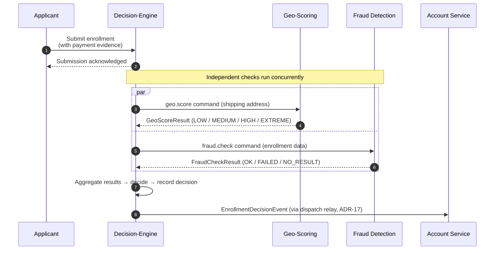

# Architecture: Event-Driven Enrollment

## Overview

**About this Project**

I built this portfolio project to show the engineering decisions that matter in a resilient, event-driven system, in particular how to guarantee message delivery when downstream dependencies are slow or unreliable. The README has the longer version of why I built it and what it is meant to show. This document is the architecture itself.

**Architecture At a Glance**

The Enrollment Hub processes incoming registration requests, evaluates them against scoring modules, and emits auditable enrollment decisions. It sits between the registration frontend and the downstream fulfillment services, and the scoring implemented so far serves fraud detection.

At an estimated five requests a second, throughput was never the constraint. I designed the system around two hard operational requirements instead: an accepted request must never be lost, and the back-office services it depends on are slow at the tail (over a second) and prone to downtime.

One central design decision follows from that: the hub accepts requests immediately and durably, moves scoring to the background, and delivers the decision asynchronously. Four decisions carry it through:

- Accepting a request and scoring it are separated by a durable queue, so a slow or failing downstream service never reaches the applicant (ADR-13).
- Each fraud check runs as its own service. The decision engine dispatches the checks in parallel, gathers the results, and aggregates a final decision (ADR-07).
- A slow or unresponsive check never blocks an enrollment. The system emits a decision and records the missing signal, so the gap stays traceable (ADR-15).
- At ingress, the request is durable before any check begins, without a separate outbox table. At egress, the decision is committed to the correlation record before it is published, so the record itself is the outbox (§8.7, ADR-17).

**Safety & Validation by Design**

One property I chose to enforce by construction rather than convention: Geo-Scoring can flag an enrollment for human review, but it can never reject one on its own. The aggregation only lets it raise a review flag, so the worst a misconfigured threshold can do is temporarily expand the review queue; it cannot cause a wrongful automated rejection (§8.6, ADR-14).

I also required the design to be validated by data rather than asserted. Geo-Scoring ships with cautious thresholds and a falsifiable hypothesis, so production data can confirm or refute the signal before it affects real users (Geo-Scoring Business Analysis §3.2, §5).

**Scope**

The system runs locally on single-instance Postgres, RabbitMQ, and Redis. That is not the production posture; what I would change for production is in §7.4, and where a decision would shift at higher volume, the relevant ADR says so.

The document follows arc42, tailored for portfolio scope: quality goals are folded into §1.2 rather than a separate quality-requirements chapter, §10 combines risks and open decisions, and §11 holds a short glossary of the terms this document coins.

---

## 1. Introduction & Goals

### 1.1 Architectural Drivers

Four forces shape the design. Each is stated as the pressure, then the architectural response.

**Extensibility.** Fraud evolves, so new checks are added over time. Each check runs as its own service that joins the scatter-gather as a listener, so adding one is a localized change: a `SignalConfig` entry, a request builder, a result listener (ADR-07, ADR-13).

**Fault isolation.** The pipeline depends on external services for geocoding, spatial indexing, and fraud scoring, which lack strong SLAs and fail independently. Each signal is augmentative rather than essential, so each is isolated behind its own process boundary and the system fails open: a Nominatim outage or a fraud-service failure degrades detection without stalling enrollment (ADR-15).

**Durability.** Enrollment is a write-once event. Once the applicant has seen `202 Accepted`, the work must survive a JVM restart, a broker partition, or database lock contention. An intake queue and a durable correlation record hold that state, removing the lost-update risk of in-memory `@Async` processing (§8.7, ADR-13).

**Latency isolation.** The downstream services carry P99 latencies over a second at best-effort availability. A synchronous call chain would pass those delays to the applicant, or drop the enrollment during an outage. Ingress is therefore decoupled from evaluation by durable messaging, and the decision is delivered out of band (ADR-17).

---

### 1.2 Quality Goals

The quality attributes from §1.1 translate into the goals below: measurable targets where a number exists, structural guarantees where it does not.

| Quality Goal        | Target / Guarantee                                                                                                                                                                    |
|---------------------|---------------------------------------------------------------------------------------------------------------------------------------------------------------------------------------|
| **Scoring Latency** | **Bounded latency:** P95 ≤ 2 seconds for `GeoScoreResult` events under peak load                                                                                                      |
| **Resiliency**      | **Zero-block intake:** downstream detection failures trigger a fail-open state rather than blocking enrollment (§8.6)                                                                 |
| **Privacy**         | **48-hour TTL:** automatic eviction of PII and spatial data from the geo-index to minimize GDPR exposure                                                                              |
| **Integrity**       | **Strict gatekeeping:** no enrollment is scored until its prerequisite payment and identity assertions are verified (§8.1, ADR-03, ADR-19)                                            |
| **Reproducibility** | **Deterministic scoring:** identical request and geo-index state always yield the same score; no ML model, no run-to-run drift; the decision is replayable and auditable after the fact |

---
### 1.3 Scale and When It Changes

The system is sized for a baseline of up to 50,000 enrollments per day at a peak ingress of 5 requests per second (RPS). Within a rolling 48-hour window the spatial index holds approximately 100,000 active data points. The internal latency SLA is under five seconds per decision, and the business window for acting on a fraud ring is the 48-hour index retention period.

The 5 RPS figure describes ingress only. Internal concurrency is driven by downstream tail latency and the fan-out to parallel checks, not by the ingress rate.

| Downstream Service | Median Latency | P99 Latency   | Availability Target | Impact if Synchronous                         |
|--------------------|----------------|---------------|---------------------|-----------------------------------------------|
| Account Service    | ~200 ms        | **>1,000 ms** | 99.9%               | Applicant timeout; enrollment dropped on blip |
| Fraud Detection    | Variable       | **>1,000 ms** | Best-effort         | Enrollment blocked during outage              |

Where a decision would change at higher volume, the relevant ADR records the trigger:

- Sustained load at or above 50 requests a second changes the timeout and scaling story (ADR-15).
- At roughly ten times peak, the single Redis instance moves to cluster mode (ADR-11).
- At or above 50 requests a second, lock contention on the correlation record is revisited (ADR-16).

---

## 2. Constraints

The drivers in §1 state what the system must achieve. The constraints below bound how it may do so.

### 2.1 Technical & Infrastructure Constraints

**Local-first deployment.** The whole system runs on one local machine in containers. That rules out managed cloud services and requires portable open-source components: PostgreSQL, RabbitMQ, Redis.

**Current Java runtime.** The project commits to JDK 25, which puts the concurrency model on virtual threads (Project Loom). The scatter-gather is I/O-bound, so this avoids one platform thread per concurrent request (ADR-04).

**Transient storage only.** Scoring is stateless. No fraud evidence is written to local disk, and the data needed for correlation or aggregation is held only in transient, TTL-bound remote storage.

### 2.2 Regulatory & Compliance Constraints

**Data minimization.** GDPR forbids long-term retention of high-precision spatial data, so anything used for signal derivation expires under an automatic, irreversible 48-hour policy. No permanent geographic map of users is created.

**Decision traceability.** GDPR Art. 22 requires that an automated decision affecting a person be reconstructable after the fact. The system delivers this at two levels, unequally. How the decision was composed is fully reconstructable: the settled signal map, with each entry's outcome, risk level, or the reason it has neither, is persisted on the correlation record and republished on the decision event, and trace context propagates across every service and message boundary (§6.3; ADR-14, ADR-17). How a scoring signal reached its tier is not: only the tier is persisted, and the geo-index that produced it expires after 48 hours (ADR-12). Retaining the enrollment payload would not close that gap, which is why ADR-20 erases it after dispatch; persisting the measurement at settle time would (§10.1).

**Identity isolation.** Spatial data and identity data are held in separate logical silos, and spatial signals use anonymous identifiers, so a single-service compromise cannot correlate a location back to a person.

**Signed assertions only.** The hub cannot verify identity itself. It trusts externally signed assertions (eIDAS or payment JWTs) and authenticated sessions, and if the trust chain breaks, intake halts rather than proceeding on unverified input.

### 2.3 Security & Trust Boundary

**Delegated trust.** Authentication happens at the gateway against the identity provider. The decision engine admits a request to an enrollment route only if its token carries the scope that route requires, so a valid session with the wrong scope is rejected before any scoring begins (§8.1, ADR-03).

### 2.4 Operational & Business Constraints

**Asynchronous outcome.** The final outcome is delivered out of band, so the public API holds no synchronous wait loops.

**Resource efficiency.** The system is distributed, but at its baseline volume it must not demand a disproportionate infrastructure footprint to run reliably.

---

## 3. Context & Scope

### 3.1 System Context (C4 Level 1)

Five external parties interact with the hub. The registration frontend submits enrollment requests on behalf of an applicant. An identity provider authenticates that applicant and issues the session token each request carries. Separate verification services, a payment-check service and an eIDAS identity connector, issue the signed prerequisite tokens the hub requires before any processing begins. Once a decision is reached, the Account Service consumes it and owns everything that follows: provisioning, fulfillment, and the long-term enrollment record.

That last party also marks the scope boundary. The hub decides; it does not fulfill. It never touches raw card data, so it stays outside PCI-DSS. It does not verify identity itself (§2.2), and it does not own the enrollment record, which belongs to the Account Service (ADR-02). What the hub owns is the decision and the short-lived state needed to reach it.

---

## 4. Solution Strategy

The strategy follows from the threat model. Detection anchors on a physical invariant, the delivery address, rather than on the digital attributes an adversary can vary per request. The assumed adversary is capable of:

- **Synthetic Identity Proliferation**: building many synthetic personas by varying the per-request attributes (IP, device, email) and spreading genuine credentials (real payment instruments, verified identities) across them. Each enrollment passes per-request validation, while the physical address, needed to receive mail and documents, stays invariant across the cluster.
- **Single-Vector Evasion**: defeating any one detection layer by diversifying instruments or rotating fingerprints, so that uncorrelated checks each pass in isolation.
- **Iterative Threshold Probing**: submitting repeatedly to find the threshold a cluster can stay under.
- **Exploitation of Latency**: acting in the window between enrollment and detection.

Each capability maps to an architectural safeguard:

| Adversary Capability                 | Architectural Safeguard                                                                                                                                                                                   |
|--------------------------------------|-----------------------------------------------------------------------------------------------------------------------------------------------------------------------------------------------------------|
| **Synthetic Identity Proliferation** | **Geo-temporal density analysis:** per-request validation cannot catch valid credentials reused across personas, but physical-address density over a short window does.                                   |
| **Single-Vector Evasion**            | **Scatter-gather with durable correlation:** all applicable signals run concurrently and aggregate on one durable correlation record, so defeating one check does not defeat the combined assessment.      |
| **Iterative Threshold Probing**      | **Unconditional indexing:** every scored enrollment is indexed regardless of its outcome, so each probe raises the local density it is measured against; the atomic check closes the burst-timing bypass. |
| **Exploitation of Latency**          | **Scoring at enrollment time:** the decision lands in seconds (§1.3), well inside the 48-hour window in which a ring is actionable.                                                                       |

**Why a non-payment signal.** Payment verification alone cannot catch this pattern: AVS is largely unavailable from European issuers and coarse where it runs, and SCA verifies the cardholder, not how many accounts one cardholder builds. Geo-temporal density is therefore the primary signal in the adjacent-address scenario; the Geo-Scoring Business Analysis §2.2 covers the gap in the existing defenses.

---
## 5. Building Block View (C4 Level 2)

A request enters the hub through the gateway, the authenticating perimeter. Past it, the hub is a set of independently deployable services that communicate over RabbitMQ rather than by direct call, across four exchanges: intake, the scatter-gather request and result channels, and outbound decisions (ADR-13). Message schemas live in one producer-owned library, so a contract mismatch is a compile error rather than a runtime deserialization failure. The blocks are described perimeter first: the gateway, the shared contract library, then each service.

### 5.1 Gateway

The gateway is the hub's edge and its authenticating perimeter, built on Spring Cloud Gateway Server WebMVC. It routes and relays and composes no responses, so it is an authenticating gateway rather than a backend-for-frontend. An unauthenticated request is redirected into the OIDC `authorization_code` login against the identity provider; once the user holds a session, a `TokenRelay` filter attaches the access token to each proxied request. Signature, expiry, and issuer validation happen downstream at the decision-engine resource server, so the perimeter authenticates and the service that owns the data authorizes (ADR-03). The gateway holds the OAuth2 login session and no domain data; scaling it horizontally requires a shared session store. The login and token-relay flow is in the gateway README.

---

### 5.2 Contracts

A shared Maven module holds every event record and shared enum that crosses a service boundary. The producer of an event owns its schema, and consumers depend on the library, which has no persistence and no runtime. ADR-06 records the choice over a schema registry or per-service duplication, the evolution rules, and the conditions that would justify a registry.

The catalog comprises the intake event, the per-signal scatter-gather commands and their results, and the outbound decision:

| Event                     | Producer → Consumer               | Carries                                                                                   |
|---------------------------|-----------------------------------|-------------------------------------------------------------------------------------------|
| `EnrollmentEvent`         | decision-engine intake → pipeline | the submitted enrollment data                                                             |
| `GeoScoreRequest`         | decision-engine → geo-scoring     | the shipping address only                                                                 |
| `GeoScoreResult`          | geo-scoring → decision-engine     | a `RiskLevel`, or none with a reason when geocoding fails                                 |
| `FraudCheckRequest`       | decision-engine → fraud-detection | the full enrollment data                                                                  |
| `FraudCheckResult`        | fraud-detection → decision-engine | a `CheckOutcome`, with a reason when it reached no verdict                                 |
| `EnrollmentDecisionEvent` | decision-engine → Account Service | a fresh `decisionId`, the original request, the `DecisionResult`, and the settled signals |

Payloads follow least privilege. Each check receives only the fields it needs, and the outbound decision exposes a fresh `decisionId` while withholding the internal correlation key. Whether a signal reports a `RiskLevel` or a `SignalOutcome` follows the classification in ADR-14.

---

### 5.3 Geo-Scoring

Geo-Scoring is the non-payment signal against synthetic identity proliferation (§4). It measures how densely enrollments cluster around a physical address within a short window, a quantity that stays invariant when an adversary varies payment instruments, devices, and identities. It is a separate service so that a geocoding outage degrades this one signal only, and because it carries infrastructure and a data-retention profile the rest of the system does not (ADR-07).

It consumes a `GeoScoreRequest` and replies with a `GeoScoreResult` carrying a `RiskLevel`. Processing has three stages, backed entirely by Redis/Valkey with no relational state.

- **Normalization.** A libpostal sidecar reduces the address to a deterministic canonical form, so formatting variants of the same address share one cache key; a libpostal failure falls back to the raw string (ADR-10).
- **Geocoding.** A self-hosted Nominatim resolves the address to coordinates, fronted by a keyed-hash cache that stores no enrollment identifiers. The `GeocodingProvider` interface in front of it is a test seam, not a runtime migration path (ADR-09).
- **Density scoring.** A fixed-radius neighbor count at 100, 250, and 500 meters over a country-partitioned Redis GEO set maps to a `RiskLevel`; the choice of fixed radii over DBSCAN is recorded in ADR-08. The count and the index write run as one atomic Lua script, closing the burst-timing race a simultaneous ring would exploit (ADR-11).

Every scored enrollment is indexed regardless of outcome, and every member expires after 48 hours. The TTL is a detection window as much as a privacy control: it bounds the index to the period in which a ring is still actionable (ADR-12).

The Redis structures, the Lua scripts, and the retry and dead-letter behavior are in the Geo-Scoring design document; radius and threshold calibration is in the Geo-Scoring Business Analysis.

---

### 5.4 Decision Engine

The Decision Engine is the orchestrator. It is the resource server that validates gateway-relayed JWTs and applies the per-route authorization and prerequisite checks before a request enters the pipeline (ADR-03). From there it owns the enrollment lifecycle: it dispatches one command per applicable signal, gathers the results on a durable correlation record (ADR-13), and aggregates them under the classification model (ADR-14). A deadline bounds every enrollment. A signal that has not answered by then settles as fail-open or fail-closed according to its classification, so a downstream failure degrades one signal rather than stalling the decision (ADR-15). A result that arrives after the decision cannot reopen it (ADR-16).

The decision is written to the correlation record and published out of band by a dispatch relay, so the record is the outbox and there is no dual write (ADR-17). The engine owns the decision and the short-lived correlation state, not the enrollment record, which belongs to the Account Service (ADR-02).

---

### 5.5 Fraud-Detection

Fraud-Detection is a reference implementation of the internal fraud signal and shows how a check is added to the pipeline. It evaluates the enrollment data and returns a result classified `BEST_EFFORT` (ADR-14): an explicit failure drives rejection, while a timeout or missing result fails open.

In the current build it is a stub that approves every request. The Decision Engine already declares the `FRAUD_CHECK` signal configuration and dispatches the command, so replacing the stub with a production service is confined to this module.

---

## 6. Runtime View

### 6.1 The CREDIT_CARD Happy Path

The Decision Engine dispatches the Geo-Scoring and Fraud-Detection checks concurrently and gathers each result as a scored outcome or a fail-open signal; a geocoding failure, for example, returns no risk level and a reason, which the engine records as a no-result (§6.3). Once every applicable signal is terminal the engine aggregates. Geo-Scoring can raise the outcome to a manual review and never drives a rejection on its own (§8.6).

```mermaid
sequenceDiagram
    autonumber
    participant A as Applicant
    participant O as Decision-Engine
    participant G as Geo-Scoring
    participant F as Fraud Detection
    participant AS as Account Service
    A ->> O: Submit enrollment<br/>(with payment evidence)
    O -->> A: Submission acknowledged
    Note over O, F: Independent checks run concurrently

    par
        O ->> G: geo.score command (shipping address)
        G -->> O: GeoScoreResult (LOW / MEDIUM / HIGH / EXTREME)
    and
        O ->> F: fraud.check command (enrollment data)
        F -->> O: FraudCheckResult (OK / FAILED / NO_RESULT)
    end

    O ->> O: Aggregate results → decide → record decision
    O ->> AS: EnrollmentDecisionEvent (via dispatch relay, ADR-17)
```

The diagram is schematic. The acknowledgment is returned once the intake message is durable, and the commands are dispatched by the intake consumer rather than the request thread (§8.7). The decision event is published by the dispatch relay after the decision is committed to the correlation record, which is itself the outbox (ADR-17).

### 6.2 Routing Strategy

The decision engine dispatches one command per applicable signal; each check consumes its own command and replies. Routing keys, queue declarations, and the retry and DLQ configuration are in ADR-13 and `decision-engine/design.md`. The lifecycle has three phases.

**Step 0, durable intake.** The REST endpoint authorizes the request synchronously and publishes one durable message to the intake exchange, which feeds a point-to-point queue; no database write happens on the HTTP request thread. The intake consumer inserts the correlation record, dispatches the per-signal commands, and marks the record complete before acknowledging the intake message; a redelivery reads that marker and either re-dispatches or acknowledges the duplicate (§8.7).

**Step 1, per-signal dispatch.** The engine derives the applicable signals for the route from `SignalConfig` and publishes one command per signal to the request exchange, routed by signal name. The credit-card route dispatches the geo and fraud checks; the invoice route dispatches the fraud check alone. Each command carries only the data its check requires.

**Step 2, gather and aggregate.** Each check consumes its command and publishes a result on the result exchange keyed by signal name. Results are recorded against the correlation record under a row lock (ADR-16). Once every applicable signal has settled, the engine aggregates, persists the decision to the record, and the dispatch relay publishes the event (ADR-17).

The applicable-signal set is defined once, in configuration, and seeds both the dispatch and the completion predicate, so the two phases cannot drift (ADR-13).

### 6.3 Timeout and Fail-Open

A detection service can fail independently: an outage, a slow dependency, a Redis partition. When a correlation record reaches its deadline with signals still pending, the timeout poller settles those slots as never executed, or, for a `REQUIRED` signal, as an explicit failed verdict (ADR-15). Every applicable signal is then terminal, and aggregation runs on whatever answered in time, dispatching on the gate classification (ADR-14) with no per-signal special case:

1. A `BEST_EFFORT` or `SCORING_SIGNAL` that timed out contributes nothing; the `DecisionResult` reflects the signals that settled in time (fail-open).
2. A `REQUIRED` signal that timed out settles as a failed verdict and drives `REJECTED` (fail-closed): an unverifiable required check rejects. No current `SignalConfig` carries this classification.

Whichever path completes the row, the result handler or the timeout poller, runs the same finalize step, and the dispatch relay publishes the `EnrollmentDecisionEvent` out of band (ADR-17).

**Fail-open annotation.** A fail-open decision carries the normal outcome (`APPROVED` or `CONDITIONAL_APPROVED`) for the signals that answered, and the missing signal is published and persisted with its own reason: `NOT_EXECUTED` when no reply arrived in time, or no outcome when the service ran and could not produce a value (ADR-15 §Fail-open annotation). Such a decision is otherwise indistinguishable from a fully evidenced one, so `decisionengine_signal_settled_total` records how each signal settled and `SignalFailingOpen` fires when one signal's fail-open share stays elevated (§8.4).

**Late-arriving results.** A result that arrives after the decision is recorded finds its slot in a terminal state, and the idempotency guard (ADR-16) discards it without modifying the record. Whether a discarded late result should raise a `LateScoreArrived` event, flag the record, or stay visible only through the dead-letter queue is open (§10.1).

---

## 7. Infrastructure & Deployment

### 7.1 Local Stack

The system runs locally as host-run Spring Boot services against two Docker Compose stacks:

**Infrastructure (`docker-compose.yml`):**

- PostgreSQL: decision-engine correlation store and authorization-server persistence
- RabbitMQ: event bus
- Redis/Valkey: geo-scoring cache and geo-index
- Nominatim: self-hosted geocoding (ADR-09)
- libpostal: address normalization (ADR-10)

**Observability (`otel-local/docker-compose.yml`):**

- OTel Collector, Tempo, Loki: the trace/log pipeline (§8.4)
- Prometheus: metrics scraping and alert-rule evaluation (`monitoring/prometheus/`)
- Grafana: single pane across all three signals; datasources provisioned at startup

**Services (host-run):** gateway, authorization-server, decision-engine, geo-scoring, fraud-detection (stub), and the shared `contracts` library.

### 7.2 Target Environment

Production deployment is vendor-neutral. The target environment provides:

- container orchestration with independent horizontal scaling per service;
- managed PostgreSQL with automated backups and point-in-time recovery for the correlation store;
- a managed RabbitMQ-compatible broker with durable queues and dead-letter support (ADR-13);
- a managed Redis-compatible cache supporting Lua scripting and per-member sorted-set operations (ADR-11);
- TLS-terminating ingress with health checks, network-level filtering, and DDoS protection;
- secrets management for connection strings, JWT signing keys, and the geocoding-cache HMAC pepper.

Specific cloud-provider service mappings are out of scope.

### 7.3 Portability Guardrails

Every endpoint is configured by environment variable (`REDIS_HOST`, `DB_HOST`, `RABBITMQ_HOST`, `IDP_JWKS_URI`, and so on). Standard Redis AUTH, standard AMQP, no vendor-specific auth mechanisms. The application code is identical across environments; only connection strings change.

### 7.4 Single-Instance Components and Production Replication Posture

Local Docker Compose runs single-instance PostgreSQL, RabbitMQ, and Redis. This is intentional for portfolio scope and is **not** the production posture. The application is replication-naive: it relies on the broker and database to handle failover transparently, so moving from local to production requires no application-code change.

| Component | Local | Production expectation | Failure mode if local posture deployed |
|---|---|---|---|
| PostgreSQL (correlation store) | Single instance | Managed Postgres with synchronous replica + PITR backups | All undecided enrollments lost; idempotency guard cannot recover state from the broker alone |
| RabbitMQ (event bus) | Single broker | Managed cluster with quorum queues; mirrored DLX | In-flight messages lost on broker failure; Publisher Confirms (ADR-13) detect this and trigger retry, but the publishing process must survive the broker outage |
| Redis (geo-index + geocoding) | Single instance | Managed Redis with replica + persistence (RDB + AOF) | 48h of geo-index lost; geo-scoring settles without a score and fails open, published as a signal with no outcome and a reason; no enrollment lost |

---

## 8. Crosscutting Concepts

Concerns that cut across every module: security, privacy, observability, data ownership, regulatory alignment, and the messaging and consistency guarantees the pipeline depends on.

### 8.1 Security & Access Control

Three layers (ADR-03):

| Layer | Responsibility | Rejects | Status |
|---|---|---|---|
| Edge Ingress | TLS termination, DDoS protection, network-level filtering | Malformed connections, blocked IPs/regions | Target environment (§7.2); not part of the local stack |
| Spring Cloud Gateway | Routing, OIDC `authorization_code` login (session) + token relay | Unauthenticated requests (redirected to login) | Implemented |
| Services (resource servers) | JWT validation (signature, expiry, issuer, audience), scope authorization (`enrollment:write`), prerequisite-token validation | Invalid/expired tokens, wrong audience, insufficient scope, missing/invalid prerequisite tokens | Implemented |

A control-by-control map of this section and §8.2, with the implementation, the test that pins each control, and its status, is in [security-controls.md](security-controls.md).

**Rate limiting (not implemented).** No request-rate cap exists on the enrollment route. The intended design places it on the gateway, the only public entry point in the target topology: keyed on the authenticated principal and never on a payload field, rejecting with `429` and `Retry-After`, with rejections counted in Prometheus behind an alert rule (§8.4). Two constraints bind it: in the local compose stack the decision-engine port is directly reachable, so the guarantee assumes the production topology, and in-memory bucket state is a single-instance choice. Brute-force limiting on the login and token endpoints belongs on the authorization server.

**Internal transport (not authenticated).** The layers above cover the user-facing path only. Between the decision engine and its workers, RabbitMQ carries no per-message or per-service authentication; broker network access is the trust boundary, and no user token crosses it. That holds while the broker is private to the deployment (§7.2). A shared, exposed, or multi-tenant broker is the trigger for hardening (ADR-03 §Internal trust posture).

**Prerequisite tokens.** A route may require an externally signed attestation before the request is admitted. The credit-card prerequisite is implemented end-to-end (ADR-18): the authorization-server issues a `credit_card_check` token under a distinct trust root, the gateway holds it server-side and relays it as `X-Prerequisite-Token`, and the decision engine validates it on the CREDIT_CARD route only. Each prerequisite type is verified against its issuer's configured public key; identity-provider keys come from the JWKS endpoint. The eIDAS prerequisite for the INVOICE route is designed (ADR-19) and not built. The full sequence is in [prerequisite-token-flow.md](prerequisite-token-flow.md).

**Prerequisite check services (out of scope).** Provider-specific integration (Adyen webhooks, Onfido JWTs) lives in dedicated check services that each emit a standardized signed JWT, so replacing a provider does not touch the engine (ADR-03 §Prerequisite check services).

**Webhook ingestion (not built).** Provider webhooks bypass the gateway and would terminate at the check service through the edge ingress under HMAC verification, transparent to the decision engine.

### 8.2 PII & Privacy Strategy

Two Redis structures and one PostgreSQL table hold personal data, each under its own rule. The keying scheme, score encoding, and per-member TTL are in `geo-scoring/design.md`.

**Geo-index.** Coordinates only: no names, phone numbers, or unit numbers. Members are single-use `enrollmentId` tokens; the link to an identity is held separately in the access-controlled correlation store. This is pseudonymized personal data (GDPR Art. 4(5)), not anonymized, so it stays in scope, minimized and short-lived: every member expires after 48 hours (ADR-12).

**Geocoding cache.** Maps a peppered HMAC-SHA256 digest of the normalized address to coordinates under a 90-day TTL (`geocoding.cache.ttl`). The entry is address → coordinates, not enrollment → address, so many enrollments collapse onto one entry and none is identifiable from it. The TTL outlasts the geo-index window on purpose: the cache spares Nominatim repeated lookups, and an address's coordinates do not change.

**Correlation store.** Holds the enrollment workflow state and the decision of record. `original_request` carries the full enrollment payload from intake until the broker confirms the decision event that carries it downstream, because the engine has no other source for it. After that confirm the payload has no reader, so `PayloadRetentionJob` erases the column on its next pass with no waiting period; ADR-20 argues both points. What survives is pseudonymous: ids, outcome, settled signals, timestamps. That is still personal data under Recital 26, retained rather than aged out because it holds the only `decisionId → enrollmentId` bridge; the deletion window stays open (§10.1). `decisionengine.payload.oldest.age` reports how long the oldest payload has been held. Residual copies in backups, WAL, and superseded row versions are bounded by those cycles, not by the job (ADR-20 §Residual exposure).

**Minimization at the signal boundary.** Each check command carries only what its signal needs. `GeoScoreRequest` carries the shipping address and no identity, so geo-scoring never sees a name, email, or phone. `FraudCheckRequest` is the deliberate exception: it carries the full `EnrollmentData` for the anticipated fraud signals, while the current stub reads only `enrollmentId`, so that breadth is re-examined when the real service lands (§10.1). Because each worker receives a slice, none can return the whole payload, which is why the correlation store holds it in between (ADR-20).

**Prerequisite tokens are not stored.** They are validated in memory and never persisted. Only the validation result and the failure reason are logged.

**Address data never reaches the logs.** No log statement at any level carries an address, an address fragment, or coordinates derived from one. Where a line has to identify the address it concerns, it logs the peppered cache digest, which is not reversible. Geocoding is an HTTP call with the address in the query string, and both upstreams (Nominatim, libpostal) echo the request in their error bodies, so request URIs are logged path-only and error bodies are reduced to their status code. Diagnostic context travels as the `enrollmentId` in the MDC. The rule matters beyond the log files: every service exports logs over OTLP (`management.opentelemetry.logging.export.otlp`), so a line carrying an address would land in a store with its own retention that no cleanup job here can reach. It is enforced by review, not by a test.

**Pre-production GDPR tasks.** Before go-live: document the lawful basis for fraud processing (legitimate interest, Art. 6(1)(f) and Recital 47) with a legitimate-interest assessment; complete a DPIA (Art. 35) covering the fraud profiling; record the Art. 22 safeguards for the automated decision, namely the fail-open path and `CONDITIONAL_APPROVED` as the route into human review; and, where the engine and the Account Service sit under different controllers, put a data-sharing or Art. 28 arrangement in place. The review queue is a consumer-side workflow the hub does not own.

### 8.3 Data Ownership

Privacy boundaries keep the modules separate: the decision engine never stores coordinates, Geo-Scoring owns the geo-index and the geocoding cache, and raw addresses are transient on the event bus only (§8.2).

| Data point | Owner | Storage |
|---|---|---|
| Enrollment data (name, email, address) | Account Service (out of scope) | persistent store (out of scope) |
| Enrollment state | Decision Engine | PostgreSQL (correlation store) |
| Raw address string | Decision Engine → Geo-Scoring | `geo.score` command payload (transient); shipping address only |
| Enrollment data (for fraud check) | Decision Engine → Fraud Detection | `fraud.check` command payload (transient); full enrollment data |
| Geocoded coordinates | Geo-Scoring | Redis/Valkey geo-index (48h TTL) |
| Geocoding cache | Geo-Scoring | Redis/Valkey (90-day TTL by default; configurable) |
| Geo-score result | Geo-Scoring → Decision Engine | RabbitMQ → correlation store |

### 8.4 Observability

Three signals, two transport paths. Traces and logs are pushed over OTLP through the OTel Collector to Tempo and Loki; metrics are pulled by Prometheus, which scrapes each service and evaluates the alert rules in `monitoring/prometheus/rules/`. Every log record carries the trace and span ids, and Grafana fronts all three signals and correlates logs to traces by `traceId`.

**Trace context across RabbitMQ.** A publish injects the W3C `traceparent` header and the listener container restores the context before the handler runs, so one enrollment is one distributed trace from HTTP entry through every queue hop to the decision publish, with no manual header handling.

**Alerting.** The Prometheus rules encode the operational contracts the ADRs promise:

| Alert | Condition | Contract it enforces |
|---|---|---|
| `DlqNonEmpty` | `rabbitmq_dlq_depth > 0` for 5m | Poison-pill containment ends in ops review, not silent loss (ADR-13); procedure in `docs/runbook-dlq-replay.md` |
| `DecisionPublishFailures` | any `decisionengine_publish_failures_total` increase in 15m | Publisher Confirms failures are surfaced, not absorbed by retries (ADR-13) |
| `StuckDecisionOutbox` | `decisionengine_outbox_oldest_age_seconds > 300` for 5m | A decided enrollment is never silently undelivered; the outbox state is observable and alerts before consumers notice (ADR-17) |
| `SignalFailingOpen` | a signal's `NO_RESULT` + `NOT_EXECUTED` share of `decisionengine_signal_settled_total` above 20% over 30m (min. 10 settlements), for 15m | Fail-open degradation is measured, not assumed; a detection service can be unavailable while every enrollment is still decided and dispatched normally (ADR-15) |

### 8.5 DORA/NIS2 Alignment

| Requirement                          | Technical implementation                                                                                                                                                                                                            |
|--------------------------------------|-------------------------------------------------------------------------------------------------------------------------------------------------------------------------------------------------------------------------------------|
| **Service continuity & resilience**  | Scatter-gather with fail-open (§5.4, §6.3): a failing check degrades its signal without stalling enrollment. The production replication posture is specified per stateful component, with the failure mode if it is ignored (§7.4). |
| **Anomaly detection**                | Geo-temporal density scoring (ADR-08): real-time detection of synthetic-identity fraud via fixed-radius neighborhood analysis.                                                                                                      |
| **ICT third-party risk**             | Geocoding and normalization run self-hosted (Nominatim, libpostal) behind a provider interface (ADR-09, ADR-10), and the target environment is vendor-neutral (§7.2); no critical function depends on a single external provider.   |
| **Incident detection & handling**    | The Prometheus alert rules encode the operational contracts the ADRs promise (§8.4); dead-letter containment ends in an operator runbook (`docs/runbook-dlq-replay.md`), not silent loss (ADR-13).                                  |
| **Identity integrity**               | Prerequisite token validation (§8.1): high-materiality transactions (invoicing) are backed by legally non-repudiable identities (eIDAS, deferred).                                                                                   |

GDPR data-minimization measures, the 48-hour TTL and the pseudonymized geo-index, are covered under the privacy strategy (§2.2, §8.2, ADR-12) rather than here; they are privacy obligations, not resilience ones.

### 8.6 Decision Engine Signal Classification Model

Every signal carries a typed `GateClassification` on its `SignalConfig`, and the aggregation dispatches on that classification rather than on signal identity. The classification fixes two things: whether a missing signal fails closed or fails open, and whether the result can drive the outcome or only flag for review.

| Classification   | Missing-signal behavior                                            | Authority over outcome                                 | Current assignment                                                            |
|------------------|--------------------------------------------------------------------|--------------------------------------------------------|-------------------------------------------------------------------------------|
| `REQUIRED`       | Fail-closed; a missing signal settles as a failed verdict (ADR-15) | Authoritative; can drive any outcome                   | Reserved; no current signal   (future: sanctions screening, regulated KYC) |
| `BEST_EFFORT`    | Fail-open; aggregation proceeds without the signal                 | Authoritative; can drive any outcome                   | Fraud Detection                                                               |
| `SCORING_SIGNAL` | Fail-open; aggregation proceeds without the signal                 | Advisory; can flag for review, cannot drive rejection  | Geo-Scoring                                                                   |

The load-bearing property is the asymmetry. A `SCORING_SIGNAL` can flag for review but is structurally excluded from the rejection path, so a geo-score of `HIGH` or `EXTREME` cannot turn a fraud-clean `APPROVED` into `REJECTED`, only into `CONDITIONAL_APPROVED`. A misconfigured threshold inflates the analyst review queue and cannot cause a wrongful rejection. Prerequisite validation sits outside this model (§8.1, ADR-03).

The aggregation algorithm, the per-category result types, how the asymmetric guarantee is enforced, and why `REQUIRED` is named ahead of its first use are in ADR-14.

### 8.7 Entry-Point Durability and Causal Ordering

The entry point faces a dual-write: a correlation record must be inserted into PostgreSQL and the per-signal commands dispatched to RabbitMQ, with no transaction spanning both. Either ordering leaves a crash window (ADR-13 §Alternatives at the entry point).

The design inverts the write order. The REST endpoint publishes one durable intake message to a point-to-point queue and does nothing else. A single decision-engine consumer inserts the correlation record with `intake_status = PENDING`, dispatches one command per applicable signal under publisher confirms, and marks the record `COMPLETED` before the intake message is acknowledged (ADR-13 §Ingress Inversion). The intake queue is the durable record of intent, and the ledger on the row tells a redelivery whether to re-dispatch or acknowledge a duplicate. Because the insert commits before any dispatch, no consumer on the internal bus can observe a check command for an uncommitted correlation record.

The narrow window between a successful dispatch and the `COMPLETED` commit can produce a duplicate dispatch, which is harmless because every internal consumer is idempotent (ADR-13). That is the trade-off: a small volume of duplicate internal events in exchange for no outbox table and no relay at the current volume envelope.

The ledger and the timeout policy (ADR-15) close different failure modes: the ledger recovers a command that was never published, the timeout sweep a check service that went silent after a correctly published one. The exit side is the mirror image and uses a transactional outbox on the correlation record, because the decision is born inside a database transaction with no upstream message to carry it (ADR-17, §8.8).

### 8.8 Messaging and Consistency Guarantees

Delivery is at-least-once and every consumer is idempotent, which gives effectively-once processing without distributed transactions. There is no global linearizability requirement: each `enrollmentId` is its own small consistency domain, and no consensus protocol crosses request boundaries. The entry-point guarantees that make this safe at the decision engine's request boundary are in §8.7; the table covers every other boundary.

| Boundary | Guarantee | Mechanism | Source |
|---|---|---|---|
| Entry point: correlation record ↔ trigger event | Causal; no consumer observes a check command for an uncommitted correlation record | Intake queue + publish-after-commit | §8.7, ADR-13 |
| Exit point: correlation record ↔ decision event | Record/reality parity; decision computed once, persisted, then published, so the downstream effect matches the decision of record | Commit-then-publish outbox: eager after-commit dispatch, scheduled sweep replaying after a crash; idempotent consumers | ADR-17 |
| Correlation record (per `enrollmentId`) | Serialized per-row updates (row lock, not SERIALIZABLE isolation); exactly-once decision *computation* + at-least-once *delivery* | `SELECT FOR UPDATE`; completion predicate evaluated inside the lock; idempotency guard on the signal slot | ADR-16, ADR-17 |
| Geo-index density check + write (per request) | Atomic across check and write; no TOCTOU race between concurrent enrollments | Single Redis Lua script | ADR-11 |
| Cross-service event delivery | At-least-once + idempotent consumers (effectively-once) | Publisher Confirms with returned-callback retry on every publish path; AUTO ack after the listener's DB commit | ADR-13, ADR-16 |
| Poison-pill messages | Contained for operator review, never silently dropped | DLX with a bounded redelivery count | ADR-13, §8.4 |
| Result for a correlation row that no longer exists | Treated as an inconsistency for triage, not as a late result | `UnknownCorrelationException`, dead-lettered on the first throw with no retry. Retention never deletes a row (ADR-20), so any future deletion window must exceed the maximum plausible result-arrival window | ADR-16, ADR-20, §10.1 |
| Cross-request ordering | None required; each request is processed independently, with no causal link between distinct enrollments | N/A | — |
| Late-arriving score vs. emitted decision | Causally inconsistent by design; late results discarded, retroactive review is an open decision | Idempotency guard at the status check | ADR-16, §6.3, §10.1 |

Consumers of `EnrollmentDecisionEvent` dedup on `decisionId`, since the sweep re-publishes after a crash between the decision commit and the publisher confirm (ADR-17).

**Backpressure.** Consumer prefetch (`spring.rabbitmq.listener.simple.prefetch`) is the mechanism: a slow consumer receives no new messages until it acks the in-flight ones. Virtual threads (ADR-04) make a high prefetch cheap, and JDK ≥ 24 (JEP 491) removes the synchronized-pinning caveat for JDBC internals, so the binding constraint is the JDBC connection pool: a handler blocked in `SELECT FOR UPDATE` holds a pooled connection for the transaction, and prefetch × concurrent consumers is sized against the pool maximum. The defaults sit well below that ceiling at the §1.3 envelope; both are tuned together at the ≥50 RPS trigger recorded for correlation-row lock contention (ADR-16).

---

## 9. Architecture Decision Records

Every non-trivial decision is recorded as an ADR in [`docs/adr/`](adr) and cited by number throughout this document. The index, with a one-line decision per ADR, is [`docs/adr/README.md`](adr/README.md).

---

## 10. Risks & Open Decisions

### 10.1 Open Decisions

**Internal fraud-detection signals.** The `FRAUD_CHECK` signal is a stub that returns `SignalOutcome.OK` unconditionally. Velocity checks, device fingerprinting, email-domain analysis, and IP clustering are the candidates. Which of them a real service evaluates, what data and stores they require, and when they land is a separate workstream, independent of the geo-scoring rollout.

**`FraudCheckRequest` payload breadth.** The command carries the full `EnrollmentData` for the signal set above, and the stub reads only `enrollmentId`, so the payload is transmitted unused on both routes. Narrowing a shared contract (ADR-06) now to widen it later is churn, so the decision is bound to the fraud-detection workstream.

**Correlation-row deletion window.** The payload half is settled: `original_request` is erased after dispatch (ADR-20, §8.2). Whether the stripped row is deleted after a window or retained indefinitely is open. It holds the only `decisionId → enrollmentId` bridge and no direct identifiers, so retention is the current default. Any window is set by the DPIA and the investigation workflow, must exceed the maximum plausible result-arrival window (§8.8), and would be implemented by time-partitioning rather than a batched `DELETE` (ADR-20 §Options considered).

**Scoring-signal evidence.** `GeoScoreResult` carries the neighbor counts, triggered radii, and saturation behind a score; `GeoScoreResultListener` reduces them to `SignalState.Scored(riskLevel)` and nothing persists them. Because the geo-index expires after 48 hours (ADR-12), the measurement cannot be re-derived later. Until it is persisted on the row or the event, §2.2's traceability claim covers how a decision was composed, not how a scoring signal reached its tier.

**Identity provider.** A self-hosted Spring Authorization Server is the current choice for local-development parity. Production selection depends on operational burden and existing identity infrastructure.

**Late-arriving score after decision.** The runtime behavior, an idempotent discard, is fixed (§6.3). The design response is open: emit a `LateScoreArrived` event with a causal reference to the original decision, flag the correlation record on a monitoring dashboard, or reopen and rescore. It is deferred until the late-arrival rate is measurable in production.

### 10.2 Known Risks

**Nominatim capacity at peak volume.** 50K enrollments a day with a low geocoding-cache hit rate could overload the self-hosted instance. The cache absorbs repeated lookups; the hit rate is monitored, and Nominatim scales horizontally if it drops below an acceptable threshold (ADR-09).

**Threshold calibration cold-start.** No labeled fraud data exists to tune density thresholds against at first deployment. Phase 1 deploys with thresholds high enough that flagging is rare, and production traffic supplies the density distributions Phase 2 calibrates against (Geo-Scoring Business Analysis §5).

**Dense urban false positives.** Legitimate businesses in city centers can trigger cluster alerts and inflate the analyst review queue. The 48-hour TTL prevents long-term density accumulation (ADR-12), and Phase 2 sets separate urban and rural baselines per region.

**Core hypothesis failure.** Phase 1 data may show that legitimate and fraudulent clusters are not statistically separable in DE/NL/AT cities. The symptom is an inability to tighten thresholds without unacceptable review-queue inflation, not customer-facing harm. The feature is stood down by leaving thresholds at conservative settings, with no operational disruption.

**Adversarial adaptation.** A ring can slow-roll enrollments beyond the 48-hour window or disperse them beyond the fixed detection radius. Phase 3 instruments the adaptation indicators (time-distribution drift per cluster, geographic dispersion, threshold probing), and countermeasures are designed against observed behavior rather than in advance (Geo-Scoring Business Analysis §5).

**Attacker-writable geo-index.** Every scored enrollment is indexed before any decision exists (ADR-11), so a ring can seed clustered points to poison density or probe thresholds. The blast radius is bounded: the 48h per-member TTL caps accumulation (ADR-12), the atomic check-and-write removes the burst-timing bypass (ADR-11), and unconditional indexing makes probing self-defeating. Containment and visibility are instrumented in Phase 3 (Geo-Scoring Business Analysis §5).

---

## 11. Glossary

Terms this document coins or uses with a specific meaning.

| Term | Meaning |
|---|---|
| **Signal** | One fraud check's contribution to a decision: dispatched as a command, returned as a result, settled as a slot on the correlation record. |
| **Gate classification** | The typed authority a signal carries (`REQUIRED`, `BEST_EFFORT`, `SCORING_SIGNAL`): whether its absence fails the signal closed or open, and whether its result can drive rejection (§8.6, ADR-14). |
| **Correlation record** | The durable per-enrollment row in PostgreSQL that gathers signal results, carries the intake ledger and the decision, and bounds the enrollment's consistency domain (§5.4, §8.8, ADR-13). |
| **Intake ledger** | The `PENDING → COMPLETED` marker on the correlation record that a redelivered intake message reads to decide between re-dispatch and duplicate acknowledgment (§8.7). |
| **Ingress inversion** | The entry-point pattern: the REST endpoint publishes one durable intake message and does nothing else; a single consumer owns the correlation insert and the per-signal dispatch (§8.7, ADR-13). |
| **Dispatch relay** | The exit-side mechanism that publishes a recorded decision out of band: an eager after-commit dispatch plus a scheduled sweep that replays after a crash (§8.8, ADR-17). |
| **Fail-open** | The policy that a missing or timed-out non-`REQUIRED` signal degrades detection rather than blocking enrollment; the decision proceeds on the signals that settled (§6.3). |
| **Prerequisite token** | An externally signed JWT (payment check, eIDAS identity) that must validate before a request is admitted to the pipeline (§8.1, ADR-18, ADR-19). |
| **Geo-index** | The country-partitioned Redis GEO set of scored enrollments, every member expiring 48 hours after insertion (§5.3, ADR-11, ADR-12). |
