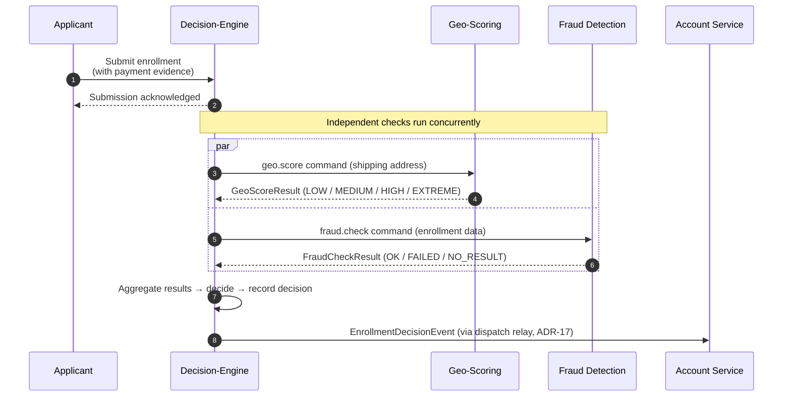

# Architecture: Event-Driven Enrollment

## Overview

**About this Project**

This is a portfolio project. I built it out far enough to showcase the real engineering decisions behind a resilient,
event-driven system — one that guarantees message delivery even when downstream dependencies are slow or unreliable. The
README has the longer version of why I built it and what it's meant to show. This document is the architecture itself.

**Architecture At a Glance**

The Enrollment Hub accepts registration requests, scores each one for fraud, and emits a decision that can be audited
later. It sits between the registration frontend and the services that fulfil an enrollment.

At an estimated five requests a second, throughput was never the constraint. I designed the system around two hard
operational requirements instead: an accepted request must never be lost, and the back-office services it depends on are
slow at the tail (over a second) and prone to downtime.

One central design decision follows from that: the hub accepts requests immediately and durably, moves scoring to the
background, and delivers the decision asynchronously.

Four decisions drive this design:

- Accepting a request and scoring it are separated by a durable queue, so a slow or failing downstream service never
  reaches the applicant (ADR-13).
- Each fraud check runs as its own service. The decision engine dispatches the checks in parallel, gathers the results,
  and aggregates a final decision (ADR-07).
- A slow or unresponsive check never blocks an enrollment. The system emits a decision and explicitly notes the missing
  signal, so the gap stays traceable (ADR-15).
- Requests are written to durable storage before any check begins, guaranteeing no check runs against a record that does
  not yet exist — and without a separate outbox table (§8.7).

**Safety & Validation by Design**

One property I chose to enforce by construction rather than convention: geo-scoring can flag an enrollment for human
review, but it can never reject one on its own. By constraining the aggregation branch to only raise review flags, the
worst a misconfigured threshold can do is grow the review queue — it cannot cause a wrongful automated rejection (§8.6).

I also wanted the design validated by data, not just asserted. Geo-scoring is deployed with cautious thresholds
alongside a falsifiable hypothesis, so production data can confirm or refute the system's efficacy before it affects
real users (see the Geo-Scoring Business Analysis, §5).

**Scope**

This is a portfolio project, so it runs locally on single-instance Postgres, RabbitMQ, and Redis. That is not the
production posture; what I would change for production is documented in §7.4, and where a decision would shift at higher
volume, the relevant ADR says so.

---

## 1. Introduction & Goals

### 1.1 Architectural Drivers

Four forces shape the structure. Each names a pressure first, then the architectural response to it.

**Extensibility.** Fraud is an evolving threat, so new checks are added over time. Each check runs as its own service
that joins the scatter-gather as a listener, so adding one is a localized change — a `SignalConfig` entry, a request
builder, a result listener — never a rewrite of the scoring logic.

**Fault isolation.** The pipeline depends on external services — geocoding, spatial indexing, fraud scoring — that lack
strong SLAs and fail independently. Because each signal is augmentative rather than essential, each is isolated behind
its own process boundary and the system fails open, so a Nominatim outage or a fraud-service failure degrades detection
without stalling enrollment.

**Durability.** Enrollment is a write-once event: once the applicant has seen `202 Accepted`, the work must survive a JVM
restart, a broker partition, or database lock contention. An intake queue and a durable correlation record hold that
state, removing the lost-update risk of in-memory `@Async` processing.

**Latency isolation.** The downstream services carry P99 latencies over a second at best-effort availability. A
synchronous call chain would pass those delays to the applicant or drop the enrollment during an outage, so ingress is
decoupled from evaluation by durable messaging and the decision is delivered out of band.

---

### 1.2 Quality Goals

The quality attributes from §1.1 resolve into concrete goals here — some measurable targets, some design guarantees the structure must hold to.

| Quality Goal        | Target / Guarantee                                                                                                                                                                    |
|---------------------|---------------------------------------------------------------------------------------------------------------------------------------------------------------------------------------|
| **Scoring Latency** | **Bounded latency:** P95 ≤ 2 seconds for `GeoScoreResult` events under peak load                                                                                                      |
| **Resiliency**      | **Zero-block intake:** downstream detection failures trigger a fail-open state rather than blocking enrollment (§8.6)                                                                 | 
| **Privacy**         | **48-hour TTL:** automatic eviction of PII and spatial data from the geo-index to minimize GDPR exposure                                                                              |
| **Integrity**       | **Strict gatekeeping:** no enrollment is scored until its prerequisite payment and identity assertions are verified (§8.1, ADR-03)                                                   |
| **Reproducibility** | **Deterministic scoring:** identical request and geo-index state always yield the same score — no ML model, no run-to-run drift — decision is replayable and auditable after the fact |

---
### 1.3 Scale and When It Changes

The numbers the design is sized against: up to 50,000 enrollments a day, peaking around five requests a second. Within a
48-hour window the spatial index holds on the order of 100,000 points. The internal SLA for a decision is seconds; the
business window to act on a fraud ring is the 48 hours before the data expires from the index.

| Downstream Service | Median Latency | P99 Latency   | Availability Target | Impact if Synchronous                         |
|--------------------|----------------|---------------|---------------------|-----------------------------------------------|
| Account Service    | ~200 ms        | **>1,000 ms** | 99.9%               | Applicant timeout; enrollment dropped on blip |
| Fraud Detection    | Variable       | **>1,000 ms** | Best-effort         | Enrollment blocked during outage              |

The five-requests-a-second figure describes ingress volume only. Internal concurrency is driven by downstream tail
latency and fan-out to several checks per request, not by request rate. Where a decision would change at higher volume,
the relevant ADR records the trigger:

- Sustained load at or above 50 requests a second changes the timeout and scaling story (ADR-15).
- At roughly ten times peak, the single Redis instance moves to cluster mode (ADR-11).
- At or above 50 requests a second, lock contention on the correlation record needs revisiting (ADR-16).

---

## 2. Constraints

The drivers in §1 describe what the system must achieve; the constraints below describe what it must work within.

### 2.1 Technical & Infrastructure Constraints

**Local-first deployment.** The whole system must run on a single local machine in containers, which rules out
managed cloud services and forces portable open-source components — PostgreSQL, RabbitMQ, Redis.

**Current Java runtime.** The project commits to JDK 25, which constrains the concurrency model to virtual threads (
Project Loom) — well suited to the I/O-bound scatter-gather, avoiding one platform thread per in-flight request.

**Transient storage only.** Scoring runs statelessly: no fraud evidence is written to local disk, and any data needed for
correlation or aggregation is held only in transient, TTL-bound remote storage.

### 2.2 Regulatory & Compliance Constraints

**Data minimization.** GDPR forbids long-term retention of high-precision spatial data, so anything used for signal
derivation expires under an automatic, irreversible 48-hour policy — no permanent geographic map of users is created.

**Decision traceability.** GDPR Art. 22 requires that automated decisions affecting a person be reconstructable after
the fact — which request, which signals settled, and why the outcome was reached. Trace context propagates across every
service and message boundary, and the decision rationale is recorded alongside the outcome (§8.3)

**Identity isolation.** Spatial data and identity data are held in separate logical silos, and spatial signals use
anonymous identifiers, so a single-service compromise cannot correlate location back to a person.

**Delegated trust.** The hub cannot verify identity itself; it trusts only externally signed assertions — eIDAS or
payment JWTs — and authenticated sessions. If the trust chain breaks, intake halts rather than proceeding on unverified
input.

### 2.3 Security & Trust Boundary

**Delegated trust.** The hub does not authenticate users or verify identity itself. Authentication happens at the
gateway against the identity provider; the decision engine then admits a request to an enrollment route only if its
token carries the scope that route requires. A valid session with the wrong scope for its route is rejected before any
scoring begins (§8.1, ADR-03).

### 2.4 Operational & Business Constraints

**Asynchronous outcome.** The final outcome is delivered out of band, so the public API must not hold synchronous wait
loops.

**Resource efficiency.** Despite being distributed, the system must stay efficient at its baseline volume and must not
demand a disproportionate infrastructure footprint to run reliably.

---

## 3. Context & Scope

### 3.1 System Context (C4 Level 1)

Five external parties interact with the hub. The registration frontend submits enrollment requests on behalf of an
applicant. An identity provider authenticates that applicant and issues the session token each request carries. Separate
verification services — a payment-check service, an eIDAS identity connector — issue the signed prerequisite tokens the
hub requires before any processing begins. Once a decision is reached, the Account Service consumes it and owns
everything that follows: provisioning, fulfilment, and the long-term enrollment record.

That last party also marks the scope boundary. The hub decides; it does not fulfil. It never touches raw card data, so
it stays outside PCI-DSS. It does not verify identity itself — it delegates that to the external services and trusts only
their signed assertions (§2.2). It does not own the enrollment record; that belongs to the Account Service (ADR-02).
What the hub owns is the decision and the short-lived state needed to reach it.

---

## 4. Solution Strategy

An assumed adversary is capable of:

- **Synthetic Identity Proliferation** — building many synthetic personas by faking what is cheap to vary (IP, device,
  email) and spreading genuine credentials (real payment instruments, verified identities) across them, so each
  enrollment passes per-request validation while the physical address — needed to receive mail and documents — stays
  invariant across the cluster
- **Single-Vector Evasion** — defeating any one detection layer by diversifying instruments or rotating fingerprints, so
  that uncorrelated checks each pass it in isolation.
- **Iterative Threshold Probing** — submitting repeatedly to identify the threshold a cluster can stay under.
- **Exploitation of Latency** — exploiting the latency window between enrollment and detection.

Each capability maps to an architectural safeguard:

| Adversary Capability                 | Architectural Safeguard                                                                                                                                                                                   | 
|--------------------------------------|-----------------------------------------------------------------------------------------------------------------------------------------------------------------------------------------------------------|
| **Synthetic Identity Proliferation** | **Geo-temporal density analysis:** per-request validation can't catch valid credentials reused across personas, but physical-address density over a short window does.                                    | 
| **Single-Vector Evasion**            | **Scatter-gather with durable correlation:** all applicable signals run concurrently and aggregate on one durable correlation record, defeating one check does not defeat the combined assessment.        | 
| **Iterative Threshold Probing**      | **Unconditional indexing:** every scored enrollment is indexed regardless of its outcome, so each probe raises the local density it is measured against; the atomic check closes the burst-timing bypass. | 
| **Exploitation of Latency**          | **Real-time scoring:** designed to reach a decision within 48 hours.                                                                                                                                      |

A Note on Why Geo-Scoring is needed:

Payment verification alone cannot catch synthetic identity proliferation, which is why a non-payment signal is needed.
AVS is primarily a North American/UK construct; most European issuers do not support it, so it cannot be relied on in the
European market — and where it does operate, it matches only at street and postcode level, too coarse to separate
adjacent addresses. SCA verifies the cardholder but does not prevent one fraudster from
using multiple legitimate instruments to build a cluster of synthetic accounts. Geo-temporal density is therefore the primary invariant signal in
the adjacent-address scenario.

---
## 5. Building Block View (C4 Level 2)

A request enters the hub through the gateway, the authenticating perimeter; past it, the hub is a set of independently
deployable services that communicate over RabbitMQ rather than by direct call. Traffic is split across four exchanges:
one for intake, two for the scatter-gather — a request channel carrying commands out to the checks, a result channel
carrying replies back — and one for outbound decisions (ADR-13). The message schemas are not redefined per service. They
live in a single producer-owned library, so a contract mismatch surfaces as a compile error rather than a runtime
deserialization failure. The blocks are specified perimeter first: the gateway, then the shared contract library every
other block depends on, then each service as it is introduced.

### 5.1 Gateway

The gateway is the hub's edge and its authenticating perimeter, built on Spring Cloud Gateway Server WebMVC. It routes
and relays and composes no responses, so it is an authenticating gateway rather than a backend-for-frontend. An
unauthenticated request is redirected into the OIDC `authorization_code` login against the identity provider; once the
user holds a session, a `TokenRelay` filter attaches the access token to each proxied request. Signature, expiry, and
issuer validation are not performed here but downstream at the decision-engine resource server, so the perimeter
authenticates while the service that owns the data authorizes (ADR-03).

It is stateful — it holds the OAuth2 login session, and scaling it horizontally requires a shared session store — but it
holds no domain data. The login and token-relay flow is detailed in the gateway README.

---

### 5.2 Contracts

A shared Maven module holds every event record and shared enum that crosses a service boundary. The producer of an event
owns its schema, and consumers depend on the library. The module is a library rather than a deployable unit, with no
persistence and no runtime. ADR-06 records the choice of a shared module over a schema registry or per-service
duplication, the forward-compatible evolution rules, and the conditions that would justify a registry.

The catalog divides into the intake event, the per-signal scatter-gather commands and their results, and the outbound
decision:

| Event                     | Producer → Consumer               | Carries                                                                                   |
|---------------------------|-----------------------------------|-------------------------------------------------------------------------------------------|
| `EnrollmentEvent`         | decision-engine intake → pipeline | the submitted enrollment data                                                             |
| `GeoScoreRequest`         | decision-engine → geo-scoring     | the shipping address only                                                                 |
| `GeoScoreResult`          | geo-scoring → decision-engine     | a `RiskLevel`, or none with a reason when geocoding fails                                 |
| `FraudCheckRequest`       | decision-engine → fraud-detection | the full enrollment data                                                                  |
| `FraudCheckResult`        | fraud-detection → decision-engine | a `SignalOutcome`                                                                         |
| `EnrollmentDecisionEvent` | decision-engine → Account Service | a fresh `decisionId`, the original request, the `DecisionResult`, and the settled signals |

Payloads follow least privilege. Each check receives only the fields it needs, and the outbound decision exposes a fresh
`decisionId` while withholding the internal correlation key. Whether a signal reports a `RiskLevel` or a `SignalOutcome`
follows the classification in ADR-14.

---

### 5.3 Geo-Scoring

Geo-Scoring is the non-payment signal against synthetic identity proliferation (§4). It measures how densely
enrollments cluster around a physical address within a short window — a quantity that stays invariant when an
adversary varies payment instruments, devices, and identities. It runs as its own service so that a geocoding
outage degrades this one signal without stalling the pipeline, and because it carries infrastructure and a
data-retention profile the rest of the system does not (ADR-07).

It consumes a `GeoScoreRequest` and replies with a `GeoScoreResult` carrying a `RiskLevel`. The work is three
stages, backed entirely by Redis/Valkey; it holds no relational state.

- **Normalisation.** A libpostal sidecar reduces the address to a deterministic canonical form, so formatting
  variants of the same address share one cache key. A libpostal failure falls back to the raw string rather
  than blocking (ADR-10).
- **Geocoding.** A self-hosted Nominatim resolves the address to coordinates, fronted by a keyed-hash cache
  that stores no enrollment identifiers. The provider sits behind an interface and can be swapped without
  touching the scoring logic (ADR-09).
- **Density scoring.** A fixed-radius neighbour count at 100, 250, and 500 metres over a country-partitioned
  Redis GEO set maps to a `RiskLevel`. Fixed concentric radii were chosen over a clustering algorithm such as
  DBSCAN because the thresholds are operationally tunable and the count is a single bounded Redis call
  (ADR-08). The count and the index write run as one atomic Lua script, closing the burst-timing race a
  simultaneous fraud ring would otherwise exploit (ADR-11).

Every scored enrollment is indexed regardless of outcome, and every member expires after 48 hours. The TTL is
an architectural asset, not only a privacy control: it bounds the index to the window in which a ring is
actionable, and unconditional indexing makes threshold probing self-defeating (ADR-12). The Redis data
structures, the Lua scripts, and the retry and dead-letter behaviour are in the geo-scoring design document;
the radius and threshold calibration is in the Geo-Scoring Business Analysis.

---

### 5.4 Decision-Engine

The decision-engine is the pipeline's coordinator and its only stateful service. It is the resource server: it
validates the JWT the gateway relays — signature, expiry, issuer, scope — and applies flow-specific authorization on the
contextual claims before any work begins (ADR-03). A request that passes authorization is admitted to the asynchronous
pipeline through a single durable ingress, and from there the engine owns the enrollment's lifecycle.

For each admitted request it derives the applicable signals for the route from `SignalConfig`, dispatches one command
per signal on the request exchange, and gathers the replies on the result exchange against a durable correlation record
in PostgreSQL (ADR-13). The same `SignalConfig` seeds both the dispatch set and the gather set, so the two cannot drift.
Whether a settled signal is weighed as a score or as a pass/fail outcome follows the classification in ADR-14.

The engine carries the system's fail-open policy. A timeout poller advances any signal still pending at the correlation
record's deadline to a failed slot, so one check's outage degrades its signal rather than stalling the decision
(ADR-15). Aggregation runs once every applicable signal is terminal, by whichever path completes the record — the result
handler or the poller — guarded so a late reply cannot reopen a settled decision (ADR-16). The decision is recorded to
the correlation record and published out of band by a dispatch relay rather than in the aggregation step, closing the
dual-write gap between deciding and emitting (ADR-17). The engine owns the decision and the short-lived correlation
state, not the enrollment record, which belongs to the Account Service (ADR-02).

---

### 5.5 Fraud-Detection

Fraud-Detection is the internal fraud signal and the worked example of the extension seam. It consumes
a `FraudCheckRequest` carrying the full enrollment data and replies with a `FraudCheckResult`. The
signal is classified `BEST_EFFORT` (ADR-14): an explicit failure is authoritative and drives
rejection, while a timeout or an absent result fails open.

In the current build it is a stub that approves unconditionally with `SignalOutcome.OK`. It exists to
demonstrate how a new signal attaches. The worker is a pure listener on the decision-engine-owned
`fraud.detection.requests.queue` (ADR-13 §Channel Ownership), so replacing the stub with a real fraud
service is confined to this module — the decision engine already declares the `FRAUD_CHECK` signal in
`SignalConfig`, dispatches its command, and records its result. It holds no state, and a production
implementation would own whatever stores its checks require. The candidate signals such a service
would run remain an open decision.

---

## 6. Runtime View

### 6.1 Geo-Scoring: From Request to Score

Geo-Scoring is a worker on the scatter-gather. The decision engine dispatches a `geo.score` command, and the
service replies on the result channel. Processing one request is sequential:

1. Normalise the shipping address through libpostal. On a libpostal failure, fall back to the raw flattened
   address so the request still proceeds.
2. Resolve coordinates. A hit on the keyed-hash cache returns at once; a miss calls Nominatim and caches the
   result.
3. Run the atomic Lua script: count neighbours within each radius, then index the new point and record its
   insertion time for the per-member TTL. The two steps cannot interleave with another request, so concurrent
   submissions at the same address cannot all read an empty index.
4. Map the neighbour counts to a `RiskLevel` and publish a `GeoScoreResult`.

The result raises a risk level for the decision engine to weigh; geo-scoring can flag an enrollment for review
but never reject one. When an address cannot be geocoded — a provider outage or an unresolvable address — the
service emits a result with a null `RiskLevel` and a reason, and the decision engine treats the absent signal
as fail-open. A transient outage instead raises a typed exception that replays the message through the
listener's retry chain and, on exhaustion, lands it on the dead-letter queue, so a sustained outage surfaces
as queue depth rather than a stream of empty scores.

### 6.2 The CREDIT_CARD Happy Path

The decision engine coordinates two parallel checks and emits a single decision. Geo-Scoring and Fraud Detection run
concurrently and report back asynchronously; the decision engine aggregates the results and decides.

```mermaid
sequenceDiagram
    autonumber
    participant A as Applicant
    participant O as Decision-Engine
    participant G as Geo-Scoring
    participant F as Fraud Detection
    participant AS as Account Service
    A ->> O: Submit enrollment<br/>(with payment evidence)
    O -->> A: Submission acknowledged
    Note over O, F: Independent checks run concurrently

    par
        O ->> G: geo.score command (shipping address)
        G -->> O: GeoScoreResult (LOW / MEDIUM / HIGH / EXTREME)
    and
        O ->> F: fraud.check command (enrollment data)
        F -->> O: FraudCheckResult (OK / FAILED / NO_RESULT)
    end

    O ->> O: Aggregate results → decide → record decision
    O ->> AS: EnrollmentDecisionEvent (via dispatch relay, ADR-17)
```

The diagram is schematic. The acknowledgement to the applicant and the dispatch of the per-signal commands are mediated
by the decision engine's intake channel rather than the same code path, and the final `EnrollmentDecisionEvent` is not
published in the aggregation step: the decision is recorded to the correlation record, and a dispatch relay publishes it
out of band (ADR-17). The dispatch mechanics are detailed in §6.3.

### 6.3 Routing Strategy

The decision engine dispatches one command per applicable signal; each check consumes its own command and replies. The
routing-key strings, queue declarations, and retry/DLQ configuration are in ADR-13 and the decision engine design
document. Three steps:

**Step 0 — Durable ingress.** The REST endpoint authorizes the request synchronously and, on success, publishes a
single durable message to the ingress exchange. No database write happens in the HTTP request thread. The decision
engine's intake consumer then runs a `PENDING → COMPLETED` idempotency ledger on the correlation record: it inserts the
record in the `PENDING` state under the `enrollmentId` unique constraint, dispatches the per-signal commands on the
request exchange, and transitions the record to `COMPLETED` before acknowledging the intake message. This sequencing
eliminates the dual-write problem at the entry point and guarantees that no check service receives a command for a
correlation record that does not yet exist. On redelivery the consumer reads the ledger and either retries the dispatch
when the record is still `PENDING` or acknowledges the duplicate without re-dispatching when it is already `COMPLETED`,
so downstream commands are never lost and re-dispatch is bounded to the window before completion (ADR-13).

**Step 1 — Per-signal dispatch.** The decision engine derives the applicable signals for the route from `SignalConfig`
and publishes one command per signal to the `enrollment.check.request` exchange, routed by signal name (`geo.score`,
`fraud.check`). The credit-card route dispatches `geo.score` + `fraud.check`; the invoice route, `fraud.check` only.
Each command carries only the data its check needs.

**Step 2 — Gather and aggregate.** Each check consumes its command, performs its work, and publishes a result on the
`enrollment.check.result` exchange keyed by signal name. Results are correlated by `enrollmentId` and recorded against
the durable correlation record. Once every applicable signal has settled, the decision engine aggregates, records the
final decision on the correlation record, and a dispatch relay publishes it out of band (ADR-13, ADR-17).

The applicable-signal set is defined once in `SignalConfig`, which seeds both the dispatch and the gather-set, so the
two cannot drift (ADR-13).

### 6.4 Timeout and Fail-Open

A detection service can fail independently — an outage, a slow dependency, a Redis partition. When a correlation
record's `timeout_at` deadline is reached with one or more signals still `PENDING`, the timeout poller (ADR-15) advances
those slots to `FAILED`. The completion predicate then holds — every applicable signal is terminal — and aggregation
runs on whatever settled before the deadline.

The aggregation carries no per-signal conditional logic for this case. It dispatches on the gate classification
(ADR-14):

1. A `BEST_EFFORT` signal that timed out contributes nothing — fail-open. The `DecisionResult` reflects only the
   signals that settled in time.
2. A `SCORING_SIGNAL` that timed out contributes nothing — fail-open, with no routing consequence.
3. A `REQUIRED` signal that timed out does not release the completion predicate — the decision is held and the
   escalation policy in ADR-15 applies. No current `SignalConfig` carries this classification.

The decision is computed and recorded on the correlation record once all applicable signals are terminal — by whichever
path completes the row, the result handler or the timeout poller running the same finalize step (ADR-17) — and a
dispatch relay publishes the `EnrollmentDecisionEvent` out of band. No signal holds the decision open beyond the
deadline in ADR-15.

**Fail-open annotation.** A fail-open decision carries the normal outcome (`APPROVED` or `CONDITIONAL_APPROVED`)
determined by the signals that settled, annotated with the reason code `APPROVED_SCORE_MISSING` and flagged for
operational review. Internally the missing geo-signal is recorded as a null risk level; `APPROVED_SCORE_MISSING` is the
externally emitted reason code — the same fact, internal state versus emitted annotation.

**Late-arriving results.** A result that arrives after the decision is recorded finds its correlation slot in a
non-`PENDING` terminal state, and the idempotency guard (ADR-16) discards it without modifying the record. Whether a
discarded late result should raise a `LateScoreArrived` event, flag the record, or remain visible only via the
dead-letter queue is an open decision.

---

## 7. Infrastructure & Deployment

### 7.1 Local Stack

The system runs locally as host-run Spring Boot services against two Docker Compose stacks:

**Infrastructure (`docker-compose.yml`):**

- PostgreSQL — decision-engine correlation store and authorization-server persistence
- RabbitMQ — event bus
- Redis/Valkey — geo-scoring cache and geo-index
- Nominatim — self-hosted geocoding (ADR-09)
- libpostal — address normalization (ADR-10)

**Observability (`otel-local/docker-compose.yml`):**

- OTel Collector, Tempo, Loki — the trace/log pipeline (§8.3)
- Prometheus — metrics scraping and alert-rule evaluation (`monitoring/prometheus/`)
- Grafana — single pane across all three signals; datasources provisioned at startup

**Services (host-run):** gateway, authorization-server, decision-engine, geo-scoring, fraud-detection (stub) —
plus the shared `contracts` library.

### 7.2 Target Environment

Production deployment is vendor-neutral. The target environment provides:

- container orchestration with independent horizontal scaling per service;
- managed PostgreSQL with automated backups and point-in-time recovery for the correlation store;
- a managed RabbitMQ-compatible broker with durable queues and dead-letter support (ADR-13);
- a managed Redis-compatible cache supporting Lua scripting and per-member sorted-set operations (ADR-11);
- TLS-terminating ingress with health checks, network-level filtering, and DDoS protection;
- secrets management for connection strings, JWT signing keys, and the geocoding-cache HMAC pepper.

Specific cloud-provider service mappings are out of scope.

### 7.3 Portability Guardrails

Every endpoint is configured by environment variable (`REDIS_HOST`, `DB_HOST`, `RABBITMQ_HOST`, `IDP_JWKS_URI`,
and so on). Standard Redis AUTH, standard AMQP, no vendor-specific auth mechanisms. The application code is identical
across environments; only connection strings change.

### 7.4 Single-Instance Components and Production Replication Posture

Local Docker Compose runs single-instance PostgreSQL, RabbitMQ, and Redis. This is intentional for portfolio scope and is
**not** the production posture. The application is replication-naive: it relies on the broker and database to handle
failover transparently, so moving from local to production requires no application-code change.

| Component | Local | Production expectation | Failure mode if local posture deployed |
|---|---|---|---|
| PostgreSQL (correlation store) | Single instance | Managed Postgres with synchronous replica + PITR backups | All in-flight enrollments lost; idempotency guard cannot recover state from the broker alone |
| RabbitMQ (event bus) | Single broker | Managed cluster with quorum queues; mirrored DLX | In-flight messages lost on broker failure; Publisher Confirms (ADR-13) detect this and trigger retry, but the publishing process must survive the broker outage |
| Redis (geo-index + geocoding) | Single instance | Managed Redis with replica + persistence (RDB + AOF) | 48h of geo-index lost; geo-scoring settles without a score → fail-open (`APPROVED_SCORE_MISSING`); no enrollment lost |

---

## 8. Crosscutting Concepts

Concerns that cut across every module. The subsections land with their subject areas; observability arrives with the
monitoring stack.

### 8.3 Observability

Three signals, two transport paths: traces and logs are **pushed** over OTLP through the OTel Collector; metrics are
**pulled** — Prometheus scrapes each service's `/actuator/prometheus` endpoint directly and evaluates the alert rules.

| Component | Role |
|---|---|
| SLF4J + Logback | Logging facade and implementation. `traceId` and `spanId` are injected into MDC automatically by Micrometer Tracing; every log record carries trace context without manual instrumentation. |
| Micrometer Tracing + OTel bridge | Spring Boot tracing abstraction (`micrometer-tracing-bridge-otel`) connecting Micrometer's `ObservationRegistry` to the OpenTelemetry SDK. Handles span lifecycle and MDC population. |
| OpenTelemetry SDK + OTLP export | Exports trace and log signals to the OTel Collector (Spring Boot 4 per-signal export configuration, `management.opentelemetry.<signal>.export.otlp.*`). |
| OTel Collector | Receives traces and logs over OTLP; routes traces to Tempo and logs to Loki's native OTLP ingestion. |
| Tempo | Distributed trace storage. |
| Prometheus | Metrics: scrapes the Micrometer Prometheus registry of all five services; evaluates the alert rules in `monitoring/prometheus/rules/`. Domain metrics include geocoding latency and cache hit rate (geo-scoring), DLQ depth, publish-failure counters, and the outbox age (decision-engine). |
| Loki | Log storage. Logs arrive from the OTel Collector, not from Promtail or log-file scraping. Correlated to traces in Grafana via `traceId`. |
| Grafana | Single pane across all three signals; Prometheus/Tempo/Loki datasources are provisioned at startup. Correlates logs and traces by `traceId`. |

**RabbitMQ trace-context propagation.** Micrometer Tracing and the OTel bridge integrate with Spring AMQP via the
`ObservationRegistry` on both sides of the broker: publishes inject the W3C `traceparent` header into the AMQP message,
and the `@RabbitListener` container restores the trace context before the handler runs. One enrollment therefore
produces a single distributed trace spanning HTTP entry, intake publish/consume, the scatter to geo-scoring and
fraud-detection, the gathered results, and the decision publish — across every queue hop, with no manual header
handling.

**Alerting.** The Prometheus rules encode the operational contracts the ADRs promise:

| Alert | Condition | Contract it enforces |
|---|---|---|
| `DlqNonEmpty` | `rabbitmq_dlq_depth > 0` for 5m | Poison-pill containment ends in ops review, not silent loss (ADR-13); procedure in `docs/runbook-dlq-replay.md` |
| `DecisionPublishFailures` | any `decisionengine_publish_failures_total` increase in 15m | Publisher Confirms failures are surfaced, not absorbed by retries (ADR-13) |
| `StuckDecisionOutbox` | `decisionengine_outbox_oldest_age_seconds > 300` for 5m | A decided enrollment is never silently undelivered — the outbox state is observable and alerts before consumers notice (ADR-17) |