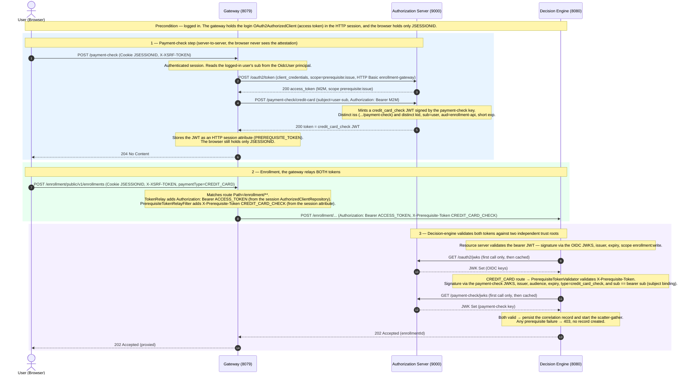

# Credit-card prerequisite-token end-to-end flow

What happens from the payment-check step through enrollment for the **CREDIT_CARD** route: how the
gateway obtains the `credit_card_check` attestation server-to-server, holds it in the session
alongside the login token, relays both downstream, and how the decision-engine validates each against
its own trust root (ADR-03, ADR-18).

> **Precondition — the user is already logged in.** Login is the standard OIDC `authorization_code`
> flow: the gateway (an authenticating edge, not a stateless validator) holds the login
> `OAuth2AuthorizedClient` (access + refresh token) in the HTTP session; the browser holds only a
> `JSESSIONID` cookie. This diagram picks up after that.

## Participants

| Component | Port | Role |
|---|---|---|
| Browser (SPA) | — | Drives the flow: login → payment-check → enroll |
| Gateway | 8079 | Spring Cloud Gateway Server WebMVC **+** OAuth2 login client (authenticating edge / token custodian) |
| Authorization Server | 9000 | OIDC issuer **+** co-located payment-check issuer (a **distinct** `iss`/`kid`) |
| Decision Engine | 8080 | Resource server — validates the bearer JWT **and** the prerequisite JWT |

## Sequence

## What gets stored, and where

| Location | What | Lifetime |
|---|---|---|
| Browser cookie | `JSESSIONID` | Session |
| Gateway session → `OAuth2AuthorizedClientRepository` | login `OAuth2AuthorizedClient` (access + refresh token) | Session |
| Gateway session attribute | `credit_card_check` JWT (`PREREQUISITE_TOKEN`) | Session (until enrollment / token `exp`) |
| Authorization Server | OIDC signing key **and** payment-check signing key (distinct `kid`) | Key lifetime |
| Decision Engine | cached OIDC JWKS **and** payment-check JWKS | Cached in memory |

The browser never holds either token — both live server-side in the gateway session (BFF custody).
The two tokens are signed by **different keys under different issuers**, and the decision-engine
validates them with **two separate decoders**.

## Subsequent calls

The payment-check step (1) runs once per enrollment; its attestation is short-lived and one-shot.
The login token is reused from the session and refreshed via its refresh token as needed. A later
enrollment on a route with no prerequisite (e.g. INVOICE today) skips steps 1 and the
`X-Prerequisite-Token` header entirely.

## Footnotes

- **Distinct trust roots.** The access token and the `credit_card_check` token are *not*
  interchangeable: different issuer, different signing key. This is deliberate (ADR-03) — it keeps
  authentication and payment attestation as separate trust authorities, even though the payment-check
  issuer is co-located in the authorization-server for the demo.
- **Simulation seam.** In production the user submits card details to the provider (e.g. Adyen) and
  the backend learns the verified result via an HMAC-signed webhook. Here `POST /payment-check` stands
  in for "the check completed → fetch the attestation"; nothing trusts a browser-presented result.
- **Subject binding.** The `credit_card_check` `sub` must equal the authenticated caller's `sub`, so a
  valid attestation issued for one user cannot be lifted and replayed by another (confused deputy).
- **eIDAS / INVOICE** uses the same shape with a second issuer (`eidas_identity`) and is deferred.
