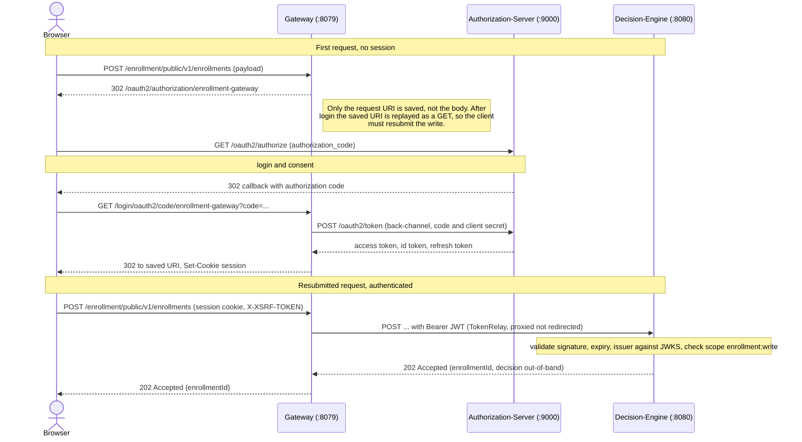

# Gateway

The enrollment-hub edge, a **stateful authenticating gateway** built on Spring Cloud Gateway Server WebMVC. It logs the end user in against the [authorization-server](../authorization-server), holds the browser session, and forwards (relays) the user's access token to the backend services it proxies. It performs routing only, with no response composition or aggregation, so it is not a backend-for-frontend. JWT signature, expiry, and issuer validation happen downstream at the [decision-engine](../decision-engine) resource server.

The gateway runs on the servlet stack with virtual threads rather than WebFlux, consistent with the rest of the project.

## Auth flow



- **`oauth2Login`** drives the OIDC `authorization_code` flow via the login registration (key `enrollment-gateway`, client-id `enrollment-login-client`); an unauthenticated request redirects straight to the IdP. A second registration (`payment-check`, client-id `payment-check-client`) handles the server-to-server `client_credentials` call below.
- **`TokenRelay`** filter attaches the logged-in user's access token to each proxied request.
- **CSRF** pairs Spring Security 7's `csrf().spa()` with a small `CsrfCookieFilter`. `spa()` provides the readable `XSRF-TOKEN` cookie repository and a `SpaCsrfTokenRequestHandler` that accepts the raw cookie value echoed in the `X-XSRF-TOKEN` header (past the default BREACH/XOR masking). It does **not** write the cookie on a plain GET — the token is resolved lazily — so `CsrfCookieFilter` forces resolution and the cookie is issued on the first authenticated GET; without it a browser/SPA client lands after login with no token to echo.
- **RP-initiated logout** ends both the local session and the authorization-server session.

## Prerequisite payment-check (credit-card route)

The credit-card route requires a signed `credit_card_check` attestation before an enrollment is accepted. The token is held server-side under the gateway's custody (BFF), so the browser never sees it.

1. After login, the client calls `POST /payment-check` (session cookie + `X-XSRF-TOKEN`). The gateway fetches the attestation from the issuer server-to-server — the `payment-check` `client_credentials` registration (client-id `payment-check-client`, scope `prerequisite:issue`) — and stores it in the session. The response is `204 No Content`; the JWT stays server-side.
2. The next `POST /enrollment/**` carries only the session cookie. `PrerequisiteTokenRelayFilter` attaches the stored attestation alongside the relayed access token, and the decision-engine validates it (issuer `…/payment-check`, audience `enrollment-api`, claim `type=credit_card_check`, RS256, keys at `GET /payment-check/jwks`). The decision-engine rejects a credit-card enrollment that arrives without it.

The issuer is simulated and co-located in the [authorization-server](../authorization-server) as a trust root separate from the OIDC issuer. For local testing it can be called directly (10-minute TTL):

```
curl -X POST http://localhost:9000/payment-check/credit-card \
  -H 'Authorization: Bearer <client_credentials token, scope prerequisite:issue>' \
  -H 'Content-Type: application/json' \
  -d '{"subject":"<user-subject>"}'
# → {"token":"<credit_card_check JWT>"}
```

## Routes

| Predicate | Target | Filters |
|---|---|---|
| `Path=/enrollment/**` | `http://${DECISION_ENGINE_HOST:localhost}:8080` | `TokenRelay` |

## Configuration

| Env var                          | Default                          | Purpose                                                                          |
|----------------------------------|----------------------------------|----------------------------------------------------------------------------------|
| `IDP_ISSUER_URI`                 | `http://localhost:9000`          | authorization-server base URI, used to build the explicit provider endpoint URLs |
| `PAYMENT_CHECK_CLIENT_SECRET`    | `payment-check-client-secret `   | payment-check (M2M) client secret (must match the authorization-server registration)       |
| `ENROLLMENT_LOGIN_CLIENT_SECRET` | `enrollment-login-client-secret` | OAuth2 login secret (must match the authorization-server registration)           |
| `DECISION_ENGINE_HOST`           | `localhost`                      | downstream resource-server host                                                  |

The provider endpoints are configured explicitly rather than through Spring's discovery-based `issuer-uri` property, so the gateway boots even when the authorization-server is momentarily unavailable.

## Run

Requires the [authorization-server](../authorization-server) (`:9000`) and [decision-engine](../decision-engine) (`:8080`). The default port is `8079`. Actuator endpoints `/actuator/health`, `/actuator/info`, and `/actuator/prometheus` are public. Demo login uses username `user` and password `password`.

Enter the gateway at `http://127.0.0.1:8079` rather than `http://localhost:8079`, so the browser session and the redirect URI registered at the authorization-server share the same host. A host mismatch leaves the stored authorization request uncorrelated at callback and the login fails.

<!-- TODO: add the command that starts the service itself (build-tool entry point). -->