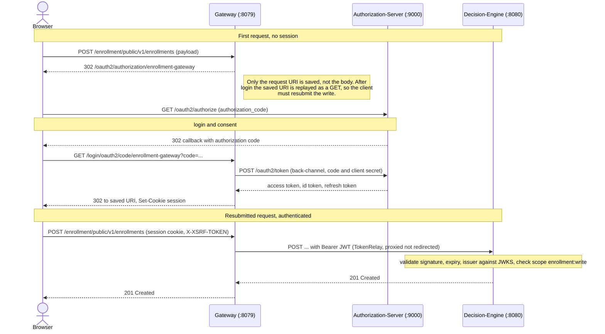

# Gateway

The enrollment-hub edge, a **stateful authenticating gateway** built on Spring Cloud Gateway Server WebMVC. It logs the end user in against the [authorization-server](../authorization-server), holds the browser session, and forwards (relays) the user's access token to the backend services it proxies. It performs routing only, with no response composition or aggregation, so it is not a backend-for-frontend. JWT signature, expiry, and issuer validation happen downstream at the [decision-engine](../decision-engine) resource server.

The gateway runs on the servlet stack with virtual threads rather than WebFlux, consistent with the rest of the project.

## Auth flow

- **`oauth2Login`** drives the OIDC `authorization_code` flow. A single client registration (`enrollment-gateway`) means an unauthenticated request redirects straight to the IdP.
- **`TokenRelay`** filter attaches the logged-in user's access token to each proxied request.
- **CSRF** uses a readable `XSRF-TOKEN` cookie (`CookieCsrfTokenRepository`) so browser and SPA clients can POST through the gateway.
- **RP-initiated logout** ends both the local session and the authorization-server session.

## Routes

| Predicate | Target | Filters |
|---|---|---|
| `Path=/enrollment/**` | `http://${DECISION_ENGINE_HOST:localhost}:8080` | `TokenRelay` |

## Configuration

| Env var | Default | Purpose |
|---|---|---|
| `IDP_ISSUER_URI` | `http://localhost:9000` | authorization-server base URI, used to build the explicit provider endpoint URLs |
| `GATEWAY_CLIENT_SECRET` | `enrollment-secret` | OAuth2 client secret (must match the authorization-server registration) |
| `DECISION_ENGINE_HOST` | `localhost` | downstream resource-server host |

The provider endpoints are configured explicitly rather than through Spring's discovery-based `issuer-uri` property, so the gateway boots even when the authorization-server is momentarily unavailable.

## Run

Requires the [authorization-server](../authorization-server) (`:9000`) and [decision-engine](../decision-engine) (`:8080`). The default port is `8079`. Actuator endpoints `/actuator/health`, `/actuator/info`, and `/actuator/prometheus` are public. Demo login uses username `user` and password `password`.

Enter the gateway at `http://127.0.0.1:8079` rather than `http://localhost:8079`, so the browser session and the redirect URI registered at the authorization-server share the same host. A host mismatch leaves the stored authorization request uncorrelated at callback and the login fails.

<!-- TODO: add the command that starts the service itself (build-tool entry point). -->