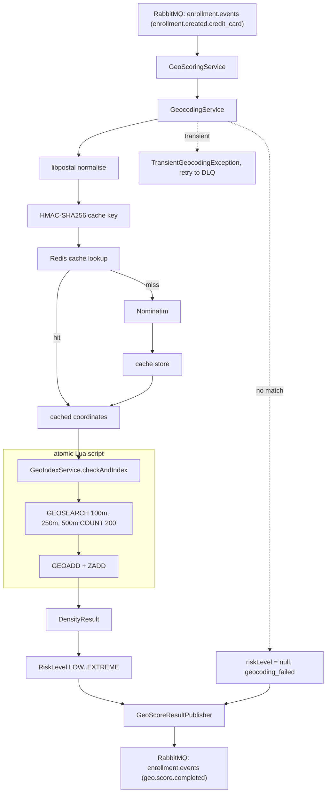

## Geo-Scoring Design

### Scoring Process Flow



### Inputs and Outputs

**Consumes:** `GeoScoreRequest` commands delivered to the durable queue `geo.scoring.requests.queue`, which the
decision engine declares and binds to the `enrollment.check.request` direct exchange with routing key `geo.score`
(ADR-13 §Channel Ownership). Geo-scoring is dispatched only on the credit-card route — the decision engine derives this
from `SignalConfig` and never sends `geo.score` for invoice enrollments. The command carries a least-privilege payload:
only the shipping address and the correlation `enrollmentId`, no other enrollment data. The listener
(`GeoScoreRequestListener`) reads them directly.

**Produces:** `GeoScoreResult` events published to the `enrollment.check.result` direct exchange with routing key
`geo.score`. The event carries the `enrollmentId` (for correlation by the decision engine), the resolved
`RiskLevel` (`LOW` / `MEDIUM` / `HIGH` / `EXTREME`, or `null` on geocoding failure), per-radius neighbour counts,
the list of triggered radii, the geocoded `(latitude, longitude)` when available, and a `noResultReason` string
when `riskLevel` is null.

**External dependencies:** libpostal (sidecar, address normalisation — ADR-10), Nominatim (self-hosted geocoder —
ADR-09), Redis/Valkey (geocoding cache, geo-index, TTL companion ZSET), RabbitMQ (event bus — ADR-13).

---

### Storage Layer

The geo-scoring service maintains three Redis data structures, each with its own lifecycle, keying strategy, and PII
profile.

**Geocoding cache** — maps `HMAC-SHA256(normalized address, secret pepper)` → `lat/lon`. Purpose: avoid redundant
Nominatim API calls. Keyed by the keyed hash of the address (not the request or account ID). Contains no enrollment
identifiers, timestamps, or links to any natural person — the keyed hash removes the readable address, the pepper
prevents precomputation attacks on the cache keys, and the value (coordinates) describes a building, not a person.
The cache TTL is a purely technical decision (no external ToS constraints — ADR-09) and can be set based on storage
and freshness trade-offs alone. A cache hit means "we've geocoded this address before," not "this enrollment has been
scored."

**Pepper rotation** — rotating `GEOCODING_CACHE_HMAC_SECRET` re-keys every entry, so the cache goes cold: each
enrollment pays one Nominatim round-trip (~50–200 ms instead of ~1 ms) until the cache re-warms, and the orphaned
entries expire via TTL. This is the same state as initial deployment. Lookups arrive at enrollment rate through the
AMQP listener — a cold cache makes each one a miss but multiplies nothing — and the self-hosted Nominatim absorbs
that rate by construction. Versioned peppers (dual-version lookup with rewrite-on-fallback) were considered and
rejected: they add a second live secret and a fallback read on every miss, purchased against an event that occurs
only on suspected compromise — where wholesale invalidation is acceptable. The pepper is not a credential to any
external system, so no calendar rotation applies.

**Geo-index** — country-partitioned Redis GEO sorted sets, keyed `geo:{countryCode}` (e.g. `geo:{DE}`). Each ZSET member
is a `enrollmentId` (the per-enrollment correlation UUID — see ADR-11); its score is the 52-bit geohash of the
enrollment's `(lon, lat)` computed by `GEOADD`. Coordinates are therefore encoded into the score rather than stored
as a separate value — `GEOPOS` reverses the geohash back to approximate coordinates, and `GEOSEARCH` exploits the
fact that geohash-adjacent scores correspond to geographically nearby points. Member uniqueness is per
`(key, enrollmentId)`: an idempotent retry of the same request overwrites (moves) its point, but two distinct
enrollments at the same building coexist as separate members with near-identical scores — which is precisely the
density signal the service detects. Because each enrollment carries a fresh `enrollmentId`, a single account that
enrolls twice within the TTL window appears as two separate members. Purpose: density detection. Contains
enrollment identifiers linked to locations with implicit temporal information (48-hour TTL). This *is* personal
data — the combination of an identifiable enrollment, a location, and a time window. The 48-hour TTL (ADR-12)
provides automatic expiration; ±5m Laplacian noise on coordinates is described as an optional mitigation in
architecture.md §8.2 but is **not implemented in v0** — current density detection runs on exact geocoded coordinates.

**TTL companion sorted set** — plain Redis sorted set (not a GEO set), keyed `{prefix}:{countryCode}:ttl` (default:
`geo:{DE}:ttl`). Each member is the same `enrollmentId` that appears in the geo-index for that country; the score is the
**insertion epoch in seconds**. It exists solely to track per-member age so the geo-index can honour a per-member TTL
(Redis GEO sorted sets have no native per-member expiry — a key-level TTL would expire the entire country partition at
once, which is not the intended behaviour). The companion set mirrors the geo-index's membership but carries no
coordinates; it is written atomically alongside every `GEOADD` in `scripts/geo-density.lua` (`ZADD ttlKey epoch
member`) and consumed by a scheduled batched Lua cleanup job (`scripts/geo-cleanup.lua`, `GeoIndexCleanupJob`) which
runs `ZRANGEBYSCORE ttlKey 0 <now − ttl>` to find expired members and `ZREM`s them from **both** keys — see **ADR-11**.
With the default 48h TTL and 1h cleanup interval the worst-case effective member lifetime is 49h, which preserves
ADR-12's 48h TTL property and its false-positive mitigation argument. PII profile: same as the geo-index (identifies
an enrollment within a time window), so it shares the geo-index's protections (48h expiry, country partitioning).

### Geo-Index Key Strategy

Keys follow the pattern `<prefix>:{<countryCode>}` (e.g. `geo:{DE}`, `geo:{MC}`), and the TTL companion appends
`:ttl` (e.g. `geo:{DE}:ttl`). The prefix is configurable via `geo-index.key-prefix`.

The country code is wrapped in a Redis hash tag, the `{...}` portion Redis Cluster hashes for slot routing. The
shared tag forces a partition's geo-index key and its `:ttl` companion onto the same cluster slot, which keeps the
multi-key density and cleanup Lua scripts cross-slot-safe under Redis Cluster (ADR-11). On a single instance the tag
is inert. `GeoIndexKeyStrategy` builds both keys and is the single source of truth for this format.

**Partitioning: per country (ISO 3166-1 alpha-2).**

Rationale:

- **Avoids cross-border false positives.** Addresses near national borders (e.g. Strasbourg/Kehl) should not inflate
  each other's density scores — fraud rings operate within a single country's account creation flow, and legitimate
  cross-border clustering (twin cities, commuter towns) would otherwise trigger false flags.
- **Keeps sets manageable.** A single global GEO set would grow to contain every account indexed in the past 48 hours.
  Country partitioning bounds each set to the volume of a single market, keeping GEOSEARCH fast.
- **Natural alignment with the domain.** `countryCode` is a mandatory, validated field on every `Address` record
  (see `contracts` module). The orchestrator rejects requests with missing or unrecognised country codes before
  the `geo.score` command is dispatched, so the partition key is always well-defined when geo-scoring executes.

`GeoIndexKeyStrategy` is the single source of truth for key generation — all geo-index consumers (density check,
indexing) must use it rather than constructing keys inline.

---

**Step 1 — Geocoding**

1. Normalise the address via libpostal (ADR-10):
   - Call `GET /parse?address=...` on the libpostal sidecar → list of `{label, value}` components.
   - Sort components by `label` alphabetically — libpostal's response order is not guaranteed stable across
     versions or locales, but the *set* of label-value pairs is. Sorting by label is the key invariant that
     makes the canonical form deterministic.
   - Join the sorted pairs as `label:value` separated by a single space. Including the label prefix prevents
     components with identical values but different types (e.g. a `house_number` and a `postcode` that happen
     to share digits) from collapsing to the same key.
   - See `AddressNormalizationService` and `ParsedAddress`.
2. Compute `HMAC-SHA256(canonical address, secret pepper)` as cache key (see `GeocodingCacheKeyService`; the pepper
   is supplied via `GEOCODING_CACHE_HMAC_SECRET` and prevents precomputation against the cache keys).
3. Look up the cache in Redis.
4. Cache hit → return cached coordinates (no TTL refresh; entries live for the fixed `geocoding.cache.ttl`, default 90 days).
5. Cache miss → call the active geocoding provider (Nominatim, self-hosted, ADR-09). Store result in geocoding cache.

**Why a 90-day TTL on the geocoding cache.** ADR-09 frees the TTL from any external constraint, so it is set by
the operational trade-off alone: longer TTL → higher cache hit rate → less Nominatim load and faster geocoding;
shorter TTL → fresher data when street numbering, building names, or PBF extracts change. 90 days is the current
balance — long enough to amortise most repeat lookups (sample addresses repeat across enrollment bursts), short
enough that PBF refreshes (released roughly monthly) propagate within a quarter. Tune via
`GEOCODING_CACHE_TTL`.

If libpostal is unavailable or returns no components, `AddressNormalizationService` falls back to the trimmed
flattened raw string under a single `address` label so the pipeline can still proceed. This degrades cache hit
rate (variants no longer canonicalise) but does not block geo-scoring (ADR-10 fail-open policy).

Variants that survive libpostal normalisation (different abbreviations, alternative parses) produce different canonical strings and therefore different cache entries, each resolved independently by the geocoder.

**Steps 2 & 3 — Atomic Density Check + Index (Lua script)**

Steps 2 and 3 execute as a single atomic operation via a Lua script (`scripts/geo-density.lua`). Because Redis executes commands sequentially on a single thread, a running Lua script blocks the entire server instance (or the specific cluster shard) for the duration of its execution. 

To ensure horizontal scalability and prevent cross-slot errors in a Redis Cluster, keys are pinned to specific shards using hash tags structured by country code (e.g., `{NL}`). While a script execution briefly locks that specific country's shard, it leaves the rest of the cluster completely unaffected.

This atomicity completely eliminates the concurrent GEOSEARCH/GEOADD race condition (F-3). Without it, a fraud ring submitting $N$ enrollment requests simultaneously could cause $N$ concurrent workers to evaluate GEOSEARCH (all seeing a density count of 0) before any GEOADD registers, allowing all $N$ fraudulent registrations to bypass the check with a LOW fraud score.


The Lua script performs, in order:

1. GEOSEARCH at each configured radius (default: 100m, 250m, 500m) with a COUNT cap (default: 200)
2. GEOADD to index the new point unconditionally

```
-- Executed atomically within Redis (no interleaving possible)
KEYS[1] = geo:{countryCode}          -- GEO sorted set
KEYS[2] = geo:{countryCode}:ttl      -- TTL companion sorted set

for each radius in [100, 250, 500]:
    count = #GEOSEARCH KEYS[1] FROMLONLAT lon lat BYRADIUS radius m ASC COUNT 200
    → return count

GEOADD KEYS[1] lon lat enrollmentId     -- index the new point
ZADD   KEYS[2] epoch    enrollmentId    -- record insertion time for per-member TTL
```

The score-before-index ordering is preserved *within* the atomic script: GEOSEARCH runs first (avoiding self-counting),
then GEOADD indexes the point. Crash recovery remains simple — if the script fails mid-execution, Redis discards all
side effects and a retry re-runs the entire operation.

Threshold comparison happens in Java (`GeoIndexService.buildResult`) after the script returns the count array. This
keeps the Lua script simple and means configuration changes (radii, thresholds) don't require script updates.

100m catches single-building clusters, 250m adjacent-building operations, 500m block-level coordination. If
GEOSEARCH returns exactly `geo-index.search-limit` results, truncation itself triggers `EXTREME` (Step 4) and is
treated by the decision engine as the strongest scoring signal.

**Unconditional indexing:** The GEOADD executes before `GeoScoreResult` is emitted and before the orchestrator has
aggregated the final decision. This is intentional: the geo-index reflects every account that was submitted for scoring,
not only those ultimately approved. A rejected account therefore leaves a density trace in the index for 48 hours. This
makes iterative probing self-defeating — a fraud ring that creates accounts at clustered addresses to test threshold
boundaries will cause those addresses to accumulate in the index regardless of individual outcomes, increasing the
density score for each subsequent attempt. Accounts rejected at the prerequisite token stage (§6.2) never reach
geo-scoring and are not indexed; they carry no verified address worth recording.

Why writing unconditionally before any decision is *safe* — the atomic check-and-write that closes the burst-timing
race, geo-scoring's independence from the decision engine, and the accepted attacker-writable trade-off — is recorded in
ADR-11 (§Why indexing is unconditional) and architecture.md §10.2. This section covers the mechanism; that ADR covers
the decision rationale.

**Country resolution:** `country_code` is a mandatory field in the account creation request payload, validated by the
orchestrator before the `geo.score` command is dispatched. A missing or unrecognised country code is rejected at entry 
(§6.2 prerequisite rejection path) and never reaches the geo-scoring service. The `{country}` partition key is therefore
always well-defined when the Lua script executes.

**Step 4 — Risk Level Mapping**

Each radius carries a configurable risk level (`geo-index.radii[].risk-level`). When a radius threshold is met, its
risk level becomes a candidate. The overall risk level is resolved as follows (see
`DensityResult.resolveRiskLevel`):

1. **Truncation override:** If any GEOSEARCH hit the COUNT limit → `EXTREME` (regardless of thresholds). `EXTREME`
   is the distinct saturation level above `HIGH` defined by the `RiskLevel` enum; the decision engine treats it as
   the strongest scoring signal.
2. **Highest triggered wins:** The most severe risk level among triggered radii is selected.
3. **No triggers:** → `LOW`.
4. **Geocoding failure:** If the address could not be geocoded (provider down, unresolvable address, libpostal
   failure), the density check does not run and the event is emitted with `riskLevel = null`,
   `noResultReason = "geocoding_failed"`, empty `neighborCounts`, empty `triggeredThresholds`, and `null`
   coordinates. No entry is added to the geo-index — the index only contains enrollments with trustworthy
   coordinates. The decision engine records this as a no-result signal state — distinct from a signal that never
   answered — and proceeds fail-open (ADR-15).

Default v0 mapping:

| Radius | Threshold | Risk Level | Rationale                                       |
|--------|-----------|------------|-------------------------------------------------|
| 100m   | ≥ 5       | HIGH       | Single-building cluster — strong fraud signal   |
| 250m   | ≥ 8       | MEDIUM     | Adjacent-building pattern — worth flagging      |
| 500m   | ≥ 12      | LOW        | Block-level — urban noise, not actionable alone |

The mapping is deterministic: the same `DensityResult` always produces the same `RiskLevel` for a given configuration.
Risk levels, thresholds, and radii are all externalized in `application.yml` — no code changes required to tune.

The numerical justification for the default radii and thresholds (urban-density baselines, expected fraud-ring
sizes, calibration plan) is **not** in this design doc — it lives in `docs/geo_scoring_business_analysis.md`.
Re-tune against that document, not against intuition.

**Step 5 — Emit Result**

`GeoScoreResult` event (see `contracts/events/GeoScoreResult.java`) containing: `enrollmentId`, `riskLevel`
(`LOW` / `MEDIUM` / `HIGH` / `EXTREME`, or `null` on geocoding failure), `noResultReason` (non-null only when
`riskLevel` is null, e.g. `"geocoding_failed"`), `neighborCounts` per radius, `triggeredThresholds`, `latitude`,
`longitude`.

**Truncation rule:** If any GEOSEARCH returns exactly `geo-index.search-limit` results (default 200), the result
set is truncated — the true neighbor count is at least the limit. Truncation overrides `riskLevel` to `EXTREME`
regardless of threshold comparisons; the saturation is communicated to the decision engine through the `EXTREME`
risk level rather than a separate flag.

**Intra-script TOCTOU note:** The three GEOSEARCH queries within the Lua script execute against the same snapshot — no
concurrent GEOADD can interleave because the Lua script holds exclusive execution. The only remaining TOCTOU is between
*separate* Lua script invocations (different accounts), which is the intended design: each account sees the index as it
was at the moment its script began executing.

---

### Cleanup Job

The geo-index honours its per-member TTL via `GeoIndexCleanupJob`, a `@Scheduled` Spring component that runs on a
fixed delay (default `geo-index.cleanup-interval = PT1H`). On each tick:

1. Compute the cutoff: `Instant.now().minus(geo-index.ttl)` (default 48 h ago).
2. Discover active country partitions with Redis `SCAN MATCH {prefix}:*` (count 100). Keys ending in `:ttl` are
   skipped — those are companion sets, not geo-index keys.
3. For each discovered partition, call `GeoIndexService.cleanupExpired(countryCode, cutoff)`, which loops the
   `scripts/geo-cleanup.lua` script until it returns less than `cleanup-batch-size` (default 1000) members.
   Each Lua invocation does `ZRANGEBYSCORE ttlKey -inf cutoff LIMIT 0 batch` then `ZREM` from **both** the geo
   key and the TTL companion atomically.

**Falling-behind behaviour.** If the job is paused or under-scaled, expired members linger in the geo-index past
the configured TTL. The bias is conservative: stale members inflate neighbour counts, biasing toward `HIGH` /
`EXTREME` rather than under-detecting. On resume, a catch-up run drains the backlog in `cleanup-batch-size`
chunks. The operational signal to watch is the size of each partition's `:ttl` companion (`ZCARD geo:{cc}:ttl`)
growing without bound, or the cleanup job's per-run log line (`Geo-index cleanup complete totalRemoved=…`) going
silent.

**Why SCAN, not a registry.** Country partitions are created lazily on the first `GEOADD` for a country. There is
no central registry of "active countries"; `SCAN` is the source of truth. The trade-off is that `SCAN` does not
provide a consistent snapshot, but since cleanup is idempotent and re-runs on the next tick, missed partitions
self-heal within one cleanup interval.

### Error Handling and Delivery Semantics

Geo-scoring participates in the pipeline's at-least-once + idempotent-consumer messaging model (architecture.md
§8.7). The module-level mechanics are:

**Inbound (consumer side, `GeoScoreRequestListener`).** Messages are auto-acked after the handler returns
normally. On exception, the stateless retry interceptor configured in `AmqpConfig` retries up to 3 times with
exponential backoff (1 s → 2 s → 4 s, capped at 10 s). After exhaustion, `RejectAndDontRequeueRecoverer` rejects
the message; the broker routes it to the request queue's dead-letter exchange `geo.scoring.requests.dlx` and queue
`geo.scoring.requests.queue.dlq` for operator inspection. The request queue and its dead-letter queue are owned by the
decision-engine (ADR-13 §Channel Ownership); active monitoring on `rabbitmq.dlq.depth` is the primary signal.

#### Listener Concurrency

The container runs `concurrentConsumers=8` (steady state) with `maxConcurrentConsumers=24` (elastic burst),
backed by `VirtualThreadTaskExecutor` (ADR-04). Per-consumer prefetch is held at `16` via
`spring.rabbitmq.listener.simple.prefetch` — well below Boot's default 250 — because per-message latency varies
by roughly 200× between a geocoding cache hit (~1 ms) and a Nominatim miss (~50–200 ms). A high prefetch would
let a single consumer absorb a burst of messages and head-of-line-block the slow ones; the low value forces
RabbitMQ to hand work to whichever consumer just acked, evening out the variable cost. Maximum in-flight at
burst is 24 × 16 = 384 messages.

Sized to ride below downstream capacity, not at it: under sustained downstream sickness the saturation surfaces
as Nominatim latency and `rabbitmq.dlq.depth` rising, not as Rabbit-side broker pressure. At 24 concurrent
consumers a 429 spike from Nominatim means up to 24 × 3 = 72 retries in flight in the same backoff window —
still bounded per message, but loud enough that M4 (circuit breaker) becomes the natural escalation. See
ADR-13 §Consumer concurrency for the cross-service sizing rationale.

**Geocoding outcomes split into three buckets**, each with a deliberate handling strategy:

1. **No match / unparseable input** — Nominatim returns an empty array, libpostal returns no components, or
   either responds with a non-transient 4xx (e.g. `400` from a malformed query). `GeocodingService.resolve`
   returns `Optional.empty()`. `GeoScoringService` publishes a `GeoScoreResult` with `riskLevel = null` and
   `noResultReason = "geocoding_failed"`. No retry is triggered; the decision engine's fail-open path
   (ADR-15) absorbs the missing signal. This is the *signal absence* case ADR-15 was designed for.
2. **Transient provider outage** — 5xx, transport error (connection refused, read timeout, DNS), or 4xx
   codes that genuinely indicate overload (`408 Request Timeout`, `429 Too Many Requests`). Both
   `NominatimGeocodingProvider` and `LibpostalClient` translate these into a domain-typed
   `TransientGeocodingException` so the AMQP listener retry chain replays the message. On retry exhaustion
   the message is routed to `geo.scoring.requests.queue.dlq` for operator inspection — a sustained provider outage
   surfaces as DLQ depth rather than as a stream of silent `NO_RESULT` events. `AddressNormalizationService`
   is the one deliberate exception: it catches `TransientGeocodingException` from libpostal and falls back
   to the raw flattened string per ADR-10, because the free-form Nominatim query can still resolve the
   address. A Nominatim outage is what actually engages the retry chain.
3. **Unexpected exception** — anything else (programming bug, body deserialisation error, etc.) propagates
   unchanged. The retry chain treats it as transient and ultimately DLQs for investigation. This avoids the
   prior "swallow every `Exception`" pattern that masked Nominatim outages as `NO_RESULT`.

**Redis failures** in the Lua script path *are* exceptions. `GeoIndexService.checkAndIndex` catches
`DataAccessException`, logs it, and re-throws unchanged so the retry chain handles transient outages. The Lua
script's atomicity guarantees that a mid-execution failure leaves the index in its pre-call state — retries are
safe and idempotent for the same `enrollmentId` (member uniqueness in the GEO sorted set means a retry overwrites
rather than duplicates).

**Duplicate requests are idempotent by design.** A duplicate `geo.score` command — e.g. a partial-publish redelivery
from the decision engine — is cheap and safe without an explicit dedup guard: (1) the address-keyed geocoding cache
turns the repeat into a cache hit, so no Nominatim call; (2) `GEOADD` re-indexes the same `enrollmentId` member,
updating its position without double-counting density; and (3) the resulting duplicate `GeoScoreResult` is discarded by
the decision engine's "already settled" idempotency guard (ADR-16). Note there is no inbound dedup check in
geo-scoring — this safety is an emergent property of those three behaviours, not a single guard, which is worth knowing
before changing any one of them.

**Outbound (publisher side, `GeoScoreResultPublisher`).** The RabbitTemplate is configured with publisher confirms
(`publisher-confirm-type: correlated`) and mandatory publishing with a returns callback. A nack or an unroutable
return surfaces as a publish failure that the listener re-throws, triggering the same retry chain. Both failure
modes increment the `geo_scoring_publish_failures_total` counter (tagged `reason=nack` or `reason=returned`).

### Observability

| Signal                                                                         | Source                                                       | Notes                                                                                                                                        |
|--------------------------------------------------------------------------------|--------------------------------------------------------------|----------------------------------------------------------------------------------------------------------------------------------------------|
| `geo_scoring_publish_failures_total` <br> `{reason=nack\|returned}`            | `AmqpConfig` counters                                        | Publisher-side broker failures. Alert on non-zero.                                                                                           |
| `rabbitmq.dlq.depth` <br> `{queue=geo.scoring.requests.queue.dlq}`             | decision-engine `RabbitDlqMetricsConfig`                     | DLQ backlog (the request queue + DLQ are decision-engine-owned, so it reports the depth). Steady-state should be zero.                       |
| `enrollmentId` MDC key                                                         | `GeoScoreRequestListener`                                    | Set on entry, cleared in `finally`. Carried into all SLF4J log lines emitted while handling the command.                                     |
| `Density check` <br> `key=… neighborCounts=… triggered=… truncated=…`          | `GeoIndexService.checkAndIndex`                              | One INFO line per evaluated address.                                                                                                         |
| `Geocoding cache hit` <br> `key=…` / `miss — resolving via provider address=…` | `GeocodingCacheService` / `GeocodingService`                 | Per-lookup cache outcome.                                                                                                                    |
| `Geo-index cleanup complete` <br> `totalRemoved=…`                             | `GeoIndexCleanupJob.cleanup`                                 | One INFO line per scheduled run. Silence = job stopped.                                                                                      |
| Trace context (`traceparent`)                                                  | Spring AMQP + Micrometer Tracing (ADR-04, architecture §8.3) | Auto-propagated across the AMQP boundary; geo-scoring spans appear in the same distributed trace as the decision engine and other consumers. |

---
